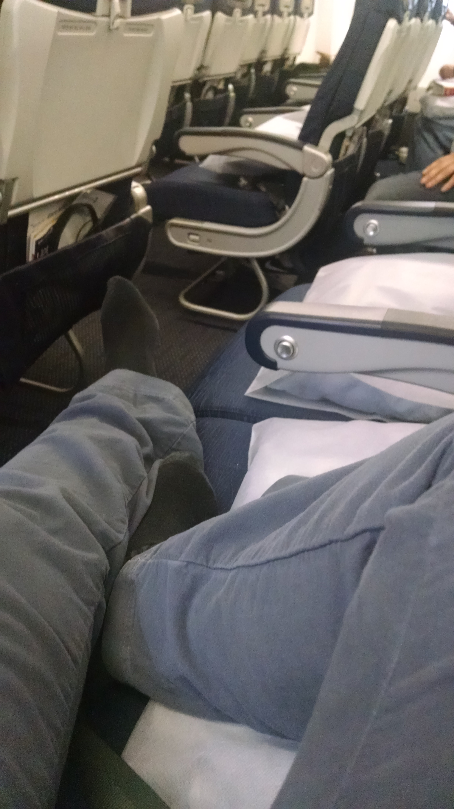
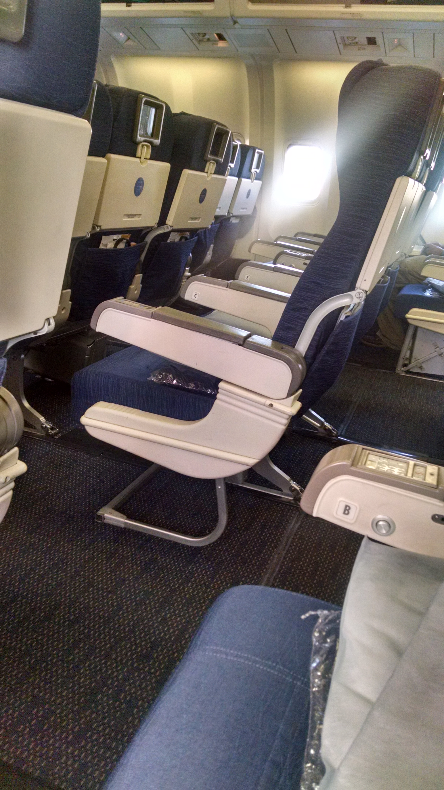

If you are looking to avoid crowds, the best day of the week to travel is Tuesday or Wednesday.

TSA lines are short and airplanes are as empty as they come these days.

An empty flight doesn't always mean a peaceful flight though. On my flight to Denver on Wednesday, the man seated across the aisle from me drank two half bottles of red wine. He then fell asleep and snored loud enough to keep even the soundest sleeping babies awake.

My flight on Wednesday to [London](https://canyoucrossthestreet.com/life-in-the-big-smoke/).

My flight on Tuesday back to Denver.

