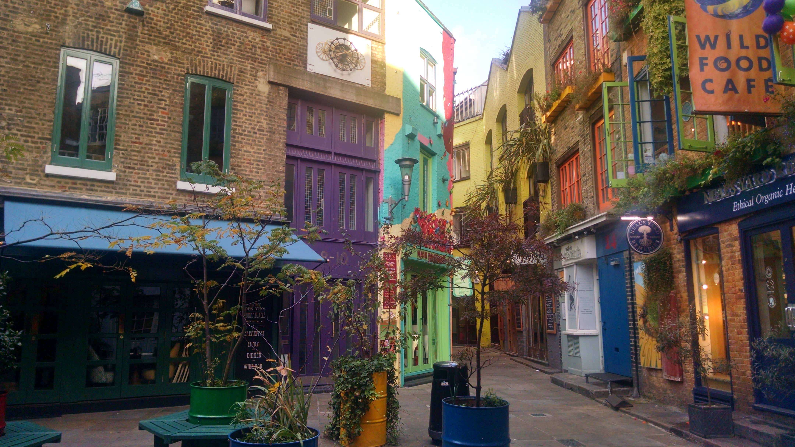
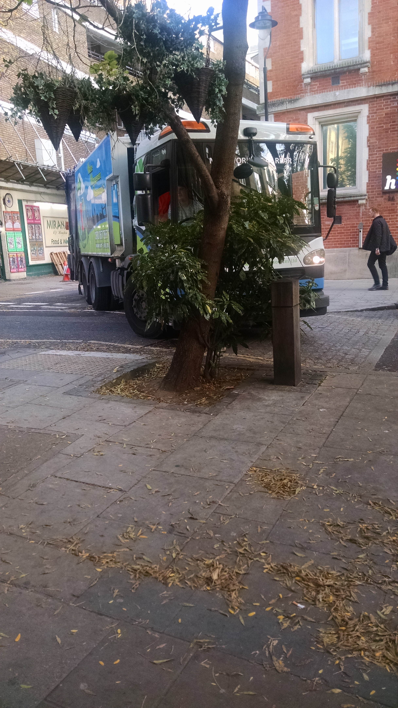

I just spent a week in London, nicknamed the Big Smoke. In the 1950's, the smog would make visibility so bad that cars couldn't even drive, as Jennifer Worth describes in [Call the Midwife](http://www.amazon.com/gp/product/B008MFVH0C/ref=as_li_tl?ie=UTF8&camp=1789&creative=390957&creativeASIN=B008MFVH0C&linkCode=as2&tag=canyoucross-20&linkId=MASAWSGASQSN3E53). But London these days is beautiful, sunny and clear. The city made a big effort to clean things up and the Thames is thriving with fish, birds and other wildlife as the city thrives with people!

I stayed right in Covent Garden in a [cute studio](https://www.airbnb.com/rooms/1177530) that I rented through Airbnb. (Here's a [$25 Airbnb coupon](http://www.airbnb.com/c/speters41).) If you want to be some place close to all the restaurants, theaters, nightlife and main tourist attractions, it was a great location. It felt like I was in the London of all the stories and movies.

Speaking of great location, there were lots of dine in and take out options. If you get take out from a restaurant, it's called "take away". I recommend [Food for Thought](http://foodforthought-london.co.uk/). I was a bit disappointed when they handed me a small styrofoam container but the vegetable ragout was awesome.

This courtyard was right around the corner from my Airbnb. It's called [Neal's Yard](http://nealsyardlondon.co.uk/history/).

My Airbnb was also on a courtyard which made it quiet at night. If you are going to stay in this part of London and you don't plan to stay out late visiting all the cute little pubs, I'd recommend finding a quiet place. Coming back at night I felt safe walking back to my room - I just had trouble in some streets getting through the crowds that were standing around drinking outside of the pubs! In the US we can't drink in the street, so it looked a bit strange to have large crowds of people standing around with pints of beer. I was glad my apartment on an inner courtyard and not over one of the pubs.

You definitely don't want to drive in London - and you don't need to. The Tube was great and takes you every where you need to go very quickly.

Covent Garden is a good home base for a London visit. Close to the Leicester Square (pronounced "Luster"), theaters and restaurants.
