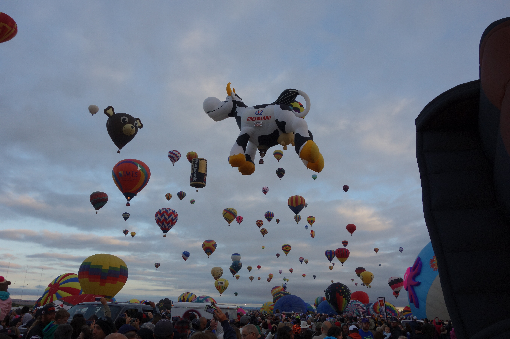

We went to the Albuquerque International Balloon Festival for the first time this year and had a great time.

We spent a lot of time in the car, in shuttle bus lines and on buses. Don't stress though! Even though everyone tells you that you should be there at 7:00 (and you should if you can - watching lit hot air balloons take off in the dark is pretty spectacular!) if you miss that part, there are still hours of balloons to watch. You can walk right up to them, talk to the folks working on them and take tons of pictures. And most of the fancy shape balloons went up later.

If you have kids, have them ask for cards - the kids with us had a blast collecting the trading cards.

I think you could really change your trip depending on where you stay. I see a couple of strategies for your hotel stay at the Albuquerque International Balloon Festival. (I looked for Airbnb options too - either there aren't many or you'd have to book way in advance.)

When it comes to hotels you could ...

1. Just stay at your favorite hotel and not worry about how long it takes you to get there. You could:
   1. Drive to the festival every day. Be sure to allocate a lot of time as traffic is bad and there will be a lot of people trying to park. I think it took us a couple of hours the first morning to go about 5 miles. The good news was that by the time we got there, they were no longer charging for parking!
   2. Drive to the [park and ride](http://www.balloonfiesta.com/guest-guide/park-ride) and then take the shuttle.
2. Stay at a hotel near one of the official [park and rides](http://www.balloonfiesta.com/guest-guide/park-ride) and ride the festival shuttle. The tickets are $12 in advance, $20 the day of. The lines for the shuttle can get very long, especially in in the evening. We waiting for a long, long time in the line to get the shuttle after the evening show. We watched most of the fireworks from the line.
3. Stay at a hotel that offers [direct shuttle service](http://www.visitalbuquerque.org/balloon-festival/balloon-fiesta-transportation.aspx) to the festival. Our friends did this the previous year and said it worked really well.
4. Stay at a hotel that will shuttle you to the park and ride. This is what we did for the evening show after our experience driving in during the morning.

Next time we'll stay at a hotel that offers direct shuttle service.

What's been your experience?
