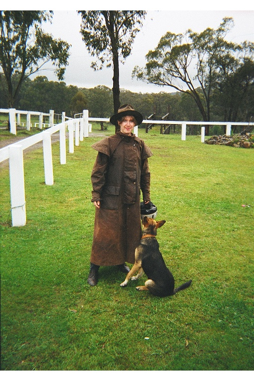
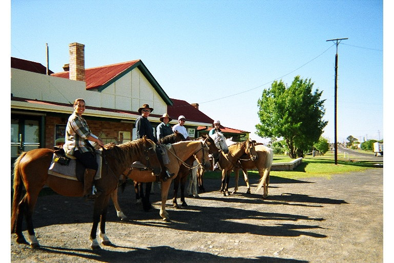
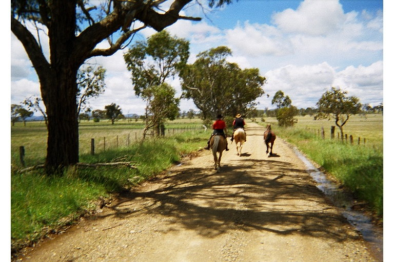
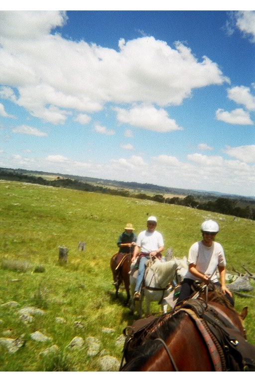
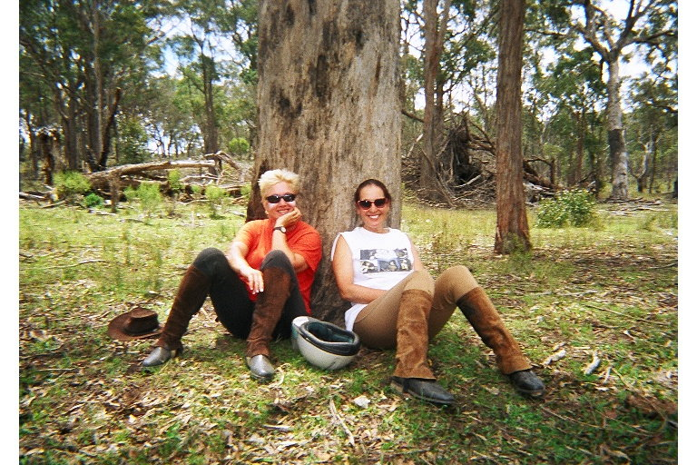
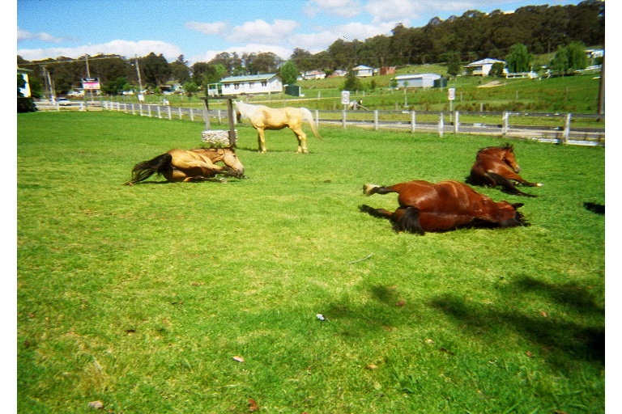
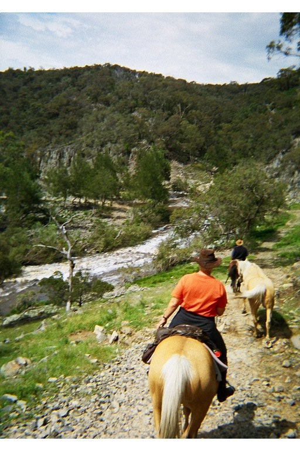
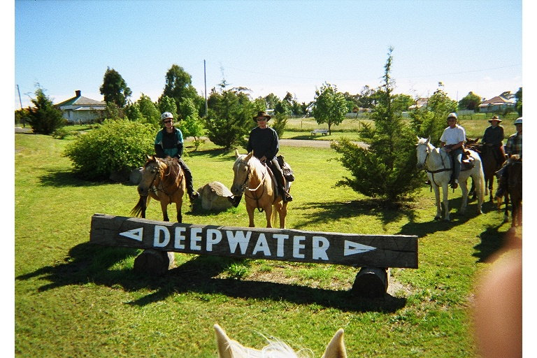

My first vacation by myself was a pub crawl on horse back in Australia.

It turned out to be quite the adventure. Here are my letters to Mom and Dad ...

\*\*\*

Hi Mom and Dad,

Wouldn't you know.  I show up in Glen Innes and it starts to pour.

Hopefully it'll be over by tomorrow at noon.  The horse back riding trip is a "pub crawl".  You ride all day and you stay in rooms above pubs in small towns.  (That's what my room is now - just  a bedroom above a pub.  It's called a "hotel".  Motels have complete rooms - TVs, bathrooms, etc, but no pub, i.e. no restaurant.)  Since it's raining, I opted for a hotel tonight so I wouldn't have to leave for dinner, but then I left to find a computer anyway.  The restaurant also looked very comfortable with easy chairs, so I might end up reading a book there tonight.  (Everytime it thunders the light in my room dims.)

You'll never guess where I found this computer.  (The library closed at noon and this was the only place in town with a computer and since it's raining I didn't have anything else to do.)  Anyway, I'm sitting in the corner of a pub at the bar - on a barstool - typing away on this old computer!  There's a bunch of old guys drinking at the bar.  (I asked for a beer and got a "new" - I'm not sure if that refers to the size (small) or the type of beer.)  Quite a unique experience.  At least nobody's smoking.

Everyone here continues to be very friendly ...  I met a guy in his late 70s on the bus.  (He was 22 when World War II was over.) He reminded me of Uncle Ted and he told me all about the towns we went through.  He's English but he's been here since 1962.  He has to go to Brisbane regularly for cancer treatment.  He and his wife gave me a ride to the hotel.  The guy in front of me was definitely a cowboy - he was going to stay with his "oldies". How would you like to be called oldies?  He said Glen Innes (pop. 9000) was too big for him.  The lady in the front seat just wanted to talk to everybody that came through the bus door.  They were all very happy that I was going to see the country, not just the beach like the rest of the tourists.

I am definitely in sheep country.  Lots of sheep, sheep and more sheep.  Lots of hills, a few cattle, lots of homes in the country and small towns.

Love,

Stormy

\*\*\*

Hi Dad,

I'll tell you all about my horse.  I get to meet him/her after lunch tomorrow.  We go for a short ride (2 hours or so) to make sure we all have the right horses.  Then we stay at the ranch (or farm as they call it here) and we leave on Monday.  Our bags go in a car.

The guy on the bus with me said I'll probably be going to small mining towns.  He said this area was/is known for sapphires.

For nice overview maps, try:
<http://www.arta.com.au/ausmap.html>

You search by town.

If you have a fast connection, and want lots of detail, try this map:  (I'm in the north part of New South Wales right now.  The islands were off the Quensland coast.)
<http://www.auslig.gov.au/facts/map.htm>

Love,

Stormy

\*\*\*

Hi Mom and Dad,

I'm sending this from the Brisbane State Library.  It is HOT here and I was looking for an air conditioned place ...

I didn't find any computers along the way.  A couple of the publicans (pub owners) sounded like they had computers in their rooms but I didn't want to ask if I could use them.  (I'm sure they would have let me - everybody was so nice.)

I had a ***terrific*** time riding!  Our start was delayed by a day because it rained so much the rivers got so high that first they couldn't get the horses to us and then we couldn't get out!  (The "Homestead" - Bullock Mountain Homestead - is surrounded on all sides by rivers.)

There were going to be five Americans, 2 Australians (one originally New Zealander), and one German who has lived here for 30 years plus the owner, Steve a.k.a Woodsy, and Jo, his helper.  However, the Americans bailed because they didn't want to ride in the rain.  They missed out - we had gorgeous weather!  So there were six of us - four guests and two owners/employees.

*Everybody* except Jo had kids my age (actually, except for Renarda, they all had 25 year old daughters - and that's saying there's a lot of daughters because all of the Americans were in 2nd marriages).  The group (of six of us) that ended up going was a lot of fun.  We joked the whole way.  Peter is a marketing manager for a large Australian food company.  We nicknamed him "Buttercup" because he kept asking what brand the bread was.  Renarda was German - she was quite a character.  Very impatient and always at the front, but a good sense of humor.  Robin was the New Zealander who is now Australian.  She works in nursing homes - "aged hostels".

My horse was an Australian stock horse named "Tia Maria".  Stock horses were bred for ranch work and also used as cavalry horses - they are endurance horses.  She was 23 years old and about to be retired to 2 hour rides instead of five day rides, but she wanted to **GO**!  She wanted to be first (she used to be the lead horse) and anytime I let her she'd take off.  I spent most of the five days holding her back!  That was fun.  She was light brown with a dark mane and tale, and her back was about even with my nose, and she wasn't fat, as the matter of fact, she was kind of bony.

My saddle gave me four bruises the first day (where the stirrups went into the saddle) but after the first day I was fine.  Not sore at all!

We went from Bullock Mountain near Glen Innes to Deepwater to Torrington to Emmaville back to Bullock Mountain.  The first day we went on dirt roads because the rivers were too high and the ground was all boggy, but after that we went completely back country.  Across fields, through trees, over hills, through three rivers, ... you wouldn't believe some of the rocky, steep, steep, hills we went up and down.  And I got my feet wet in a few of the rivers.  Beautiful country.  We went over rolling hills with lots of sheep.  Lots of cute two-week old lambs!  Through forests and past old mines.  Scared lots of kangaroos.  Saw some deer and some cows too.  Went down a gorge.  We also got to do a lot of trotting and cantering and we didn't have to walk in a line.

We carried our lunches in saddlebags with a water bottle and just picked a good shady spot to eat every day.  Then at night we stayed at a pub and had nice candle lit dinners.  The first night at Deepwater we had a beer in the afternoon, then played a couple of games of pool, ate dinner and went to bed.

The second night at Torrington we had a great time.  When we got there, some women were playing scrabble, kids were coloring and guys were playing pool.  The group I was with kept talking about the "locals" and how they wanted the pool table to themselves.  I finally got sick of it, went and found Woodsy and asked him if he'd be my partner if I put my name on the board. (The night before I'd noticed he'd played a game or two of pool before.)  Wouldn't you know it - for some reason I played terrifically - and Woodsy and I actually held the table for a while.  (I got a lot of grief because I'd turned down a game before with one of them saying I couldn't play pool!)  Then at Emmaville my pool luck deserted me so we sat outside talking to some of the people that lived around there.  We met sheep shearers, bee keepers, horse breakers, ranchers, ...

Got to run - thought I had this for an hour.

Love,

Stormy

\*\*\*

That was back in 2001. It looks like you can still book a [pub crawl through Hidden Trails](http://www.hiddentrails.com/tour/australia_bushranger_ride.aspx) and it looks like it's still run out of Bullock Mountain Farm by Steve and Allison but it's only a 3 day trip instead of a week long trip.
