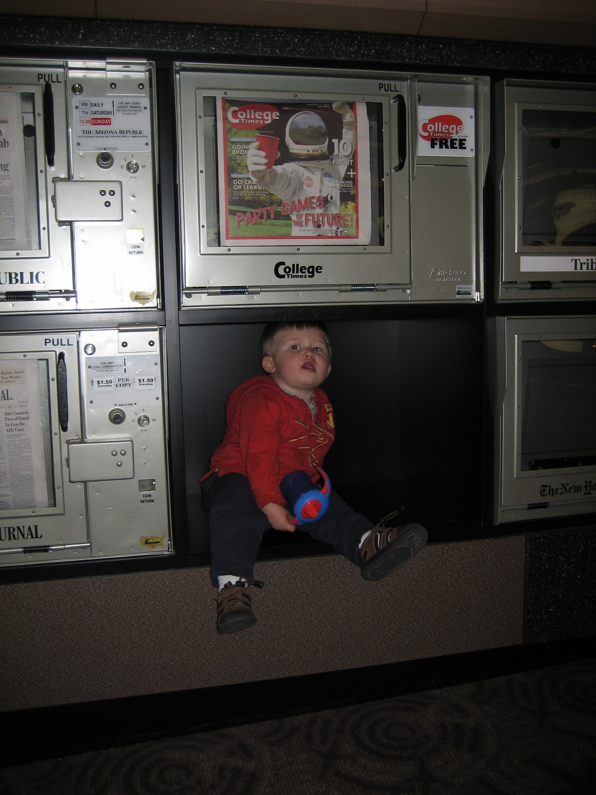
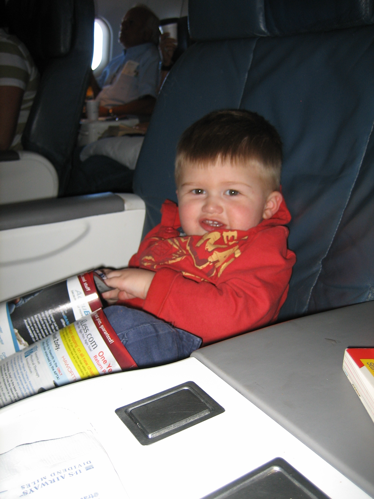

I loved airports and airplanes with my kids when they little. Now at 8 and 14 years old, they are jaded.

But at 1.5 years old they were awesome fun. We explored airports, rode the moving sidewalks, ate fast food, and watched airplanes.

And we checked out the airplane safety card. You know that one you always tell the flight attendant you've read when you sit in the emergency row but you've never really looked at? My oldest still loves the airline catalog with all the crazy gadgets that you can buy.

My partner says I'm the only person who gets excited when they sit next to a baby on an airplane. I've let them sit on my lap to see out the window. And on a long flight to China, I helped a frantic mother with a toddler and an infant. I took the baby, who promptly fell asleep and drooled all over my shirt. The three grandmothers behind me said it wasn't fair I got to hold him. None of us offered to chase the toddler around.

And yes, sometimes kids get upset. And sometimes they cry. And sometimes people around you get upset. But I figure usually the parents are more upset than the kids. And the more upset the parents, the more upset the kids become.

And to that guy in the window seat ... the one that made us get up 4 times during a 2 hour flight ... just as my toddler fell asleep each time. And then you dared to say that you gave him a "B". I give you an "F"!
