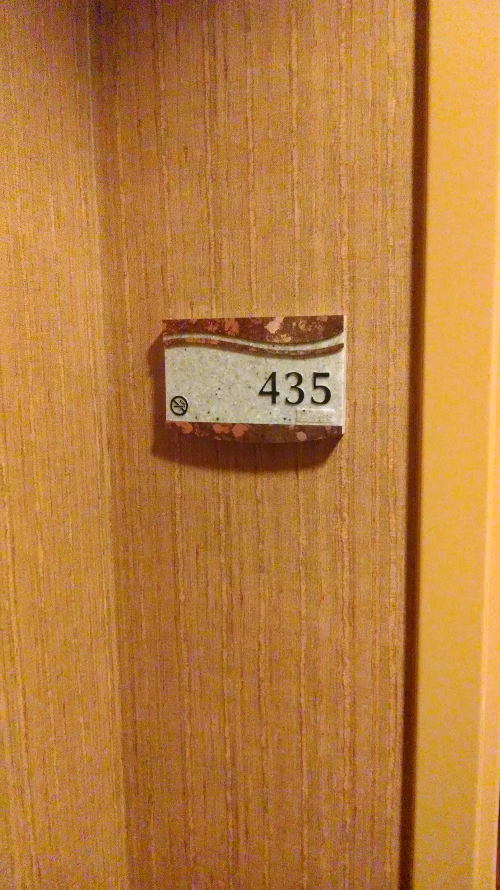

Have you ever forgotten what hotel room you were staying in? I have. Actually, I never know what number my room is, I just remember where it is - which hall and approximately where in the hall. And if I stay at the same hotel multiple times in a row, I have no idea which one is mine. (If my key card doesn't work, I immediately quit trying, move away from the door, pretend I'm walking down the hall and try to remember which room I'm in.)

The now antiquated tech way to remember which room you are in is to take a picture.

The new way is to [check in with the hotel app](http://mashable.com/2014/11/03/keyless-mobile-hotel-check-in). You never even have to stop at the front desk. You check in to your hotel room like you check into your flight. On your phone. The app lets you check in, gives you a room and can always remind you which room you are in. And you don't even need a key - your phone unlocks the door. [Starwood Hotels are the first ones](https://www.spgpromos.com/keyless/) to let you check in with your phone and open your door with your phone using Bluetooth.

I wonder if you'll be able to walk down the hall until you hear one of the doors click open?
