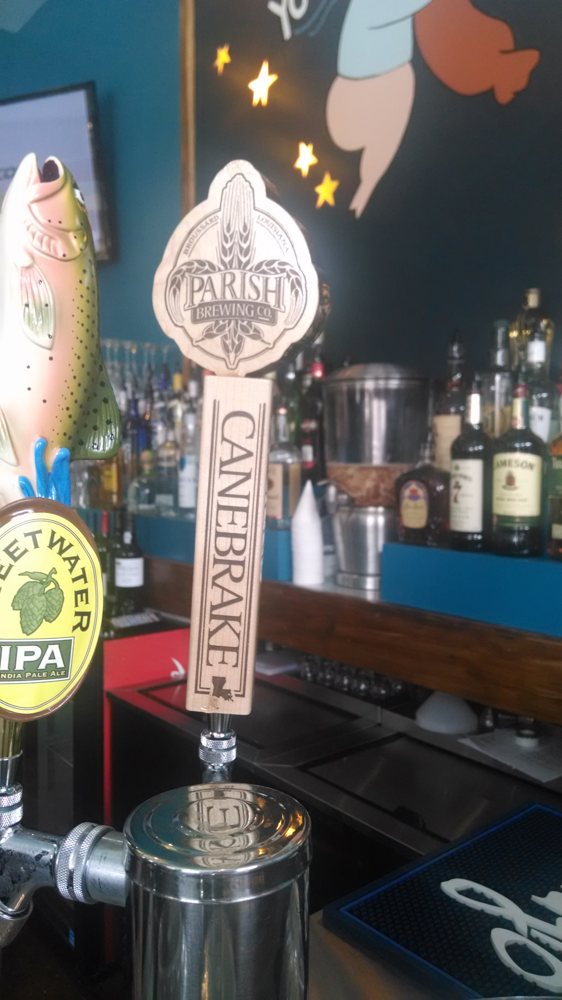
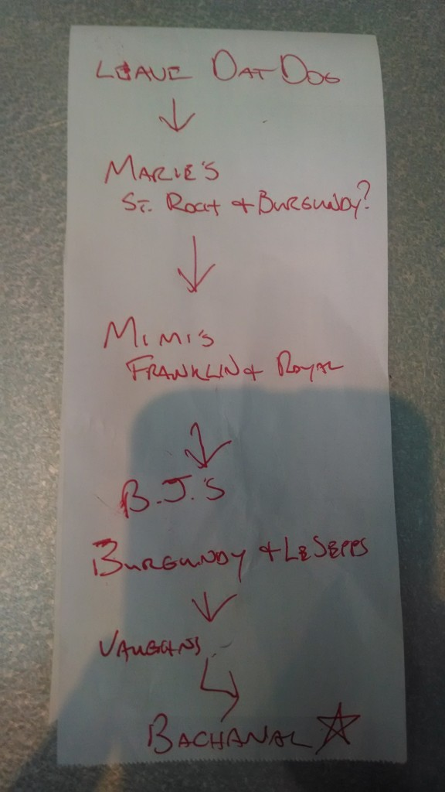
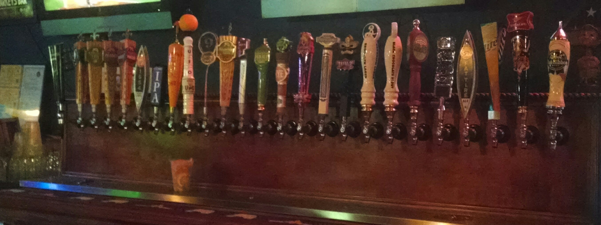
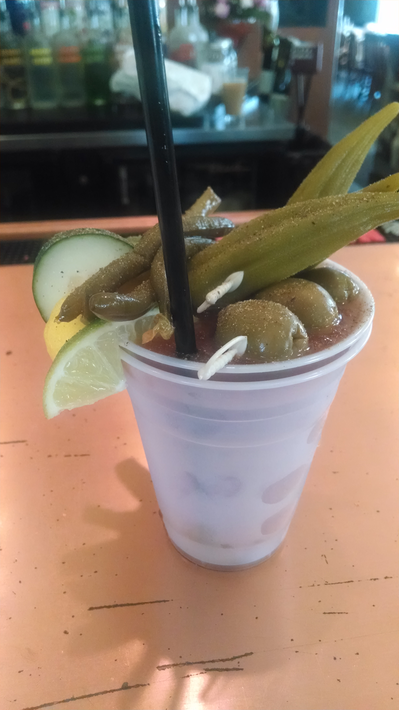
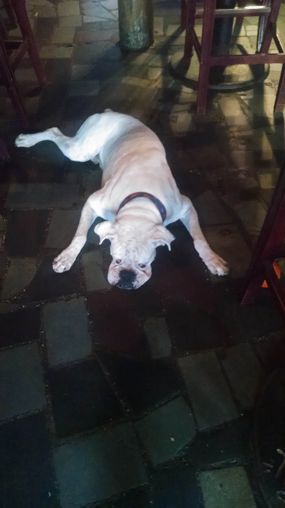
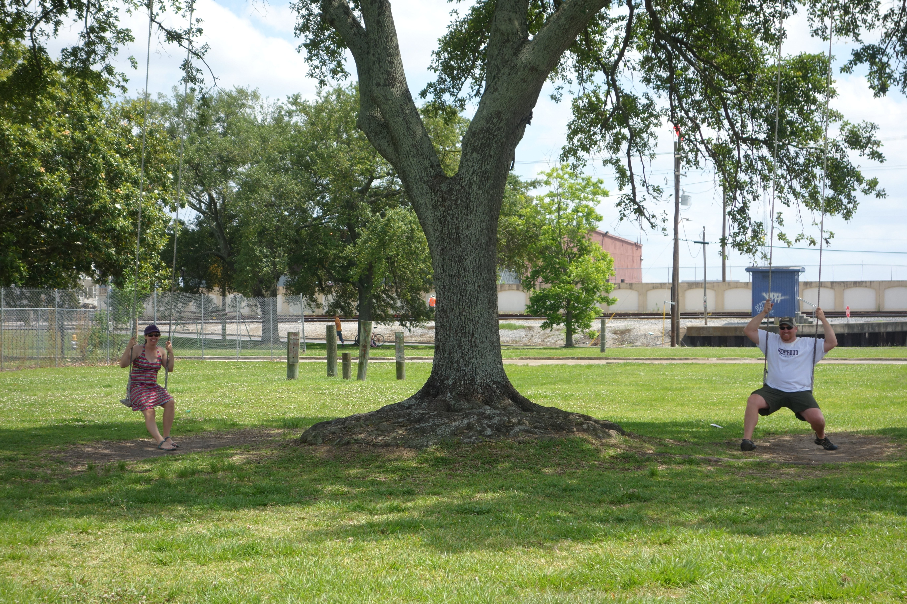

On a trip to New Orleans, Frank and I got there a couple of days earlier than our friends. Wandering around, we saw a new bar on Frenchmen Street, Dat Dog. Or rather another location for an existing bar. It didn't seem like it fit on Frenchmen Street to me. It's got a lot of plastic and it serves hot dogs but Frank wanted to check it out, so we went in. The place did serve hot dogs and did look much more modern than your typical Frenchmen jazz bar. But the wait staff was awesome.

Our waiter was named Dan and upon hearing that we were looking for something to do for the day, he went over the register and pulled off a sheet of paper and proceeded to make a list. His own personal list of favorite bars in the Marigny and Bywater neighborhoods.

So we went to Marie's. As Coloradoans used to non-smoking restaurants, we found Marie's to be a bit smokey but the bartender was super friendly.  Dan had told us who was working at Marie's but it was someone else. She was quite interested in our list. She picked up a pen and added a few more bars that she said were missing. We ended up talking to her about smoking and Airbnb. She had a place that she owned in Marigny that she rented out through Airbnb or VRBO. One of the things that I like about New Orleans is that everyone seems pretty scrappy and self employed. Many of the tours we have taken were put together by the person giving the tour.

From there we went to Mimi's and then Markey's Bar. At Mimi's the bartender added a few more bars to the list. Don't worry, we didn't end up visiting them all in one day! This bar crawl ended up being an entire week's affair and we still didn't make it to all of them.

We liked both Mimi's and Markey's. (We visited them both twice. Turns out they are good stopping points when you are walking from the French Quarter to Bywater.) Mimi's is a corner bar with lots of windows and old wood. And dogs. Every time we've been in there there have been a lot of dogs in there - like the barking, pet dog type of dogs, not the hot dogs at Dat Dog. We were told they serve pretty good food but even though we went there twice over the weekend, we didn't seem to ever hit it when we were hungry.

Markey's is a long wooden bar that is always full of people with a huge amount of beers on tap and a large group of locals that hung out there. I over heard some entertaining - or maybe just interesting? - conversations there. One between two women who looked to be about 30 years different in age were discussing a guy that I think they were both dating. There were lots of tears and hugs involved.

Bacchanal's is a great place to end up. It's a wine shop with a huge outdoor seating area with live music and great food. You buy your bottle of wine, go outside with it, order you food at the counter and then find a good place to sit back and listen to music and enjoy a glass of wine.

The complete list of bar tended recommended bars ended up being:

- Dat Dog
- Marie's
- Mimi's
- B.J.'s
- Vaughns
- Bacchanal's
- Faubourg Wines
- Delachaise
- Lost Love
- Rusty Nail
- Markey’s Bar

Our favorites were Mimi's, Markey's and Bacchanal's.

I wish I could show you the final list of bars, but I can't. I shoved it in my pocket with all my receipts and ripped it up at the end of the night like I do all my receipts.
