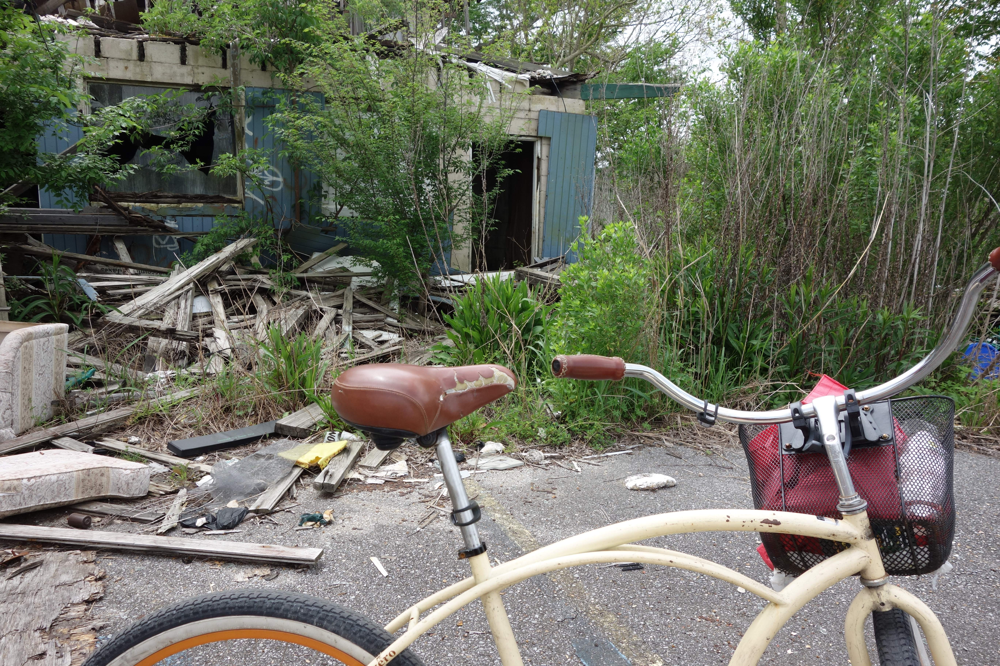
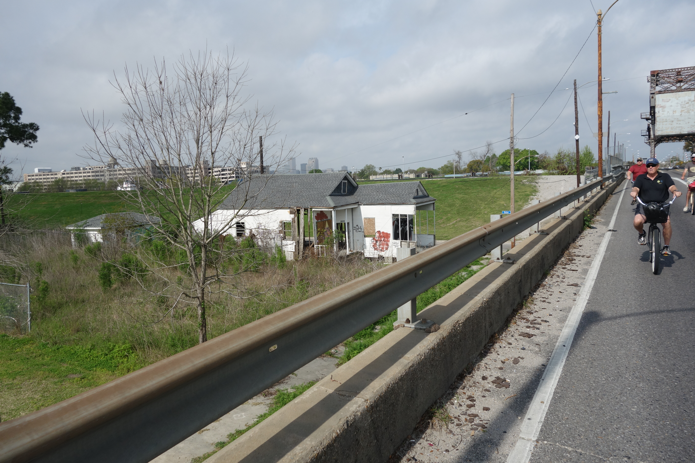
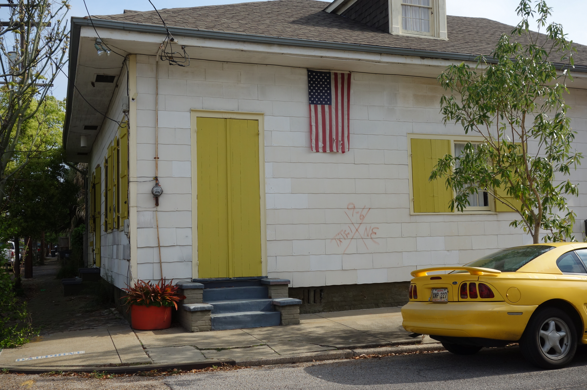
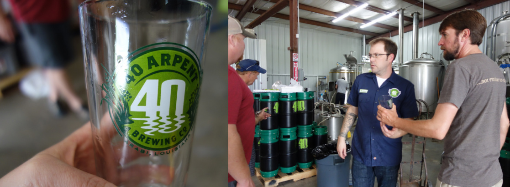
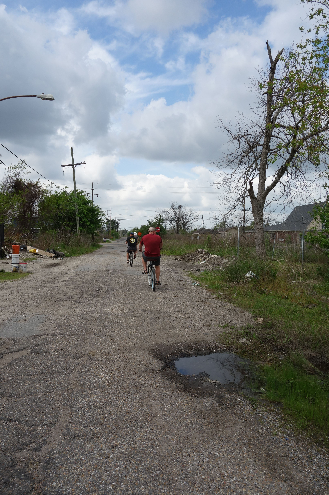
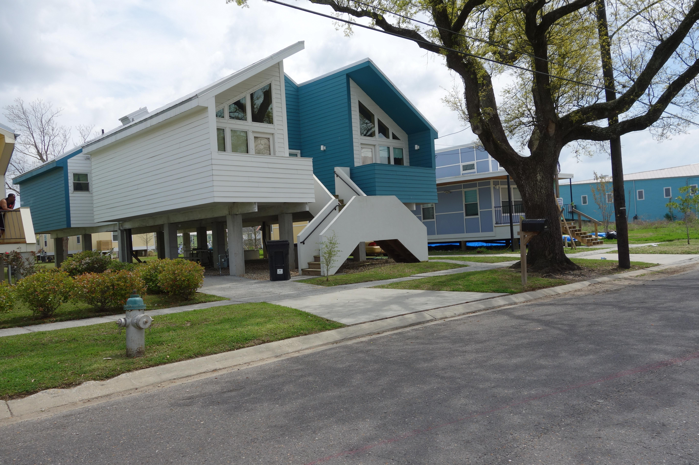
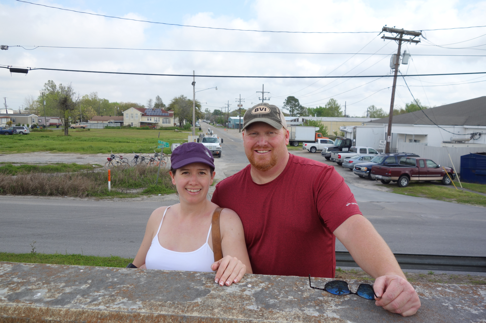

## 9th Ward Bicycle Tour in New Orleans

During a recent trip to New Orleans, Frank and I decided to go see the famous Lower 9th Ward - the neighborhood devastated by Hurricane Katrina. We signed up for a bike tour with [Confederacy of Cruises](http://confederacyofcruisers.com/) and had a very interesting, educational and fun day.

Our tour guide Derek is a native New Orleanian. When he was growing up, the Lower 9th Ward was one of those places you didn't stop at, not even for gas. (Not that there were many gas stations nor grocery stores to mention.)

We got our bikes, got the very short safety spiel, decided to leave our helmets behind - it was hot - and set off. After a nice stroll through Marigny and Bywater, we crossed a bridge - probably the only "scary" part as far as biking went and entered the Lower 9th Ward.

Along the way we learned things like how emergency workers performed search and rescue after the flood and what the [X meant on houses](http://southernspaces.org/2009/x-codes-post-katrina-postscript). They show that the house was searched, the date and what was found, including the number of alive and dead victims. Many home owners have preserved the mark.

After a stop for some awesome po'boys at Arabi's, we headed to the river.. While we were there this man walking on top of the levee wall with a weight, stopped to talk to us. In a very musical voice, he started talking about crazy things like spy boys and Indians. I was wondering what was going on when I saw Derek discreetly motion to us that he would explain later.

")

Derek had a conversation with him and once he left he explained that the man was part of the local Mardi Gras Indian krewe.

")

Most of us think of Mardi Gras parades as floats and beads and masks. But in the New Orleans neighborhoods, especially among black communities, Mardi Gras is about Mardi Gras Indians. They form krewes, led by a Big Chief, who decide the parade route on the day of Mardi Gras. The costumes and dancing are amazing. Later on the tour we stopped at Ronald Lewis' house and museum the House of Dance and Feathers to learn a lot more.

After our our chat with the spy boy, Derek looked over and said, that's a new brewery that's opening, let's go check it out! Turns out they had not even opened yet, but in between loading the truck for their opening party, they did give us a private tasting ...

After that we went to visit the area most devastated by the floods. The flood waters rose so quickly - something like 20 feet in 20 minutes - that many people ended up trapped in their attic as they climbed for safety and then couldn't get high enough nor could they get out. It's now recommended to keep an ax in your attic.

The neighborhood had a lot of empty lots and a lot of decrepit buildings. If you lived in the neighborhood before the flood, there is a program where you can buy a very cheap lot to build on.

Brad Pitt's [Make It Right Foundation](http://makeitright.org/) has also built a number of homes in the area to promote growth. They are supposed to be environmentally friendly and more flood proof. There was a lot of mixed feelings about them. But they did all seem to be occupied and that part of the neighborhood seemed to be prospering more than the rest.

After that we started our ride home. At this point we started losing one guy a lot, supposedly to take pictures. Frank had heard that couple arguing earlier about whose great idea it was to take such a long bike ride.

We thought the ride was a good mix of biking and breaks. We don't bike much but we didn't have much trouble with it, although Frank did say his butt was sore!

I highly recommend a [tour of the 9th Ward with Derek from Confederacy of Cruisers](http://confederacyofcruisers.com/ninthwardkatrinabiketours).

