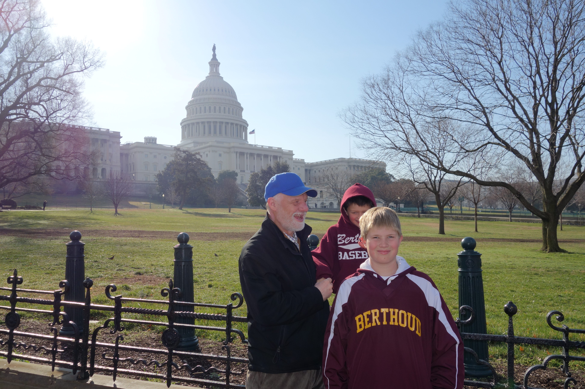
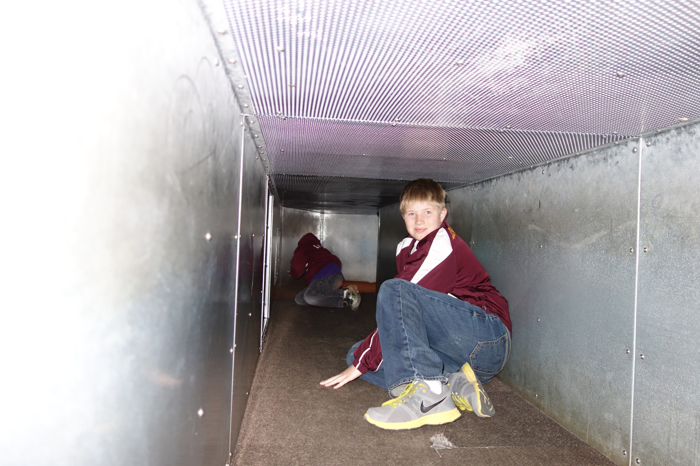
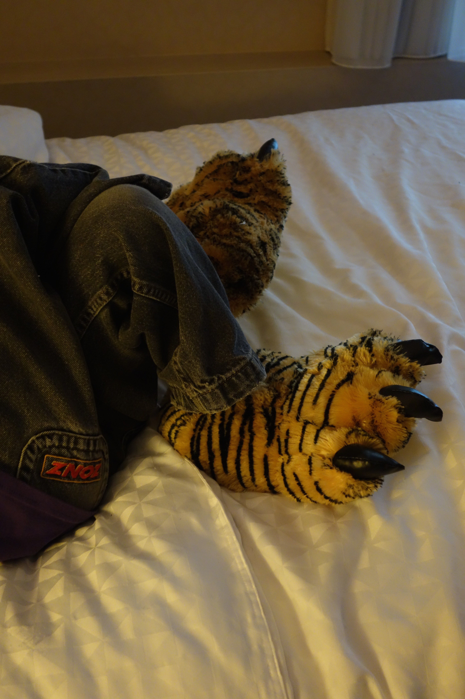
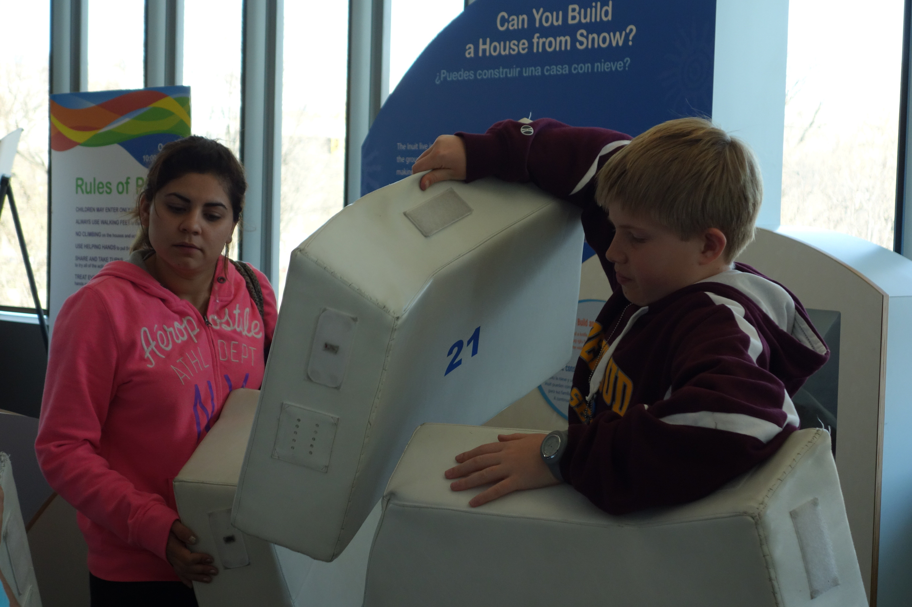
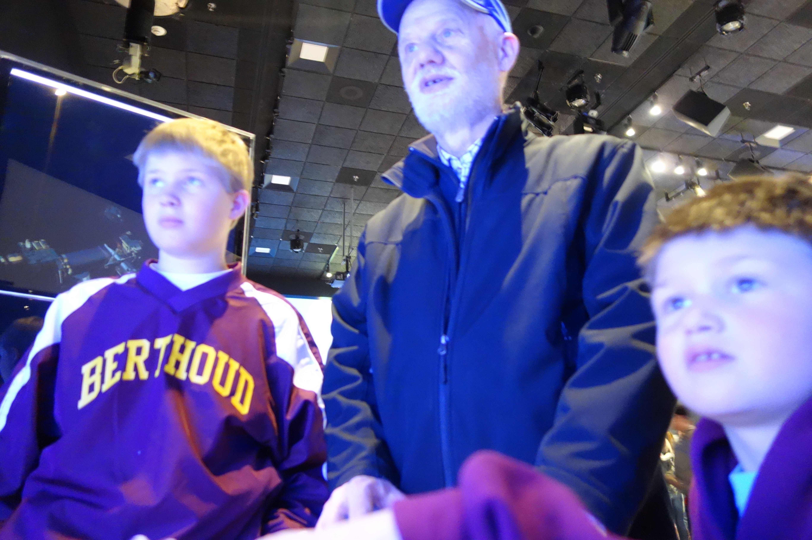
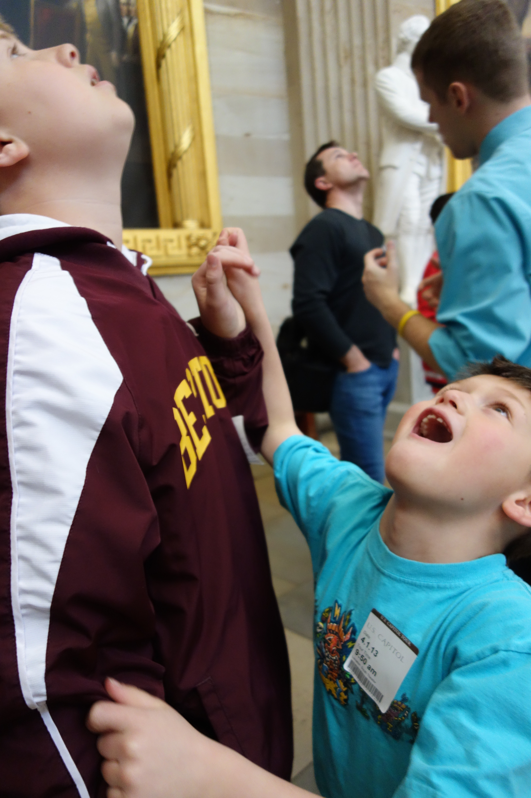
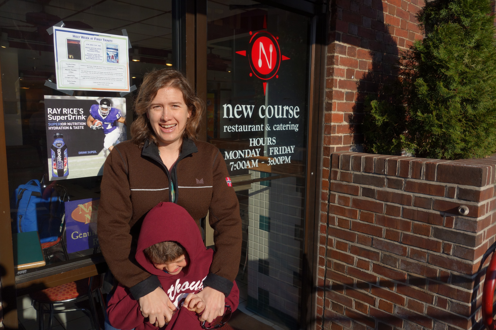
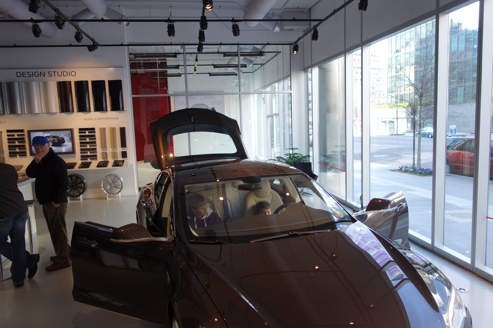
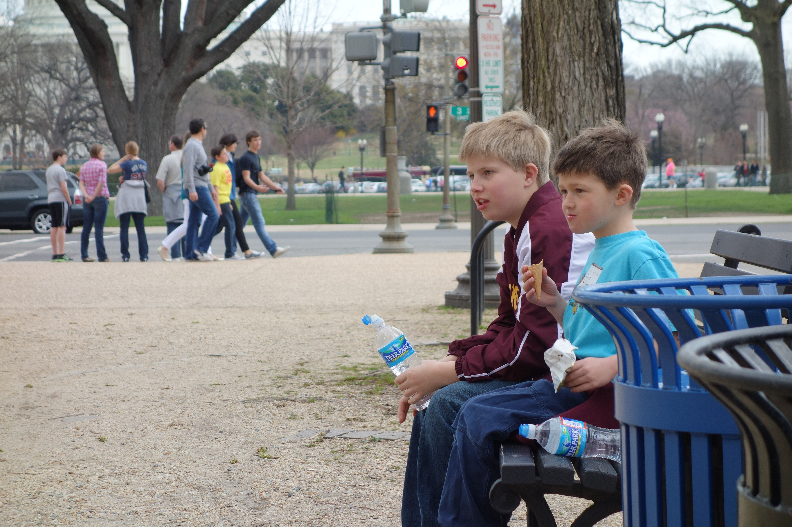

## Spring Break in Washington DC

I love Washington DC and I've been anxiously waiting for my kids to be old enough to enjoy it. There's a lot of walking in DC - not only do you walk a lot between sights but you can spend hours walking around any of the dozens of awesome museums.

So when my youngest turned 7, we decided they were old enough and my dad and I took both kids to Washington DC for spring break. My dad also wanted to go to New York City - we'll have to try that next. I thought at 7, Washington DC offered more exciting options.

Everyone's favorite activity by far was the Spy Museum. I almost didn't take the kids because it cost about $20/person but our oldest had heard that it was awesome from one of his buddies and really wanted to go. It was fabulous.

In the Spy Museum, there were lots of hands on exhibits, spy equipment, rooms set up with real life scenarios and a lot of history in very digestible formats.I also learned a lot.  Did you know that a bunch of school kids gave the President a picture that had a microphone in it? My favorite tidbit, because I can so see this happening in companies, was the fact that before Pearl Harbor, the Navy and the Army alternated who intercepted messages from Japan by even and odd days. That led to a lot of communication problems! We only left the Spy Museum after about 4 hours because we were all hungry. (Note that the line was really long to get in - I recommend going before they open to stand in line.)

We also went to the Smithsonian National Museum of American Indians. It had a lot of hands on exhibits for younger children. I really enjoyed the exhibit of Inuit Indians as it resonated with the 3 years we lived north of the Arctic Circle as a kid.

We also really enjoyed the Natural History Museum where our youngest got tiger slippers which are still enjoyed today. The dinosaur exhibit is by far the best I've seen and the mammals are also impressive.

I took the kids into the American History museum just long enough to see the exhibit of the first American flag which I find emotionally impactful. Not sure they did!

By the way, all of the Smithsonian museums are free.

When we went, you couldn't tour the White House but we did tour Congress with Colorado Senator Bennett. While we were on the tour we realized that the other family on the tour knew my partner - they had gone to high school together. That's what happens when the kids wear their Berthoud jackets every where.

We stayed at the Four Points by Sheraton on a combination of points and dollars. It was really convenient to most of the sights, but if I did it again, I'd look for a place right next to a metro stop even if it was further out. I also debated between a hotel (with a swimming pool) and an [Airbnb](http://www.airbnb.com/c/speters41?s=8) (with more space and a kitchen). The indoor pool was really nice for an afternoon break and one evening we ordered pizza and sat by the pool but if I did it again, I'd try an apartment. I'm not the only one to think of staying near a Metro stop - I found a website dedicated to [hotels near metro stops in Washington DC](http://www.hotelsneardcmetro.com/).

One morning we ate at New Course a restaurant that hires and trains chronically unemployed and homeless people.

You walk a lot in Washington DC. One of the things that helped on our trip was that I had just gotten a [Jawbone UP](http://www.amazon.com/gp/product/B00GQB1JES/ref=as_li_tl?ie=UTF8&camp=1789&creative=390957&creativeASIN=B00GQB1JES&linkCode=as2&tag=canyoucross-20&linkId=EMCTGW6WZHTJZOS2). My kids loved asking how far we walked. Most days we walked 5-7 miles. They saw it as a challenge.

We also visited a Tesla store where we all fell in love with Tesla.

On the last day, we had a food truck lunch. There were food trucks in several convenient locations that I'd recommend for easy, economical lunches.

