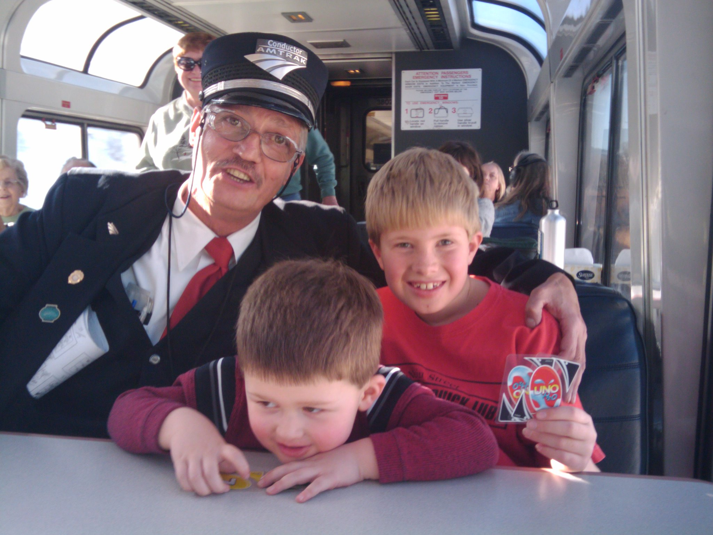
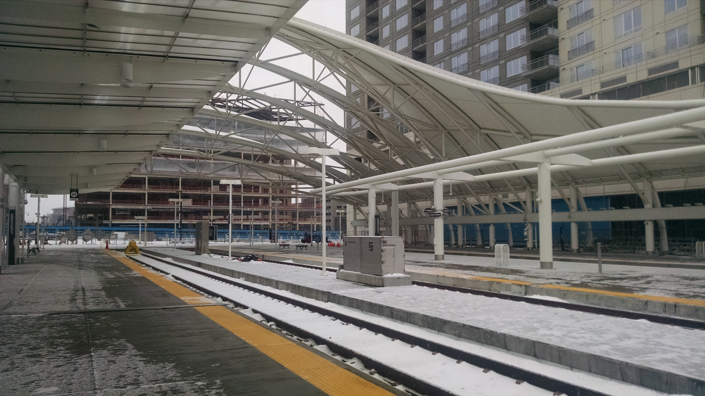
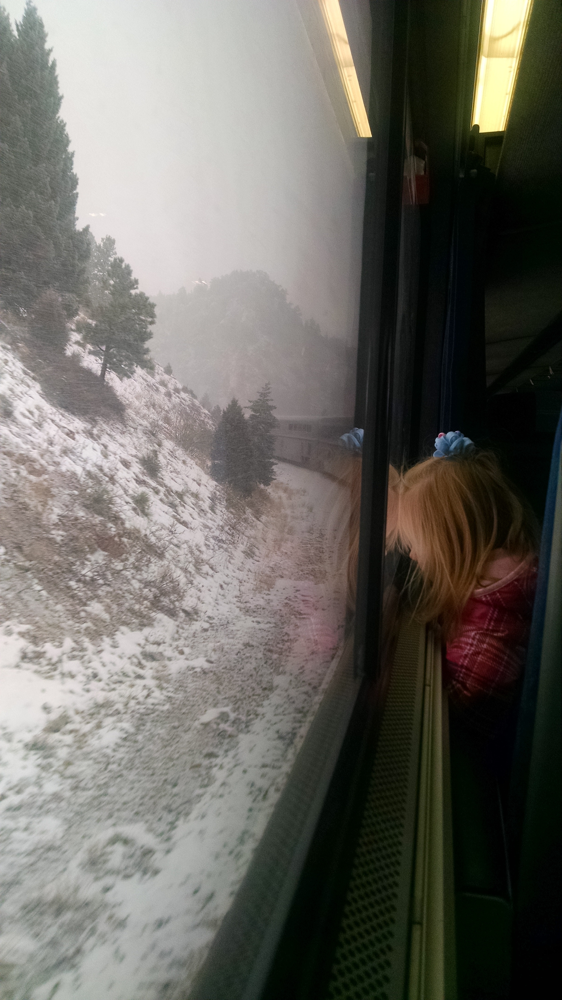
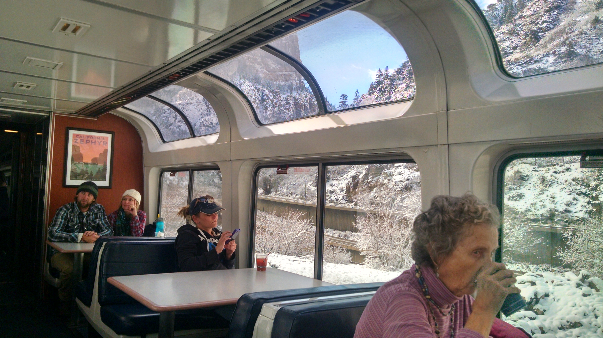
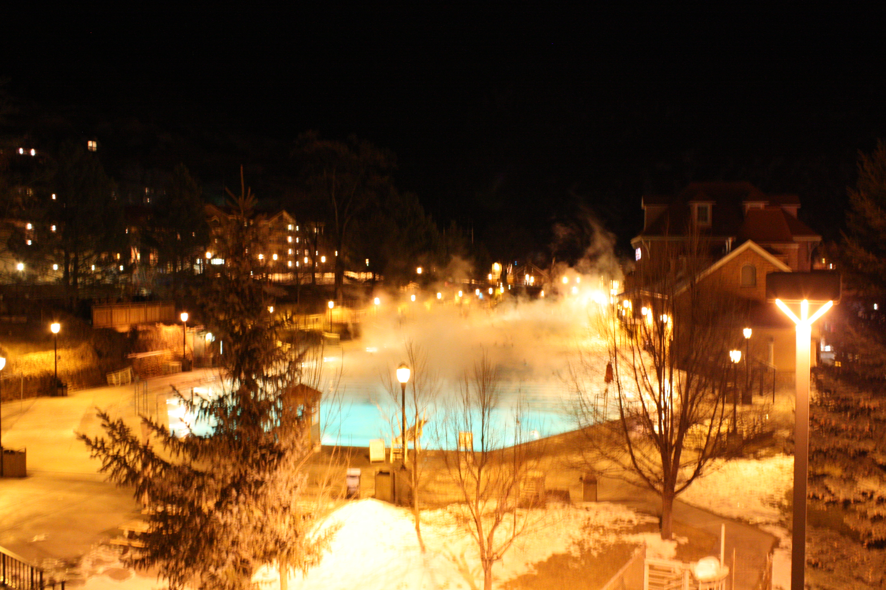
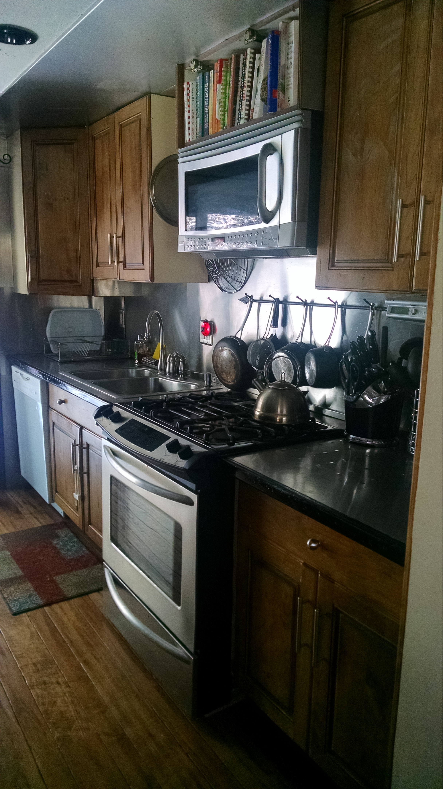
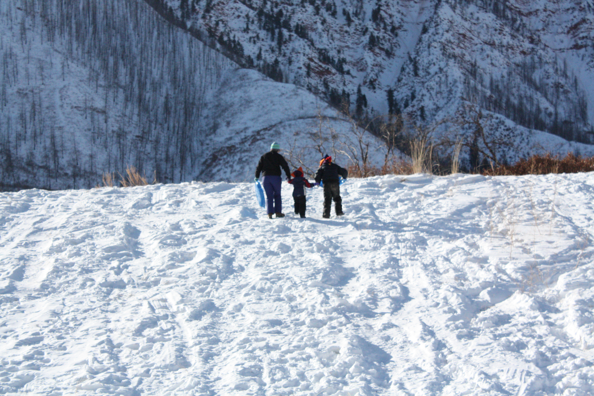
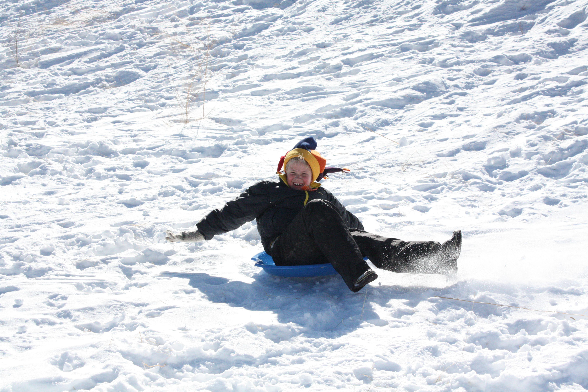
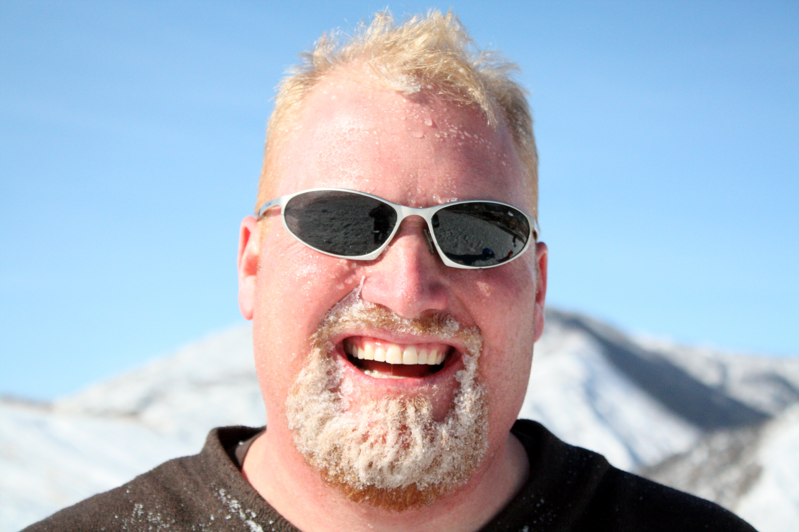
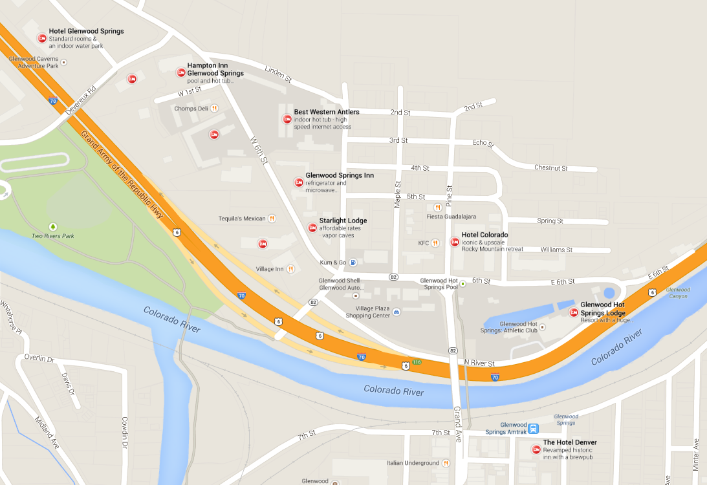

One of our favorite winter weekend trips is a train trip to Glenwood Springs!

The Denver train station has been recently remodeled and is gorgeous. We spent a while trying to figure out what the chandeliers must weigh but all we got was that there are 3 of them and they are 8 feet across.

Freight trains have priority so it is likely your train will be delayed at some point. Along the way you have a lot of time for playing games, drinking wine and watching the scenery. We saw big horn sheep, elk, deer and cattle. I never saw the mountain lions but the girl in front of me said she did.

You have a reserved seat and it's much, much roomier than an airplane seat. It reclines and has tons of leg room. You can also get up and walk around any time, look for a seat in the observation car or grab a snack from the snack car. You can also have meals in the dining car. You need to make a reservation and it's a bit pricey. The woman in front of us was a bit annoyed at her little kids for not eating their $45 macaroni and cheese meal. I assume the price was for all 3 of them!

On Saturday afternoon the observation car got a bit rowdy. Lots of drinking going on and lots of happy people saying lots of "bad words" as the kids pointed out.

The hot springs at Glenwood are gorgeous in the winter. We went at night with lots of steam and big snow flakes falling on our head. The big pool is 91 degrees and the smaller (but still huge) pool is 104 degrees.

There are lots of hotels in Glenwood Springs. Several very nice, historic hotels are right in town by the hot springs. We stayed at an Airbnb. It was nice (with a wild boar skin on the wall!) and would have been great for one family. A bit crowded with two families.

Last time we went up, we also took advantage of the snow to get in some sledding.

If you go:

- Book your tickets in advance at Amtrak.com. You want upper level tickets. The sooner you book, the better. Amtrak offers 100% refunds up until departure (so you can change your mind any time) and the tickets get more expensive as the train fills up. If you book enough in advance, tickets are $86 roundtrip. Kids are 50% off. The ride is about 6 hours each way, depends on the freight trains.
- Book your housing.
  - The hotels nearby are the Glenwood Springs Lodge (which comes with free entry to the hot springs), Hotel Denver (right in town, great location) and Hotel Colorado.
  - Or you can book an [Airbnb](www.airbnb.com/c/speters41?s=8).
  - If you don't mind walking a bit, there are several more hotels within a decent walk, like the Best Western and the Hampton Inn.
- The morning of, drive to the Denver Amtrak station. You can park your car in the garage just to the north of the station. We paid $15 for the weekend.
- Be sure to visit the [Glenwood Hot Springs](http://www.hotspringspool.com/).  It's $16 for adults in the winter. $12 for kids.
- What to take:
  - Drinks and snacks for the train. (You can buy food on the train and you can drink alcohol on the train.)
  - Books & games to play on the train.
  - Swim suit for the hot springs.
  - Lots of warm clothing!

