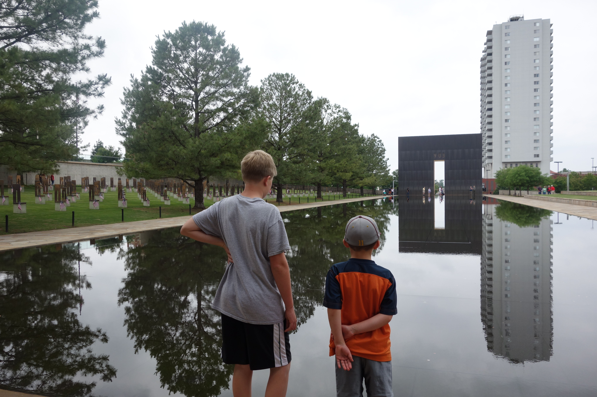
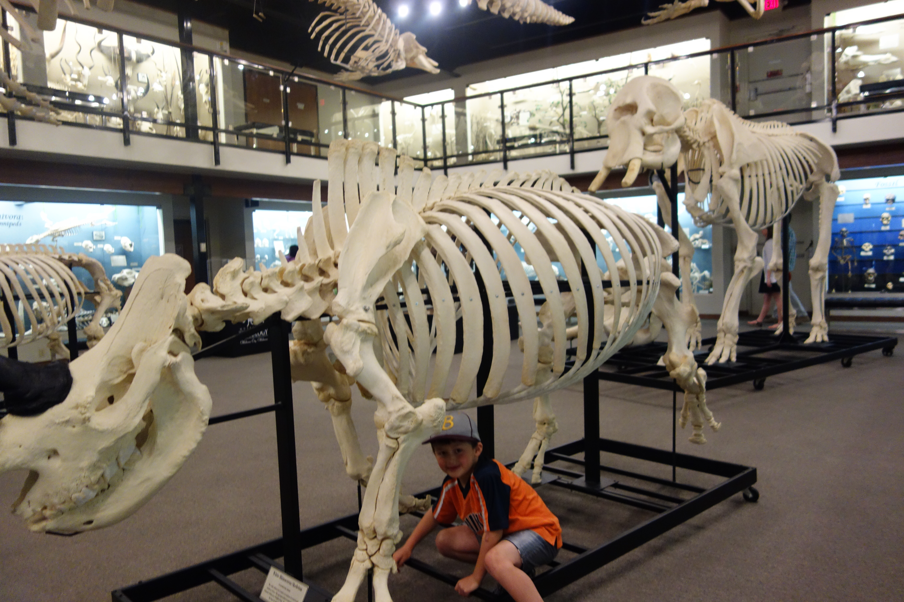
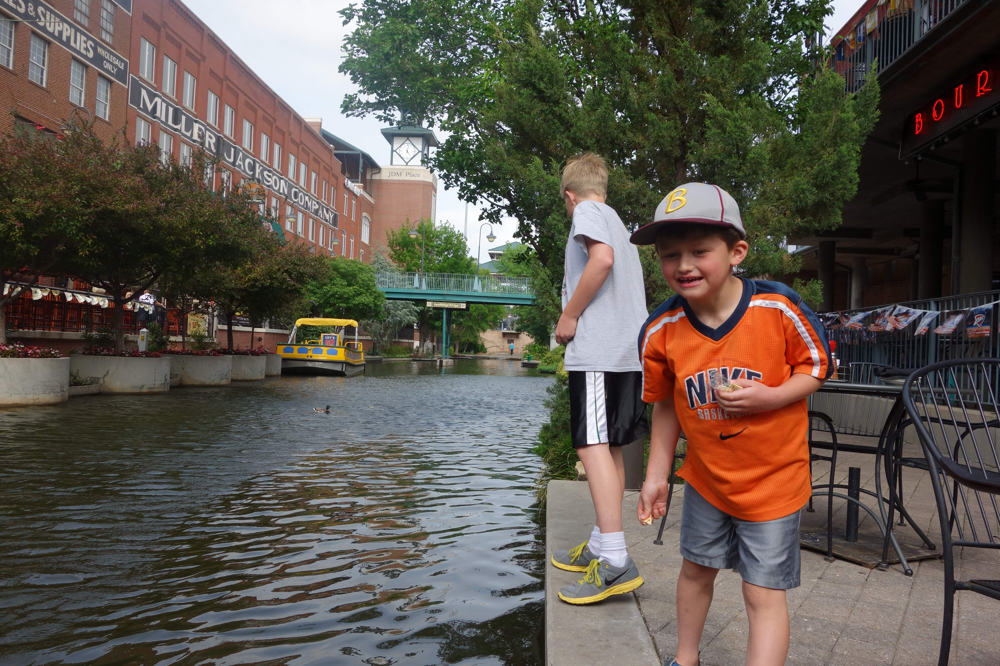
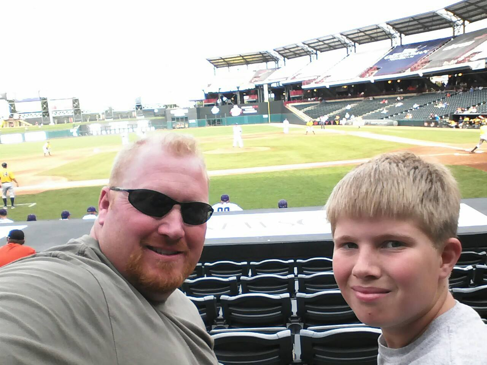
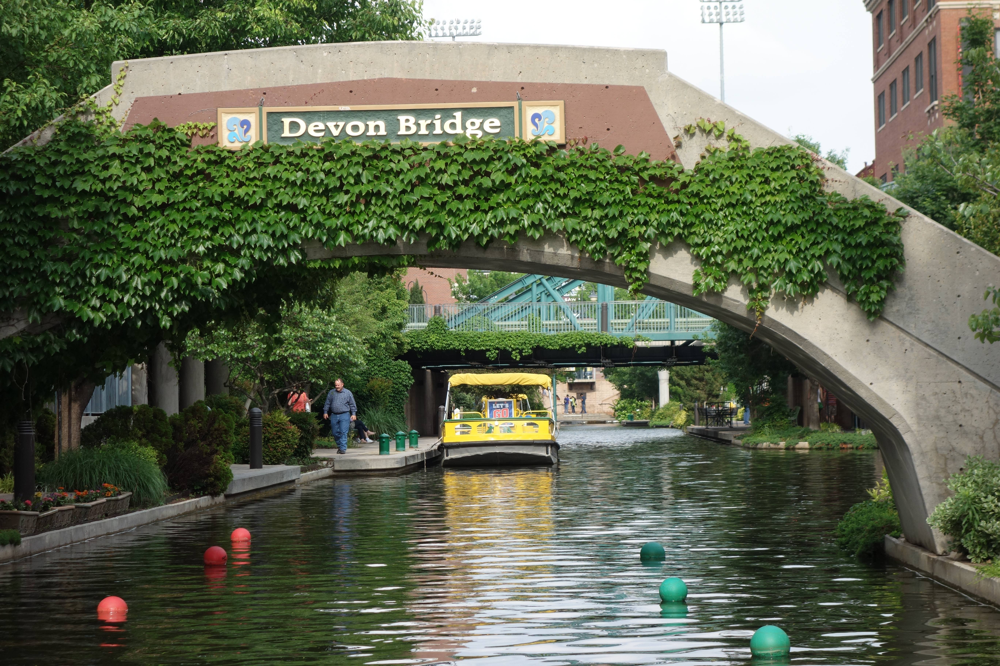
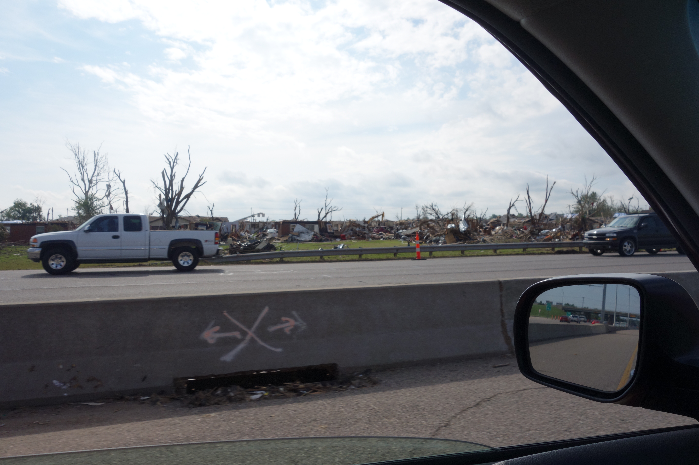

On our way to a wedding in Texas, we decided to take a day vacation and see something along the way. We didn't feel like we had a lot of choices when we settled on Oklahoma City but we were pleasantly surprised by our choice.

The highlights were:

- The Oklahoma City National Memorial & Museum honoring those lost in the Oklahoma City bombing. Absolutely worth a visit even if you don't consider yourself a museum lover.
- The river walk. Lots of restaurants, shops and life.
- College baseball in the big stadium.

##### Oklahoma City National Memorial & Museum

You've probably heard of the Oklahoma City bombing. There is now a memorial where the Alfred P. Murrah Federal building stood and the building next door has been converted into a museum. It is an absolutely fantastic museum focused on the experience of those that survived and responded to the bombing that first day as well as the detective work that went into finding the bombers.

It's both tear jerking and extremely motivating and uplifting. A few stories stuck with me. Like the woman who climbed out a window and down a ladder, went to the airport and got on an airplane and was in the Atlanta airport before she realized that she had been in the bombing. I could see that happening to me. The debris from the daycare center on the first floor was especially heart breaking. The story of all the first responders was amazing. The detective work that went into figuring out what happened was inspirational. They actually reconstructed the vehicle that had the explosives from hundreds of parts spread out over city blocks.

Go see the memorial and visit the museum. It's worth it.

##### Museum of Osteology

On [TripAdvisor](http://www.tripadvisor.com) I discovered that the number two museum in Oklahoma City is the Museum of Osteology and I was hooked. (I don't know how many museums there are in Oklahoma City so I don't know what it means to be #2 but I love things like osteology and anatomy.) My family humored me and we drove out to see it. We were all a bit worried on the way there. It's a ways out of town, down an unlikely looking road and it doesn't look like much from the outside. On the inside it was full of fascinating skeletons and trivia with several hands on experiences. Definitely worth a visit, especially if you are there with kids.

##### Oklahoma City River Walk

In the afternoon we went down to the river walk and had an appetizer and a drink right on the water. The waiter gave the kids some crackers to feed to the adorably cute ducklings. (Sorry, I took pictures of my adorably cute kids instead of the cute ducklings.)

While we were there, my partner discovered the Big 12 Championship college baseball tournament was playing. Actually, he made us follow the crowd to the stadium to see what was going on. He and our oldest bought tickets for $17 to see two games. They got awesome seats.

Our youngest and I went on a boat tour of the river. Afterwards we went back to the hotel and ordered pizza. I carefully researched our pizza options and ordered from the place with best reviews. The reviews were obviously not done by a 6 year old. There were ***green things*** on his cheese pizza!

##### Tornado Damage

It seems like Oklahoma City, a place I found to be very liveable and friendly, is best known for tragedies. We started our trip with an exploration of the Oklahoma City bombing site. We ended it with a drive through the tornado damaged area.

##### Details

We went in May which turned out to be a perfect time to visit. We were able to enjoy outdoor activities like the river walk, the memorial and the baseball games.

We stayed at the [Sheraton Oklahoma City](http://www.sheratonokc.com) on Starwood points and it was a terrific value. We ended up with two adjoining rooms that were very nicely appointed for less than one room usually costs us. The kids were absolutely thrilled to each have their own huge queen bed with huge headboards and over four pillows each.

##### Conclusion

If you are driving through the area, be sure to allocate some time to see Oklahoma City. It was worth a visit. If you could only do one thing, I'd recommend the Oklahoma City National Memorial & Museum that tells the story of the Oklahoma City bombing.
