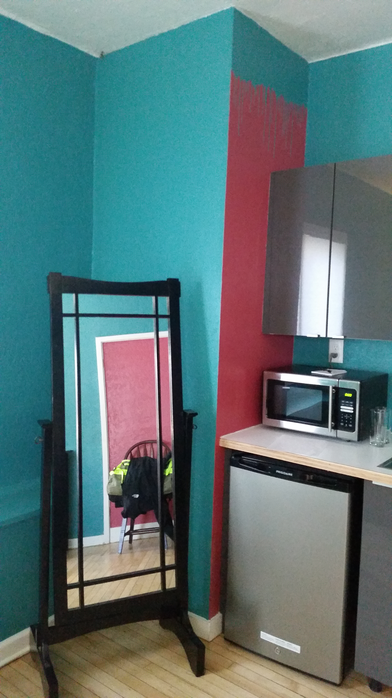
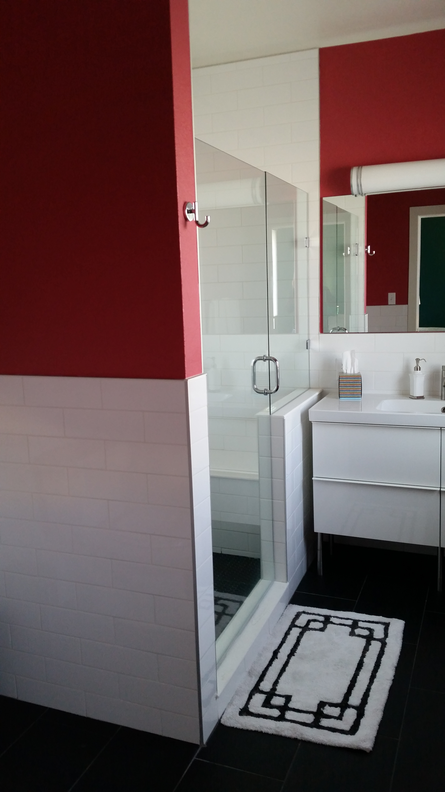
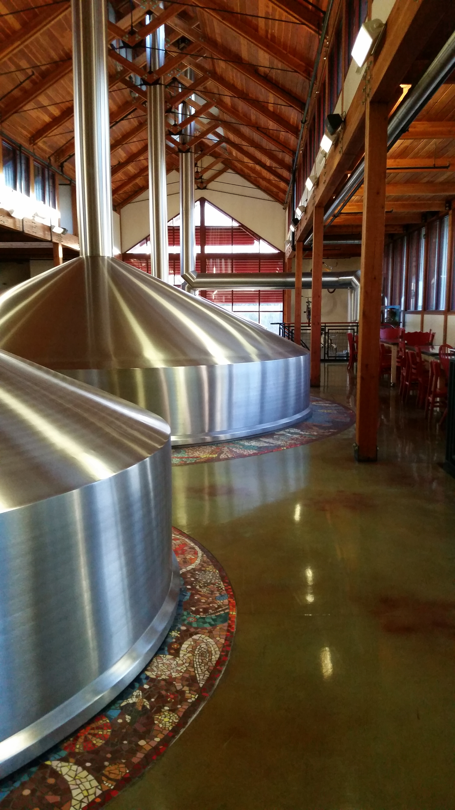
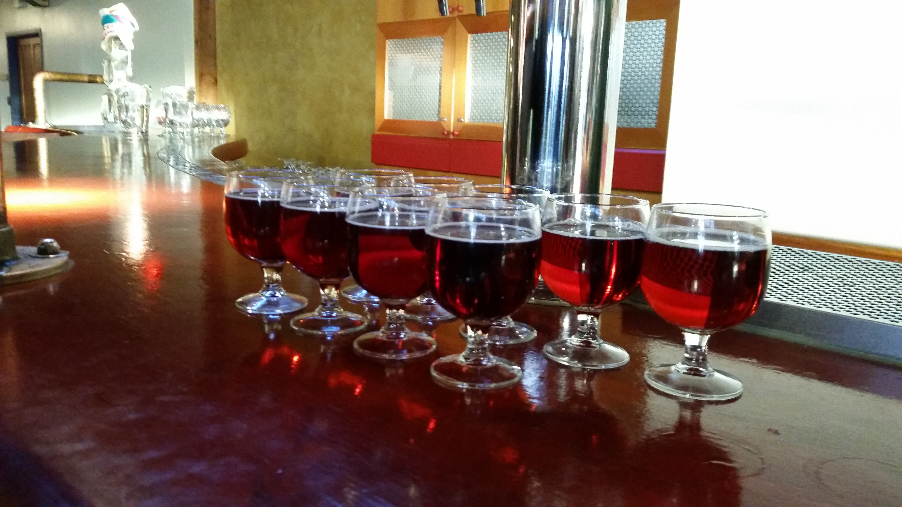
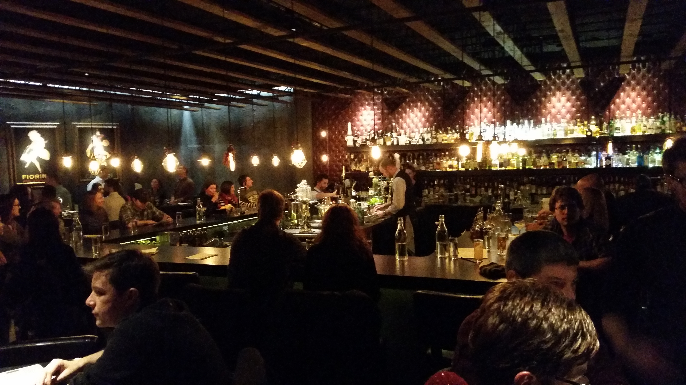
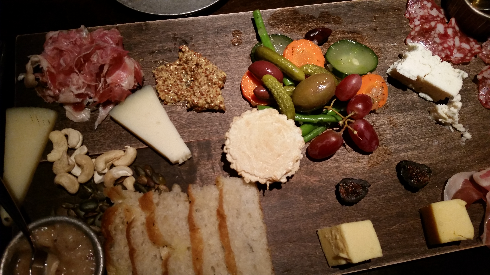
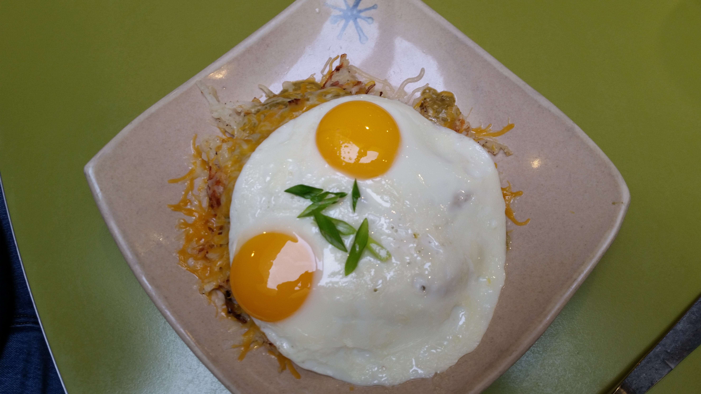

It's Thursday night and you realize you have some free time ... how do you plan an impromptu vacation? That's the situation Frank and I found ourselves in last weekend.

We decided to go do some Christmas shopping and then an evening out in Fort Collins, a city 20 miles away from us. We had an amazing weekend.

We booked a very cool bedroom in an art studio, did a brewery tour of one of the most successful, fun to work places in America, and hung out at a speakeasy inspired bar.

**1. Pick a town or city close to you.**

Pick a town or city big enough to have a few Airbnb's with a good selection of restaurants and a few tourist attractions. A small city of 200,000 will do. A city is great. A college town has lots of potential.

**2. Book an interesting Airbnb.**

We stayed at the Downtown Artery. It's a hub for artists in Northern Colorado. They have artist studios, a recording studio and an art gallery. Plus several bedrooms in the back for visiting musicians. The room was awesome - wood floors, interesting colors,  remodeled bathroom - kind of what you'd expect from a group of artists - and the people were super friendly.

**3. Be a tourist at home.**

If you are like most people, there are probably lots of tourist attractions close to home that you've never checked out because ... well, because they are in your backyard. We have friends that decided to spend a week in Denver (their backyard) seeing the sights they'd never seen.

We decided to tour the New Belgium Brewery and it was a fascinating tour.  The tour was 90 minutes long and the tour guide was not only the happiest guy around but he had lots of great stories. I bet half the tour looked up jobs on the New Belgium website when we were done.

**4. Pick one spot you wouldn't normally go.**

Our favorite dinner spot, Fish, was completely booked, so I pulled out the phone and checked out Yelp. We ended up in Social, a bar styled after speakeasys. The place had lots of atmosphere, great innovative drinks and just a fun vibe. From the outside, the place was just a small sign over some concrete stairs descending into the sidewalk. Inside it was a crowded bar full of people from all walks of life enjoying drinks and appetizers. (All walks of life but all with some money - the drinks were not cheap.) The table behind us first had a couple dressed to go to the opera (or at least what I would think of as clothes for the opera) and when they left they were replaced with a couple dressed in tshirts and tank tops sporting lots of tattoos and piercings.

And most interestingly, the acoustics were awesome. The place was packed (there was a line outside) and yet we could hear each other across the table without shouting.

Where are you going next weekend? Go plan a trip near home and then let us know what you did!
