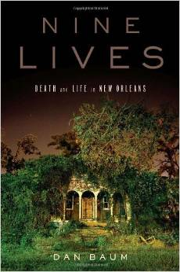

[Nine Lives: Death and Life in New Orleans](http://www.amazon.com/gp/product/038552319X/ref=as_li_tl?ie=UTF8&camp=1789&creative=390957&creativeASIN=038552319X&linkCode=as2&tag=canyoucross-20&linkId=6NFJJEAN3BTP52UL) is the remarkable story of what happened to nine people between Hurricane Betsy and Hurricane Katrina. Their stories are true and bring to life both what it means to live in New Orleans as well as the effect of Hurricane Katrina.

I really enjoyed the book. Once I realized that I had not only met the first person introduced in the book, but that I had shook his hand and had lunch in his backyard, I was hooked! Ronald Lewis, a life long resident of the Lower Ninth Ward, is the founder of the [House of Dance and Feathers](http://houseofdanceandfeathers.org/). We toured the museum during our [Lower Ninth Ward bike tour with Derrick](https://canyoucrossthestreet.com/9th-ward-bicycle-tour-in-new-orleans/).

But while we were there Ronald Lewis didn't tell us that he rode out Hurricane Katrina in a hotel room - one missing a roof and a couple of walls! Or that after the hurricane he lobbied government officials, news reporters and the general public to come help rebuild the Lower Ninth Ward.

In addition to Ronald Lewis, Nine Lives tells the story of a New Orleans police officer, the wife of a Mardi Gras Indian, a band director, a woman from the Lower Ninth Ward who puts herself through college - twice, a transvestite, the city coroner, a wealthy uptown resident and a "black jailbird from the Goose".

Dan Baum, the author, makes all of their stories come alive for the reader. His writing is full of empathy and compassion. I found myself telling everyone around me about the stories I was reading. For example, although you might think the police officer is a bit over zealous at first, when you follow him for days trying to find a place for Marie, a dead woman he finds right after the flood, you understand his desire to take care of his city and its citizens.

Dan Baum is a reporter for the New Yorker. He spent a lot of time in New Orleans right after Hurricane Katrina. He has [pictures of the nine people he wrote about on his blog](http://www.danbaum.com/Nine_Lives/About_Nine_Lives.html).

If you are interested in New Orleans or just like learning about different cultures, you should definitely read [Nine Lives: Death and Life in New Orleans](http://www.amazon.com/gp/product/038552319X/ref=as_li_tl?ie=UTF8&camp=1789&creative=390957&creativeASIN=038552319X&linkCode=as2&tag=canyoucross-20&linkId=6NFJJEAN3BTP52UL).
