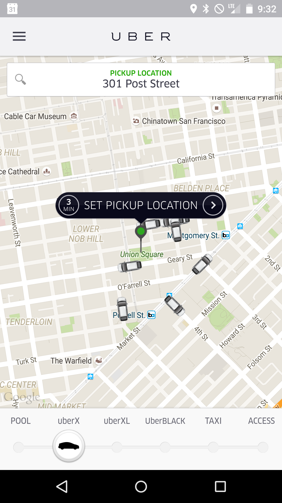

Uber is the new taxi. Uber is to taxis what Airbnb is to hotels. People driving their own cars pick up passengers and give them rides.

My friends in San Francisco are always "ubering it". We'll wrap up the evening and they'll "call an uber". The biggest advantage to me has always seemed that you can just call a car to you, using an app on your phone, much easier than you can find a taxi . And once you've called an Uber, you can track where it is and when it's going to arrive.

In preparation for our trip to the Kentucky Bourbon trail, I wanted to try out Uber. We are staying at an Airbnb in a neighborhood and I don't think taxis will be easy to find.

I decided San Francisco would be the place to try it out. I was there on a business trip and everyone I know in San Francisco seems to use Uber.

I went to the [Uber website](http://uber.com) and signed up for an account. I figured it would be easier to enter my profile information and my credit card number on my computer than on my phone.

I installed the app on my phone. I tried getting an estimate for what a ride to the airport would cost and it told me to check out the website for an idea of what rides in San Francisco cost, so I gave up on that.

Then I had a few minutes of anxiety when I realized I had a whole bunch of questions.

- Do you sit in the front seat or the back seat of an uber? (Either but most people sit in the back.)
- What's the difference between UberPool, UberX, UberXL, Uber Black, SUV and Lux? (That's in order of cheapest to most expensive. UberPool is a carpooling option, UberX is like a taxi ride in someone's personal car, UberXL is a bigger car, Uber Black is like a car service - fancier car, etc.)
- How do you know how much it will cost in advance? (No idea.)

Then I checked out of my hotel and went to the street.  When I opened the app, I saw a map and you can see all the little Uber cars driving around near you.

I confirmed my pickup location. This turned out to be the only (very slightly) tricky part. Uber knows where you are from your phone's GPS and puts a pin on the map. My pin showed me in the middle of Union Square instead of in front of my hotel door, so I had to move the pin to an approximation of where I thought I was. (All the while I'm eyeing the line of taxis in the street in front of me, but I thought, no, I'm trying this out before we go to Kentucky.)

After I confirmed my pickup location, it asked me where I wanted to go.

It then told me at least 3 times that there was a surge in price due to high demand. I even had to type in the surge amount (1.6x) to confirm that I still wanted to use Uber.

I received a picture of the car, the car model name and license plate number as well as a picture of my driver and I could watch my car drive up on the map.

When the car showed up, everything matched, and the driver confirmed my name too.

Once I got in the car, it was very much like a taxi. My driver turned out to be a sushi chef who gives rides on Uber on his day off for more cash.

When I got out of the car at the airport, I immediately got a notice in the Uber app of how much my ride had cost. I still don't know how they calculated the price but it seemed comparable to what I've paid cabs in the past for that same ride, even with the surge pricing.

All in all, it was a good experience. To me the key was the great app. I've often wished cab companies I've dealt with had a decent app.

*If you decide to try [Uber](http://www.uber.com) for the first time, you can use the code uberstormyinvite for a free $20 ride. If you do so, I will also get a free $20 ride the next time I use Uber.*
