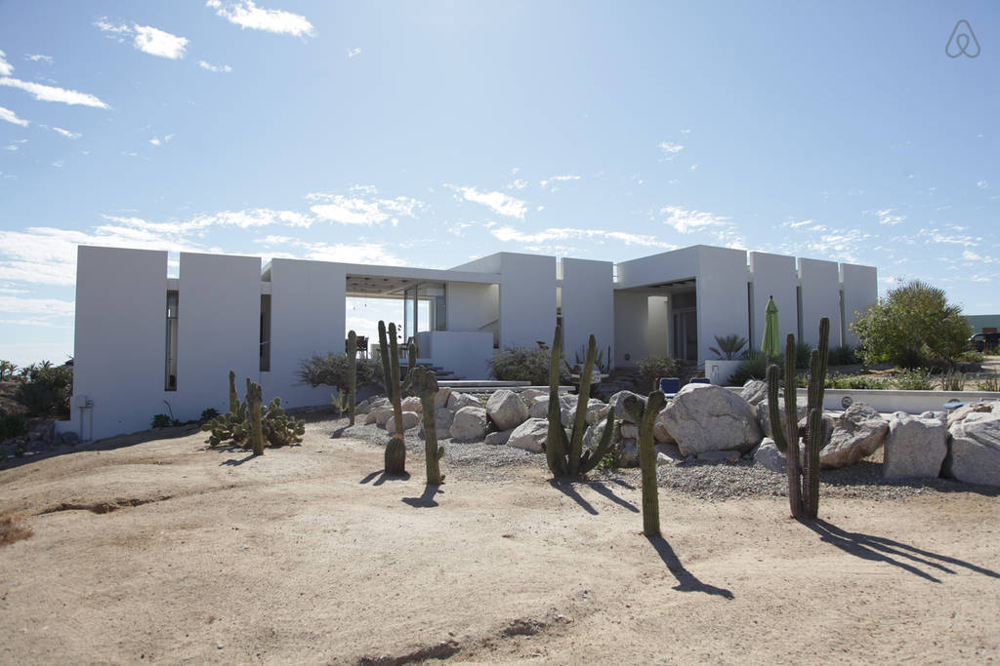
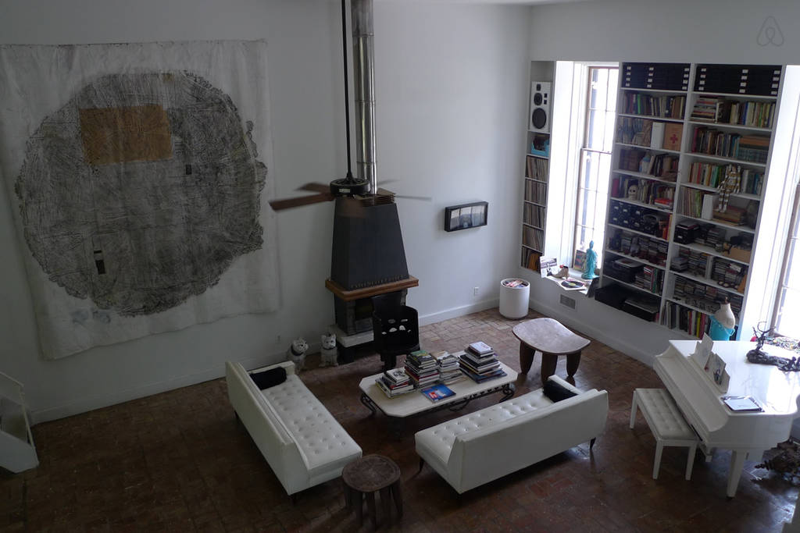

*If you’ve never booked on Airbnb before, you can get a $35 credit by using [our referral code](http://www.airbnb.com/c/speters41).*

Last year we rented this gorgeous home in Mexico. On a hill, with three private rooms, views of the ocean and a 5 minute walk to the beach. And a private pool and rooftop patio. For much less than we could have gotten 3 hotel rooms.

For three years in a row we rented the most awesome house in New Orleans. Right by the best jazz bars, decorated by an artist and super light and spacious.

How do we find these great vacation homes? Through sites like [Airbnb](http://airbnb.com) and [VRBO](http://vrbo.com) and a lot of patience.

Here are the steps I take:

1. **Location**. Figure out where you want to be. This might seem obvious, but if you are going to New Orleans, do you want to be in the French Quarter or close to Frenchmen’s Street? Or would you rather stay in the quieter Garden District? If you are going to Costa Rica, which coast? Which town? Which beach? While being flexible will give you more choices, it will probably give you too many choices and make the process much harder later.
2. **Requirements**. Create your initial list of requirements. Start with the obvious and realize you will probably add to these as you learn more. I start with number of bedrooms and bathrooms and “entire home”. There are also location specific requirements. For Costa Rica, I had to add AC as a requirement. In New Orleans, when I asked about AC, I was told “This is New Orleans. Of course we have AC! Are you crazy?” In Berlin, they count all rooms in the room count, so you have to figure out how many are bedrooms vs living rooms.
3. **Look and look and look some more**. I search on Airbnb and VRBO. (HomeAway bought VRBO so as far as I can tell, they have the same properties.) I only consider properties with at least a handful of reviews and at least 4 stars. I consider the reviews a way of validating the listings and if the place has less than 4 stars, I think the owners should adjust the description until it matches people’s expectations. Poor reviews don’t mean a bad property — it means people didn’t get what they expected. (There’s a place in New Orleans that tells you that you have to use a 2x4 to keep the door closed and that it’s in the middle of being remodeled. Some people don’t mind that for a place that’s under a $100/night where most places go for $250. Know what you are getting and you’ll be happier!)
4. **Keep a list**. Both sites now let you create wish lists that you can share with your friends. You can all add properties and comment on the places on the list. In addition to the lists on Airbnb and VRBO, when planning a vacation, I keep my own list or spreadsheet. That way I can track which ones meet which requirements and why I rejected certain places even though they keep showing up in the search and looking perfect. Also, many people list their properties on both sites. With a spreadsheet you can keep track of that.
5. **Read *all* the reviews**. I think the best way to learn about the property is to read all the reviews every where it’s listed. Travelers will often tell you what’s great about the property and they’ll mention things that might not be so great (like there’s a sky light over the bed with no curtains.) They will often give you a more accurate description of where the property is. Sometimes the owner will say it’s within walking distance of an attraction and the reviews will tell you it’s a 25 minute walk. You can also learn interesting things that lead to additional requirements. While reading reviews for properties in Costa Rica, I learned that the area was experiencing a drought and most of the town lost water from late afternoon to early morning. Some properties had their own water tanks and wells, some had no water at all during those hours. Remember that unless they had a bad trip, most people are reluctant to say anything bad, so they will be saying negative things in the nicest way possible.
6. **Reach out to the owners.** Tell them what you like about their place and ask your questions. Don’t be afraid to ask them very specific questions about anything you are wondering about. For example, I always ask about bed sizes. I found one place that listed all beds as “matrimonial” which turned out to refer to doubles, not queen sized beds. One exception — it’s not usually considered polite to ask the street address — instead ask for the closest intersection.
7. **Figure out how you want to book.** On Airbnb, you book directly through Airbnb. As the renter, you pay the entire price up front, including any cleaning fee and Airbnb’s fee. Airbnb pays the owner during your stay. VRBO/Homeaway also offers that option (although they’ve recently added more fees) but VRBO owners will often offer you a discount to book directly with them. If you choose to do so, be sure you carefully research the property, the owner and payment methods. Also, consider different scenarios. A place that I had booked on Airbnb once sold. Airbnb helped me find an equivalent place.
8. **Enjoy your vacation!** Remember it’s not a hotel. It’s someone’s home or second property. Treat it well, love its quirks and enjoy getting to spend your vacation in a real neighborhood.
9. **Write a review for the property!** I think the rental by owner sites work so well because of the review system. Take a moment to write an accurate review about what you loved and what you think other renters might want to know. You can also give private feedback to the owner if you think they should update their description. Your review will help both the owner and future renters.

If you’ve never booked on Airbnb before, you can get a $35 credit by using [our referral code](http://www.airbnb.com/c/speters41).
