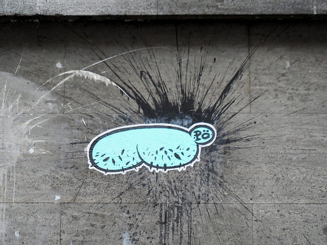
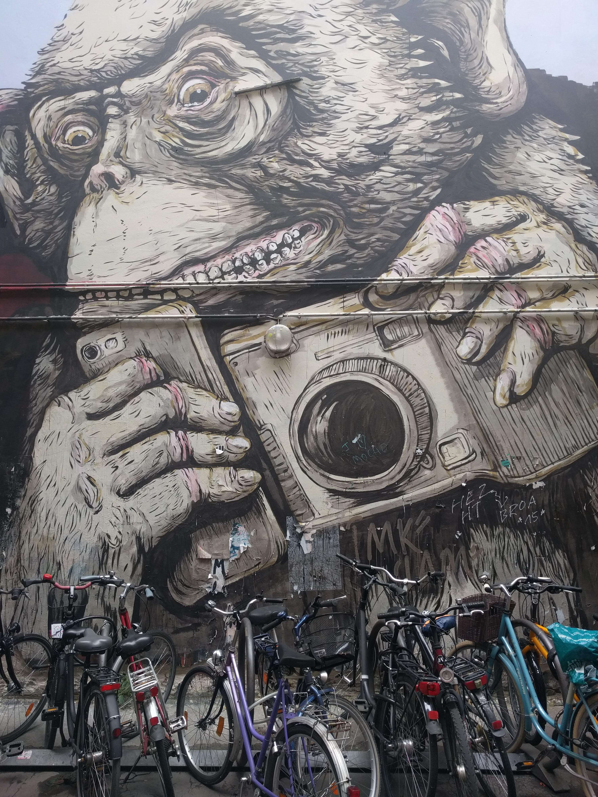
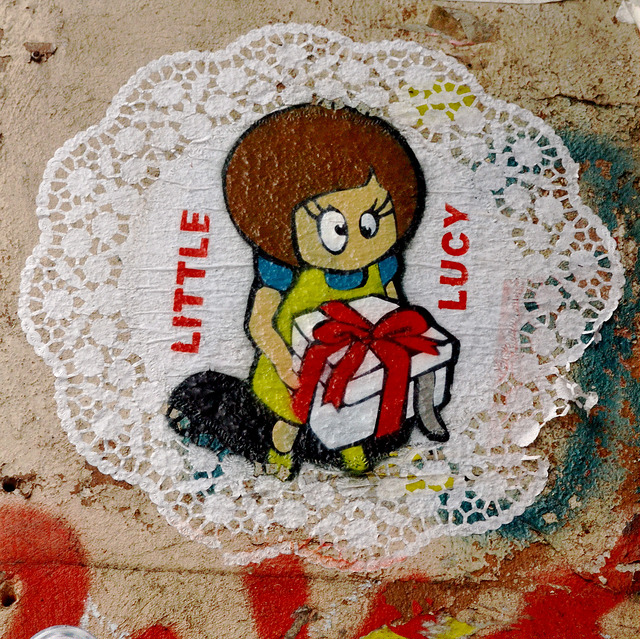
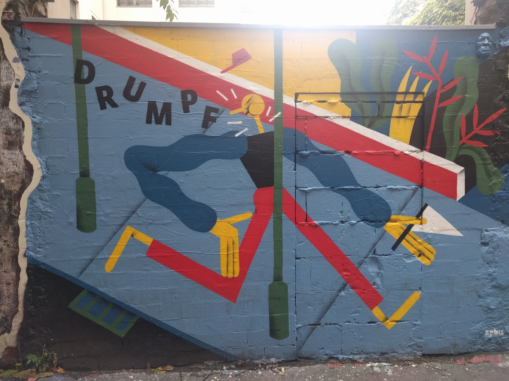
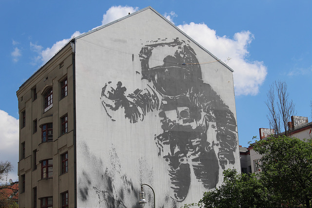
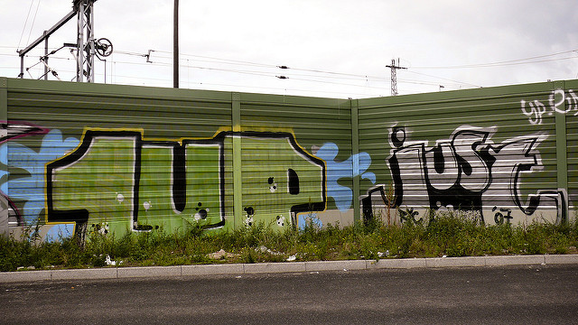
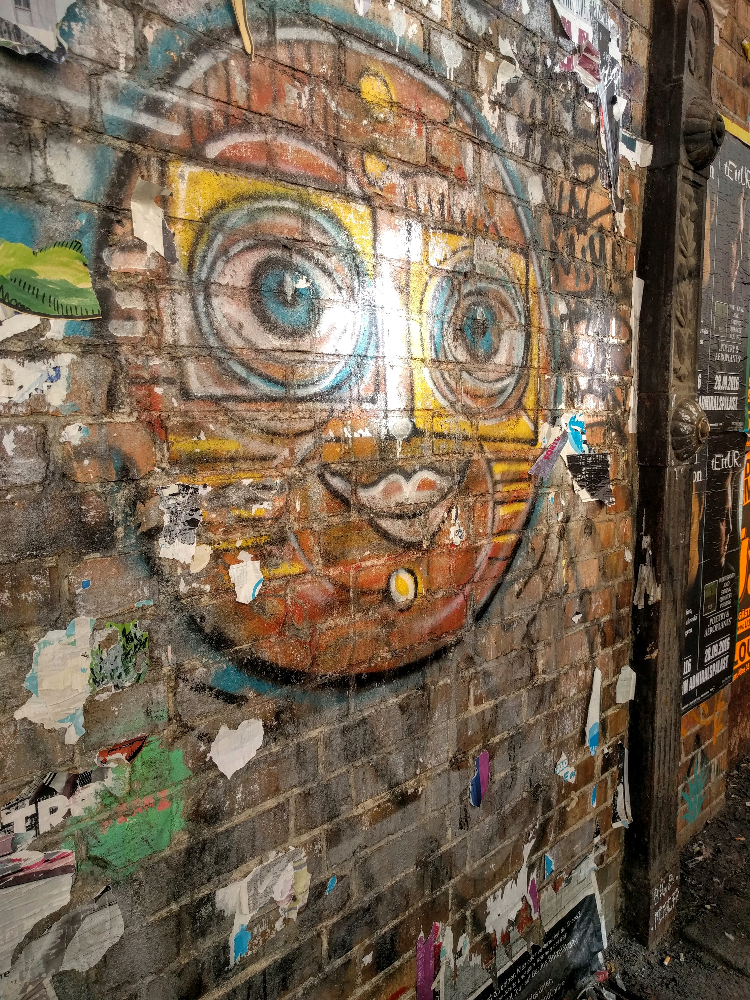

Ever wondered who street artists and graffiti artists are? Or what the difference is? Or why they do it? We went on an [Alternative Berlin](http://alternativeberlin.com/) tour with Tim that taught us all that and more.

#### What's the difference between graffiti and street art?

Graffiti is a signature and there are 3 types. One is simply a written word or two, called a tag. You see these all over and it just looks like someone wrote with paint. The second looks more like block letters and is called a throw-up. The third is still a signature but much more stylized. It’s sometimes called wild style. An example is the bum painted by a French artist, Pö. Upon arriving in Berlin, a French street artist was amused to learn that her name means bum, as in human buttocks. So she made her signature a caricature of a bum and puts those all around Berlin.

Street art is valued by the quality of the art, by its size and also by how well it uses the space it has. We saw a painting of a monkey holding a camera and a phone - depicting a tourist. It was both very large and it used its space very well - the street light on the wall has now become the flash on the camera it’s holding.

Graffiti and street art also increase in status if they are in hard to get spots - high spots, "heaven" art, are the most respected.

#### Is graffiti legal?

For the most part, graffiti and street are not legal unless the wall is a legal wall and the owner has given permission to paint there.

For example, the wall with the tourist monkey is a wall dedicated to street art and run by an organization. You have to submit your idea and get selected before you can paint on it. Most works get painted over in a matter of a couple of weeks but the one of the monkey depicting a tourist had been there for months. Something larger that uses the space even better will have to be proposed before they paint over it.

Painting on someone else’s building is illegal, and in Berlin you can tell what organizations always prosecute - like the company Bio - because their walls are clean. Other buildings whose owners either don’t care or who aren’t as diligent, are covered with graffiti and art. The threat of getting caught and how the fines are evaluated affects the type of art that is done. In Berlin, the bigger the painting and the more costly it is to clean up (so for example, how high up it is), the more expensive it is. The second factor to consider is the form. In Berlin, posters glued to the wall are a 40 euro fine, much cheaper than the fine for painting on the wall. That encourages people to paint on paper and glue it. The longer you are painting, the more chance you will get caught. Smaller paintings are faster. Another way to do something fast is to paint it at home on paper and then bring it out and paste it to the wall. One famous artist named [El Bocho](http://www.streetartbln.com/street-artist-el-bocho/) uses this method paints pictures of Little Lucy, an old Czechoslovakia cartoon character, killing her cat in various ways. His paintings became so popular that people started pulling them off the walls to keep or to sell, so the artist started painting them on large dollies. With their perforated edges they are hard to pull off the wall intact.

There are some unspoken rules to street art. For example, you never paint over someone’s art who is better than you. As an example, our tour guide showed us a really intrinsic work by a Swedish street artist who had died a few weeks earlier. Someone had put their tag over top of it, ruining it, and that was an offense.

We did see one example where someone had put their art over another piece of art in a way that was accepted. There was a painting making fun of the political candidate Trump. His family name came from the German family name Drumpf and in the painting he is portrayed a stick figure running into a lamp post with a sensitive part of his anatomy first. The painting is by a couple. If you look at the top right, there is a cast of a face. This is the face of a different artists. He makes casts of his face with different expressions and then paints them to match other art work and attaches his face molds to the other art, in essence creating a derivative work.

Not all the street art in Berlin is illegal. Not only is there the alley with commissioned works, but some of the big works around town were also commissioned for various festivals or events. One of the most famous ones is the astronaut.

#### How did they get it up there?

In Berlin, you see a lot of graffiti and street art on the sides of very tall buildings. The illegal, non-commissioned ones are done in several ways. One way is to lean over the side of the building, usually with a buddy hanging onto your legs or feet. The second is to repel down the side of the buildings painting in one long line - it’s harder the wider your art. We saw one group in particular that did this a lot. A third is to use a method, such as paint in fire extinguisher, that will reach a long ways.

Another group we heard a lot about and we saw their tags in several places is a group called [1Up](http://www.urbanartcore.eu/1up-graffiti-one-united-power/). One of the things they do is paint entire trains. They go in with a crew. One person’s job is to prop the train doors open to keep it from moving. They don’t pull the emergency alarm. While the door is propped open, a whole crew wearing scarves over their faces comes and paints the outside of the train from top to bottom - usually in about 4 minutes. At the same time, one member goes onto the train with a video camera and asks passengers on the train what they think about this. You can watch [1Up's videos on YouTube](https://www.youtube.com/watch?v=DoTePJKtw5Q). Based on interviews with the passengers, our tour guide concluded that at least half of all Berliners are very tolerant of street art and graffiti. Another stunt the group has pulled is putting a table and chairs on the top of a high speed train and having someone in a waiter uniform serve a seated person a glass of wine.

A street artist named [Just](http://1just.de/) is famous not only for his art but also for his ability to get out of trouble. At one point, the cops caught him in the act of painting "Just" on the side of the building - with a fire extinguisher full of paint - and he manages to convince them that he is doing it as part of a Nike campaign. He produces an official looking document complete with fake government seals. The cops believe him and even ask to stay and watch him complete it. So complete it he does: “Just do it”. Another time he is arrested and he is charged not just with the vandalism from the piece he’d been working on but all the other pieces he’s done around town. Given the number and size of his pieces of work, he’s looking a a pretty hefty fine. He tells them that “Just” is not just his signature, it’s a social movement and anybody can join. He backs this up with his website which contains many different projects and causes he cares about. He is cleared off all the charges except the one they actually caught him doing.

In Berlin you also see a lot of works from artists from around the world. When a street artist visits Berlin, they often want to leave a work on the wall. Sometimes they’ll paint it and sometimes they’ll bring it on paper and paste it up.

If you are interested in learning about street art in Berlin, I recommend the Alternative Tour to Berlin. They also have a workshop where you can try your hand at creating your own art using street art techniques.

