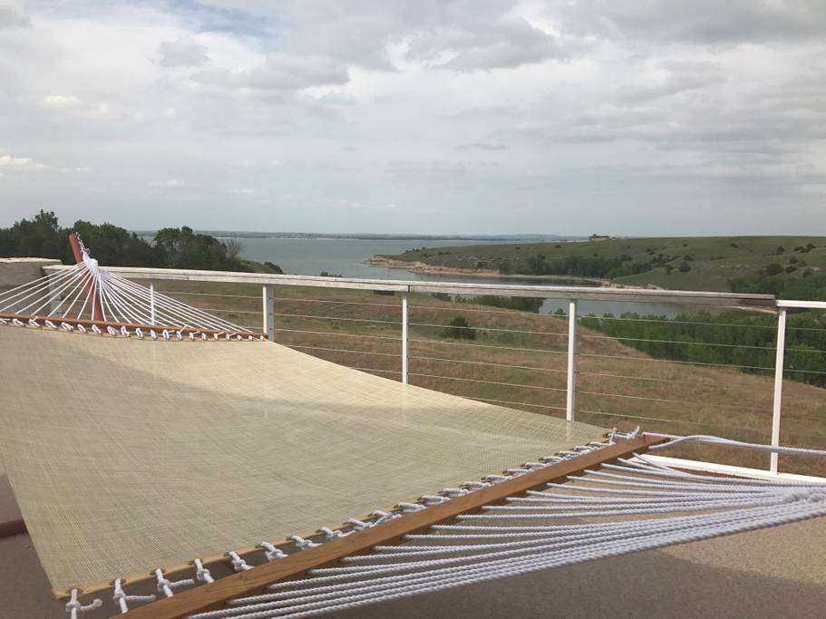

Staying at Airbnb homes provides some fabulous travel experiences. People share some stunning homes in some awesome locations at some very reasonable rates. We’ve had great experiences renting large home with friends. We also rent out a home and have learned a lot about what makes a good experience for us as hosts. Our best experiences have come from following these steps.

**Read all the information.** Read everything you can on the place you are interested in. Read the description, check out the bed layouts, look at the house rules, study all the reviews. **Hosts know that good reviews will come if guests get what they expect.** A good host will make sure that they accurately describe their house. They don’t want you to show up expecting a mansion and find a dilapidated house. Having just one more booking would not be worth the bad review. Making sure guests get what they expect is the best advice Airbnb gave me. If you read our listing, I make sure the loud trains are mentioned in every major section so that you can’t miss it. When I’m traveling, I read all the info, and if we are traveling with others, I ask them to read it all too. If there are not many reviews on Airbnb, I search for the place on other hosting sites and read the reviews there too. For example, [this gorgeous home in Mexico](https://www.airbnb.com/rooms/803102) didn’t have many Airbnb reviews when we stayed there but I found in on VRBO as well.

**Communicate with your host.** Let them know what time of day you are arriving and when you plan to leave, so they can plan their day around it. Especially if your host has self checkin, send them a message when you get there saying, “Arrived! The place looks great!” That way they can relax knowing you made it, your door code worked and you don’t have any questions. On the day guests check in to our place, I am careful to have my phone nearby at all times until they tell me they are checked in. When you check out, send them a message saying you are leaving and let them know of anything you saw that they might want to pay attention to.

**Ask for exceptions early.** If you are going to want an early checkin or late checkout, ask when you buy your plane ticket, not half an hour before checkout. Good hosts will try to accommodate you but if you ask at the last minute, you are probably asking them to change their plans or re-coordinate with their cleaning service.

**Pick up after yourself.** You don’t need to scrub the house, but make sure you put all the dirty dishes in the dishwasher and wipe off the counters. Unlike a hotel, either the owner, or someone they probably know really well, will be the person to walk in and pick up after you. Then they are going to leave you a review! On the other hand, I stayed at an apartment in Mountain View that had a horrendous checkout list. I had to wash the sheets among many other things. When I reported that I’d done it all, the host wrote back and said I was the only person who’d ever followed those rules! I decided next time I’d tell hosts if I thought the rules were unreasonable. But usually rules are posted ahead of time so you can decide whether to stay there or not.

**Don’t be afraid to report problems.** I’d much rather know that the hair dryer broke (even if you broke it), than find out from the next guest that it doesn’t work. I’ve dealt everything from major leaks in the roof to broken windows (the neighbors called me too on that one!) Also, it’s easier for your host to find a repair person during the day than after you’ve been suffering without AC for 5 hours, you’re grouchy and all the AC repair companies have closed for the evening. I’ve also been in an Airbnb when the roof started leaking so bad, plaster fell down from the ceiling. We were able to help by letting them know how bad the problem was.

**Communicate through the app or clearly identify yourself.**As a host, I often get different people in a large group of people texting me. It helps if they tell me who they are.

**Give the right feedback in the right place.** When you leave feedback for your Airbnb stay you get to leave 3 types of feedback:

1. Private message. If I have suggestions I want to give the host, I always just send them a private message. Things from the faucet wasn’t working right to it would be really nice to have some more towels. Any thing I didn’t like about the house that can be easily fixed, I put in this section.
2. Rating. The rating is really important for hosts. As long as everything was as I expected and the host communicated well, I leave a 5 star rating.
3. Public feedback. This is where I try to help reinforce the listing if it was accurate and leave any additional feedback or helpful tips. I also try to answer anything I wondered about before I got there. Again, this part is super important to hosts, so I try to be positive and honest.

What tips do you have for me and others staying at Airbnbs?
