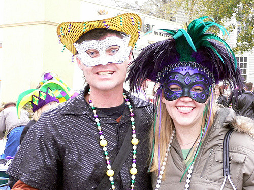
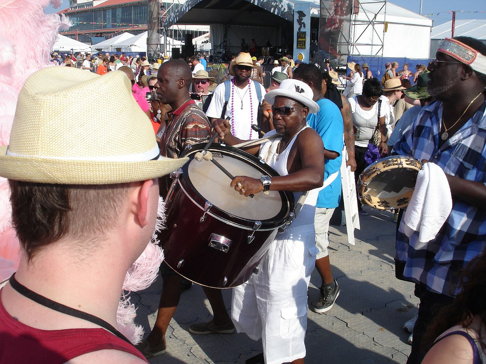
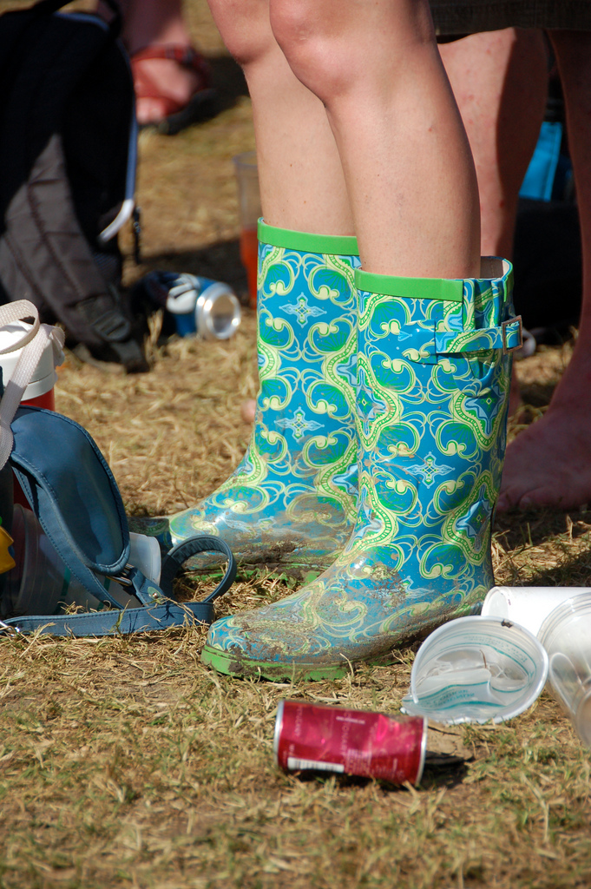
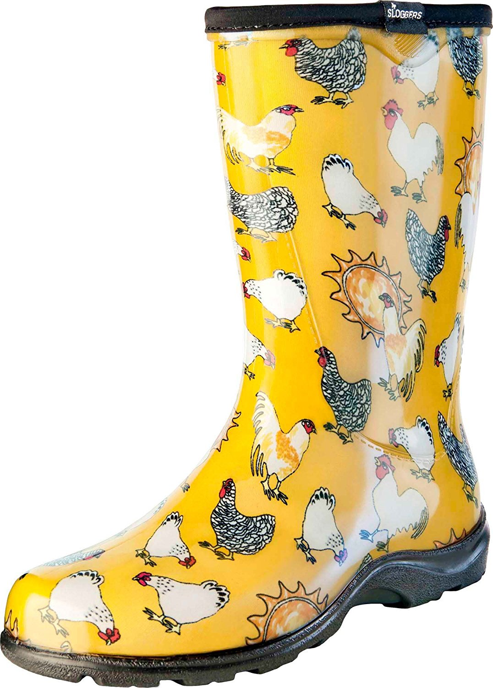
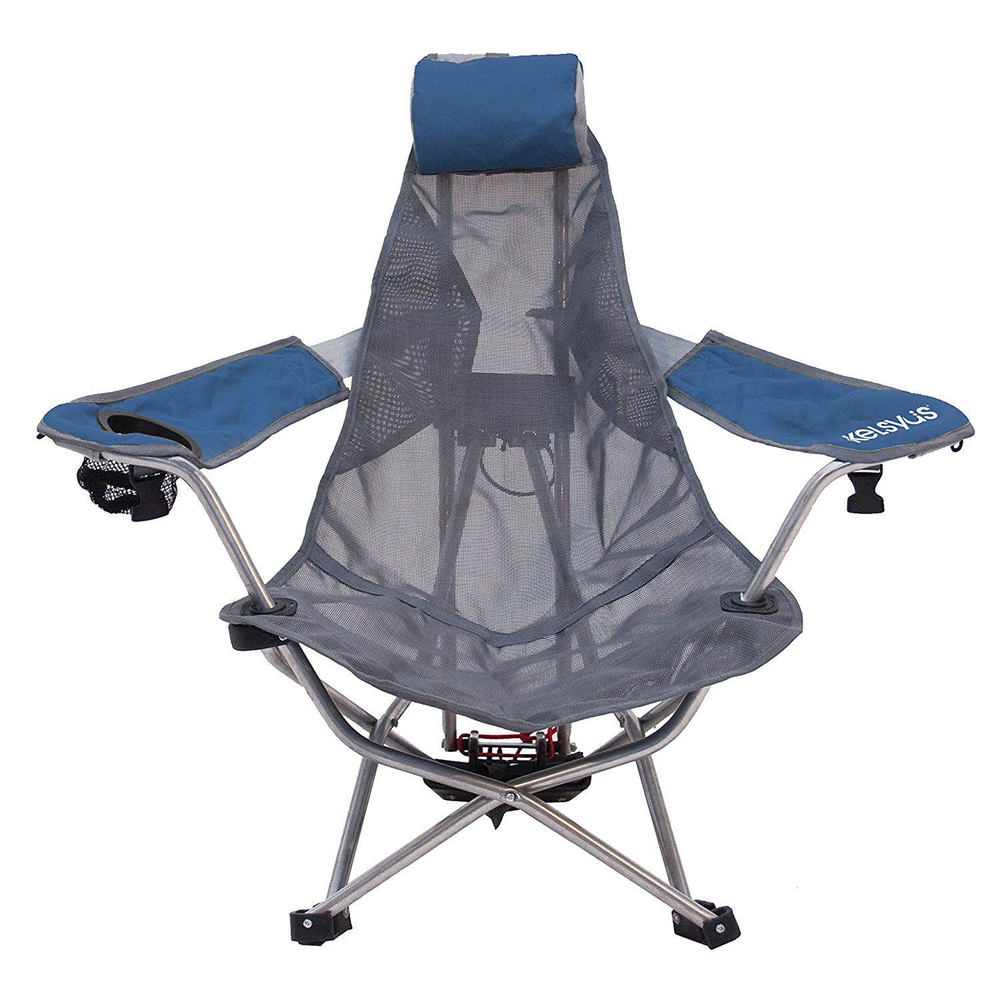

Every year there is a huge event called the [New Orleans Jazz & Heritage Festival](http://www.nojazzfest.com). This 2 weekend long event brings in thousands of visitors and top notch music from Aerosmith to Jimmy Buffett to Stevie Wonder to ... thousands of world class musicians.

What should you bring besides your love for music? Be prepared to be hot. And be prepared for rain. And if it rains, it will be hot, muddy and wet! But still fun!

1. **Hats**. This is New Orleans, bring that funky, crazy hat you bought on vacation 5 years ago and then never dared to wear again. Now's the time! While you are at it, bring at least one hat for rain and one hat for sun. And maybe just one to be crazy in!

- **Boots.** The Jazz Fest is famous for the crazy boots people wear. If it rains, it's muddy, so bring a good pair of rain boots. The crazier the better.
   
  
  
- **Bikes.** Bikes are the easiest way to get to Jazz Fest. No waiting for a cab, no walking long distances in the heat.
  ")
- Chairs or a blanket. You can dance all day or you can bring a blanket or a small chair to sit on. We like [these](https://amzn.to/2wJRPz2) because they are light, can be carried like backpacks and sit low to the ground so you don't block anyone's view.
  
- Your music plan. If there are musicians you really want to see, make sure you've checked out the [official schedule](http://www.nojazzfest.com/schedule/#/) and get there early to find a good spot!
And your love for people and music! And good food and drinks!
