Palisade  is known for its peaches and wineries in some of the most beautiful scenery in the world.

Every year some of the best peaches in the world come out of Colorado - all from small family owned orchards. In addition, many small, family owned wineries have opened over the years. The combination makes for a delicious, fun, family friendly vacation.

We recently decided to do a peach tasting tour. We stopped at each peach orchard and bought a peach or two. Actually, when they heard what we were doing, many of the orchards gave us free peaches. Some even cut open a peach on the spot for us to taste. We had to stop after about 8 orchards as we became overwhelmed with the number of amazing orchards!

We put each peach in a labeled paper bag to keep them straight.

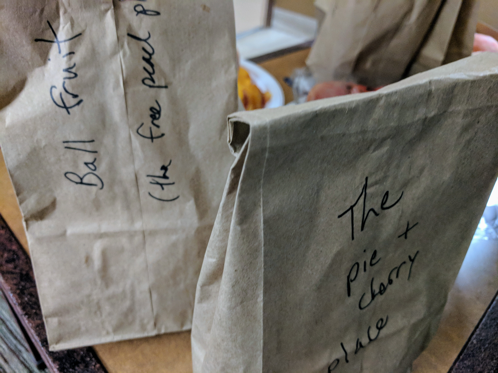

Then that night at our hotel, we cut each one open and tried them. We returned the next day to our favorites and bought several boxes.

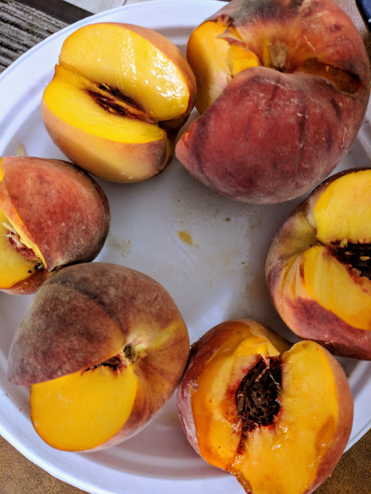
**What route to take?**

We followed the [Palisade Fruit and Wine Byway](https://visitpalisade.com/portfolio-item/fruit-wine-trail/). In the car we did the whole thing. While on bikes, we stayed in town although many people were doing the longer loop on bikes. (Hint: you can rent electric bikes in town to help you get up the big hill.)

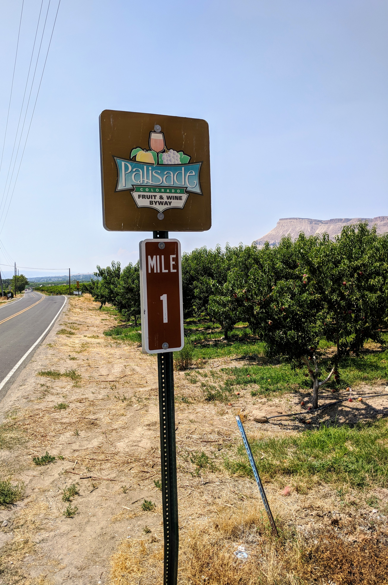
**When to go?**

If you want to bike around the beautiful countryside and visit wineries, any time in the summer is great. If you want to catch the peaches during harvest season, July-September is the best time to go. (Hint: Different varieties of peaches are harvested at different times, so you'll need to go multiple times to taste them all!)

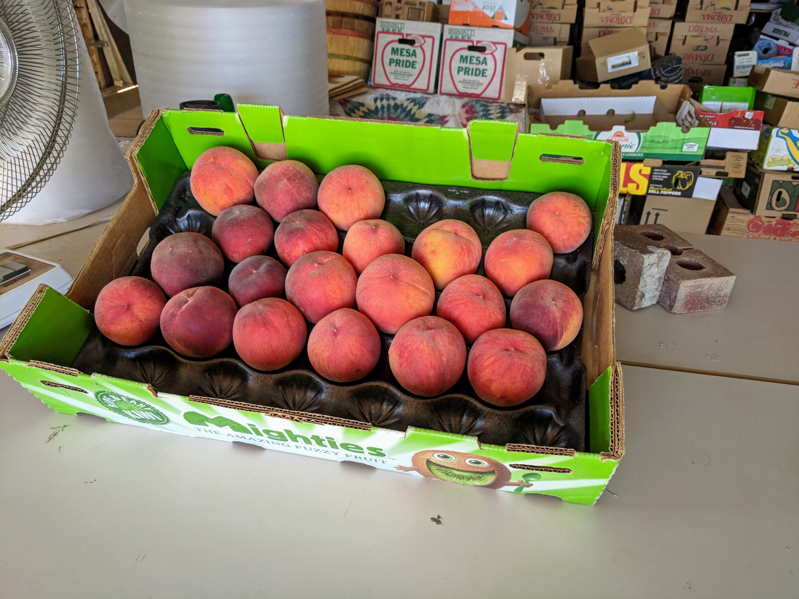

The [Palisade Peach Festival](https://palisadepeachfest.com/) is held in August every year. There is music, chef demos and kid activities.

**How to get around?**

You can bike or drive around Palisade.

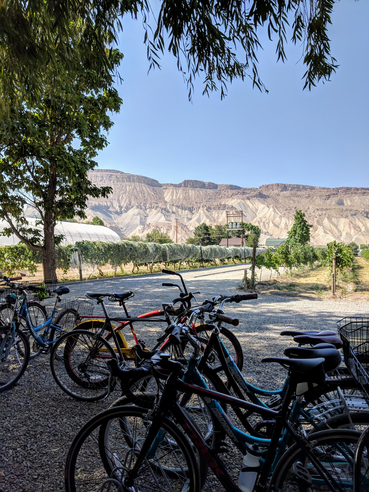

The scenery is beautiful whether you bike or drive. If you bike, either plan for a full day, stay close to town or rent an electric bike. We biked around the first day and then returned the second day in the car for our wine and peach purchases.

**Where to stay?**

Camp, rent a short term vacation rental or stay in a hotel.

There is a beautiful campground just outside of town - a very short bike ride - with some amazing views of the river. We stayed in a spot overlooking the river.

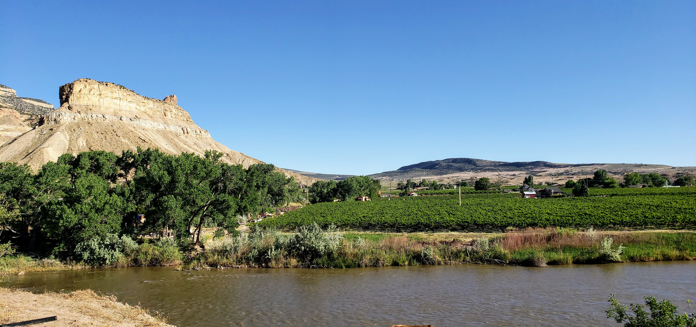

There are quite a few short term rentals in town. You can rent everything from a room to a 5 bedroom house through Airbnb. Several places come with bikes.

There are several hotels in town and several economy hotels near by. We stayed at the Best Western in Clifton which was right off the far end of the Palisade Fruit and Wine Bywater. The location was not scenic but it was very central and the hotel was great.

**Which wineries?**

You should try them all! A couple of our favorites are Colterris Winery (both the tasting room near the campground in town and the one at the Overlook), Maison La Belle Vie and, although not a winery, Talbott's Cider. I've been wishing for some more [ColoMosas](https://talbottsciderco.com/our-cider/colomosa/) all summer.

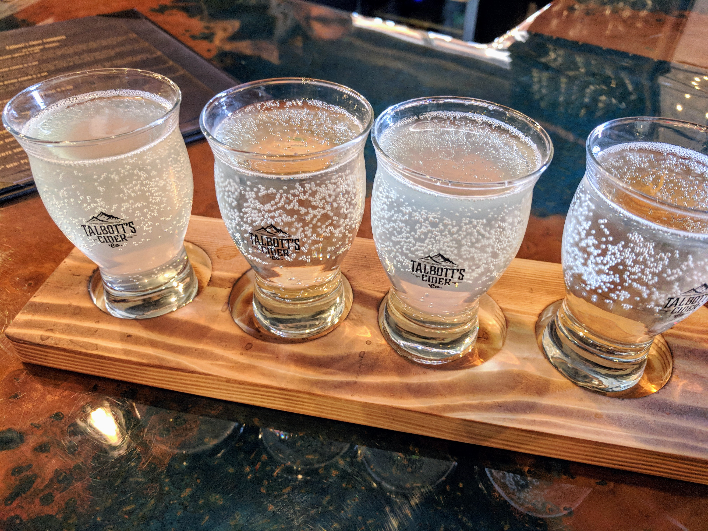
**Which peach orchards?**

Drive around and stop at any that look interesting! We loved Z's, Cathy's and the Green Barn U-Pick.

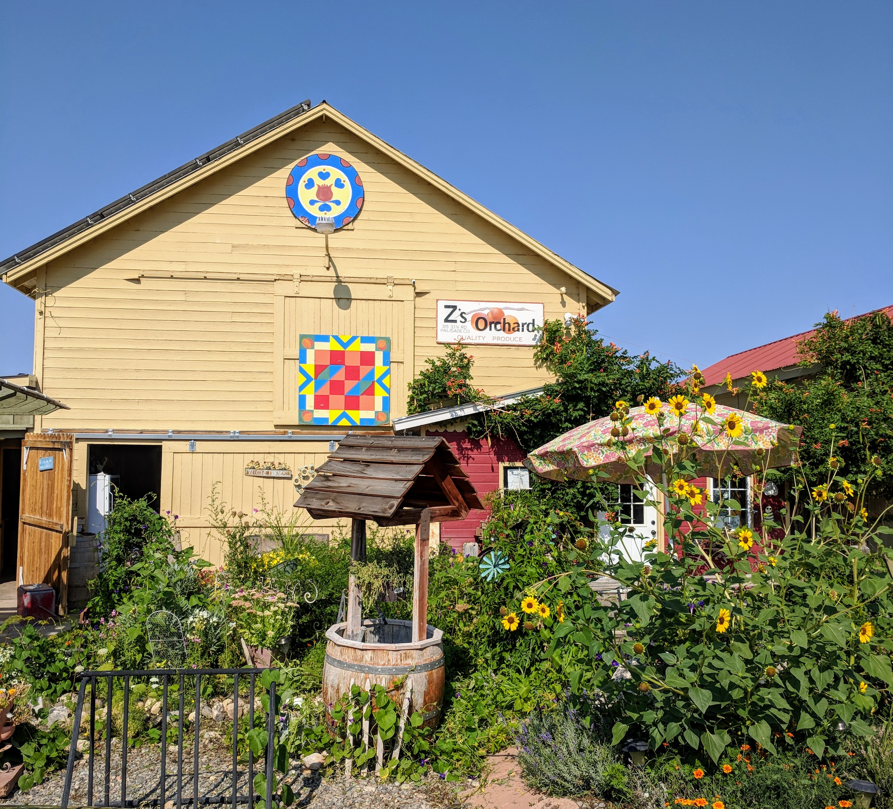
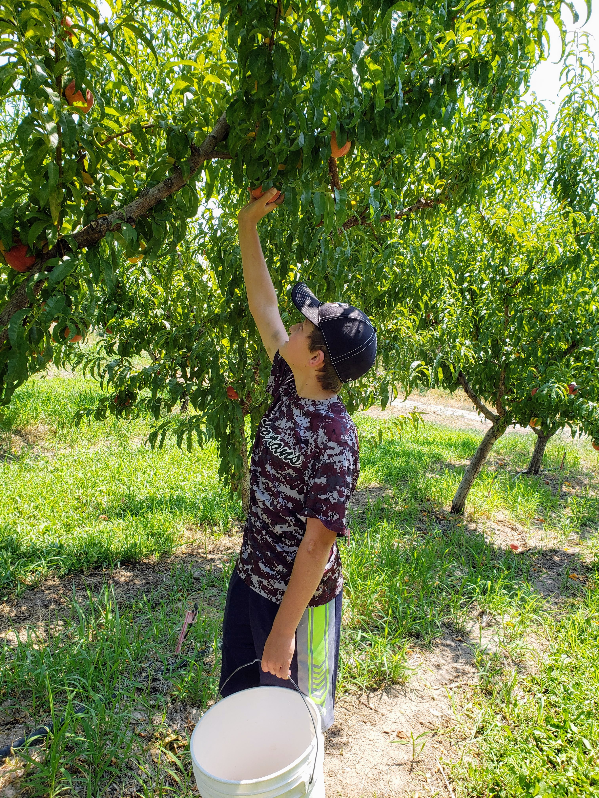
**Where to eat?**

There are several great restaurants in Palisade. Be sure to check out the roasted potato salad at Palisade Brewing Company as well as all the great snacks at the wineries!

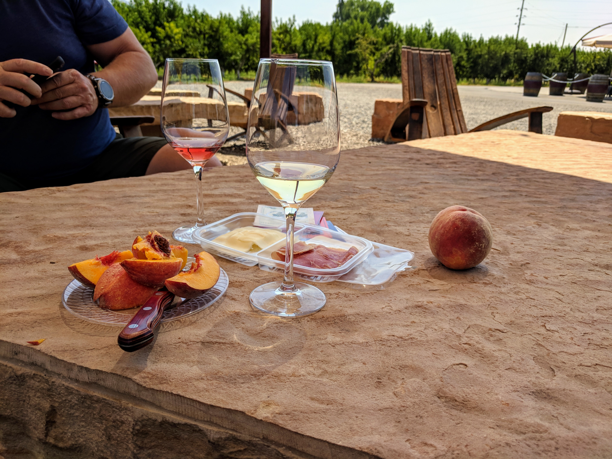

If you go, just follow the signs for the peaches!

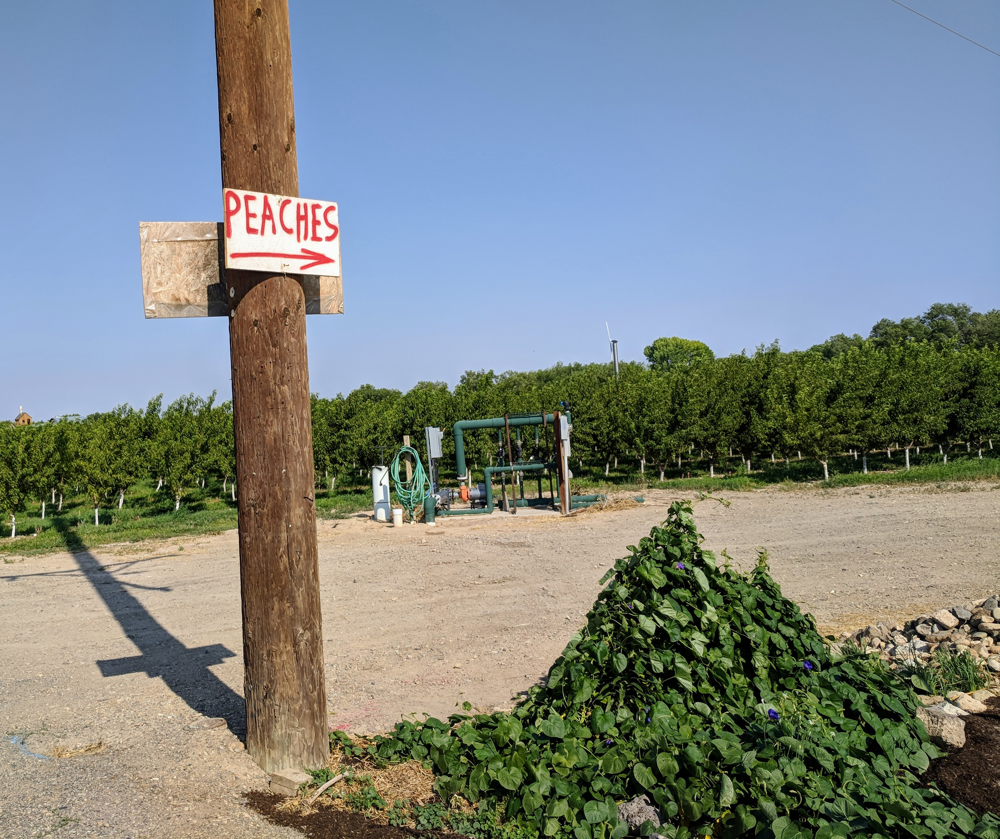
