My 18-year-old son and I set out to bike across South Korea. I've always wanted to go on a biking vacation - ever since college when my roommates and I were going to bike across Scotland together, and then everyone got jobs instead. My son wanted a vacation without rigid plans, with room to explore. I had a business trip to Hong Kong, so after some research, we decided that South Korea would be an great place for a bike trip. (Japan and Taiwan also ranked high, but Korea had an extensive dedicated bike trail network.)

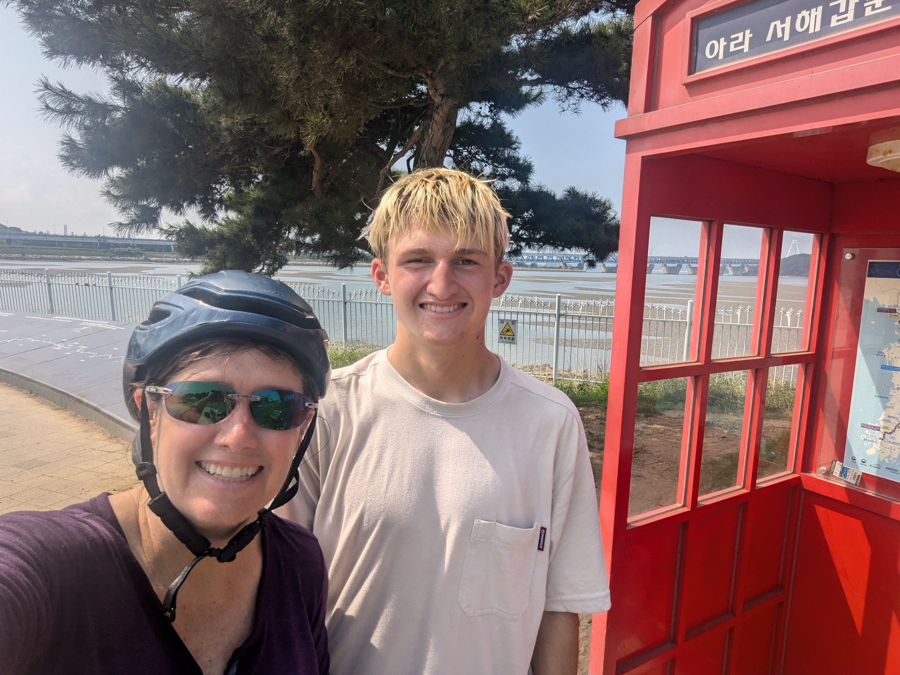

We had an awesome adventure - I'll share the highlights with you. If there is one thing I would do differently, it would be the time of year. We were constrained by my business trip and my son's school schedule, but if you have a choice I would highly recommend not going in mid-August! It was very hot, and that ultimately cut our trip short.

We encountered incredibly friendly people, like bikers stopping to give us ice-cold waters, and locals helping us find hotels. The food was amazing. For the most part, we ordered by pointing or just indicating we wanted some food. We were never disappointed. We even appreciated the convenience store food which was new to us - wrapped rice with various toppings for the most part.

## Day-by-Day Journey

### Day 1: Seoul to the Trail

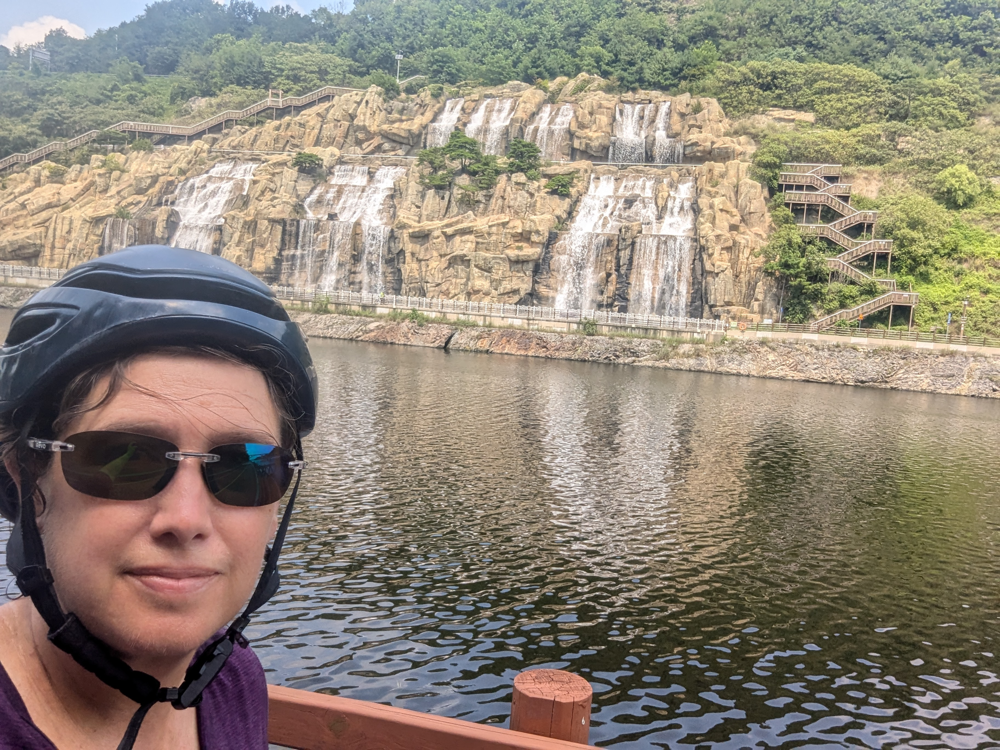

Yesterday was mileage day! We flew across the ocean on a 12-hour long flight, got our bikes, and hit the trail!

The trail is fantastic. Lots of extremely friendly bikers. One even stopped my 18yo because he saw his water bottle was empty and gave him an ice-cold bottle. Extremely well-marked bike lanes including roundabouts, speed limits, and sirens that either talk to you in Korean or blare at you if you exceed the speed limit. Everyone shouted encouraging things at us on the hills. At least it sounded encouraging!

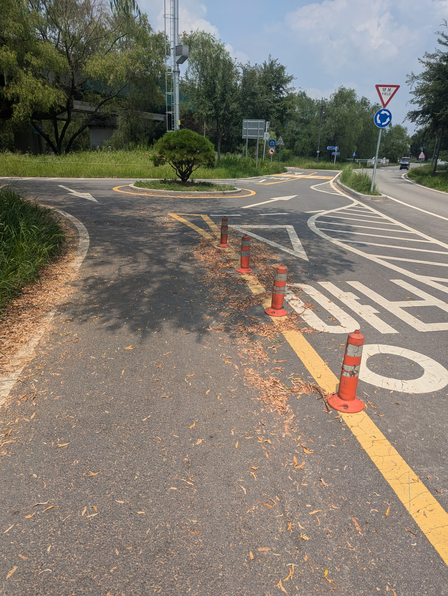

More details: We arrived at Incheon, Seoul's airport, at around 4am. We had to kill time until things opened. The non-express train doesn't run until 5:30, and ATMs don't work until 6am. We made the hour-and-a-half journey to the bike shop.

Our bikes were ready for us and it was self-service, no employees on site. My 18yo and I and 3 Korean guys got our bags loaded. We rode 2.5 hours to the start of the trail, got our trail passports, and then rode approximately 50 miles on the trail.

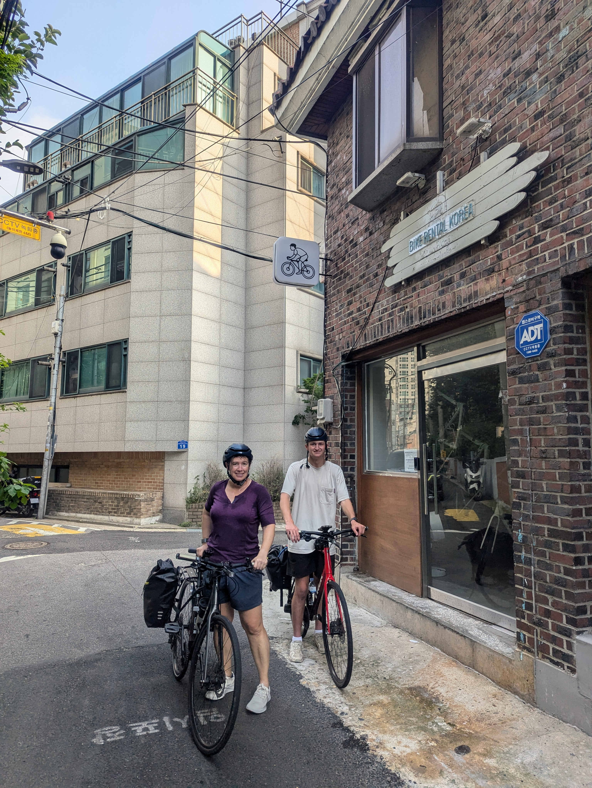

We have a passport that we stamp at red booths along the way to earn a medal at the end.

Our bikes are terrific except for the seats. I wish I'd brought my bike seat!

It was 95 degrees and extremely humid. We went through gallons of water. And never stopped to use any of the really nice public restrooms along the way.

### Day 2: Tunnels and Canopies

This morning was my favorite part so far. Beautiful landscapes, trees making a canopy over us, little shops and cafes on the trail, and best of all - tunnels! I've always been fascinated by tunnels; today I loved them, nice and cool! One even had music playing inside! People were super friendly. My son says I was being unfair to day one, which was pretty spectacular too. Maybe. Maybe it was the full night's sleep too.

<video controls preload="metadata" src="pxl-20240813-003949841-ts.mp4"></video>

The afternoon got much harder. First, they stopped digging bike tunnels and we had to climb hills like the cars. Then it got really hot. Then we filled our water bottles from a place where my 18yo translated a sign saying the water wasn't good! So we took a long break in an air-conditioned cafe and enjoyed cold smoothies. The barista filled our water bottles with ice when we left! After that, we lost the trail for a bit. Most locals don't bike on the trails between towns.

I had joked that if we didn't find lodging one night, we would sleep in a park. We came awfully close to that tonight. (Problem is there are a lot of bugs!) None of the Korean map apps could find us anything. Google Maps took us to a place that was no longer a hotel, if it ever was. Thank goodness for a Korean-American guy who was weed-whacking out front for his aunt. He found us a room about a mile away. He called the inn, and they waited out front for us and called him to translate. They even had a spot inside for our bikes. There's another Korean couple doing the trail staying here as well. The Korean-American guy gave me his number in case we have trouble in the future, and I realized I don't even know his name!

I think we did about 50 trail miles and a lot of extra miles.

### Day 3: Rice Paddies and Honorary Baby Mountains

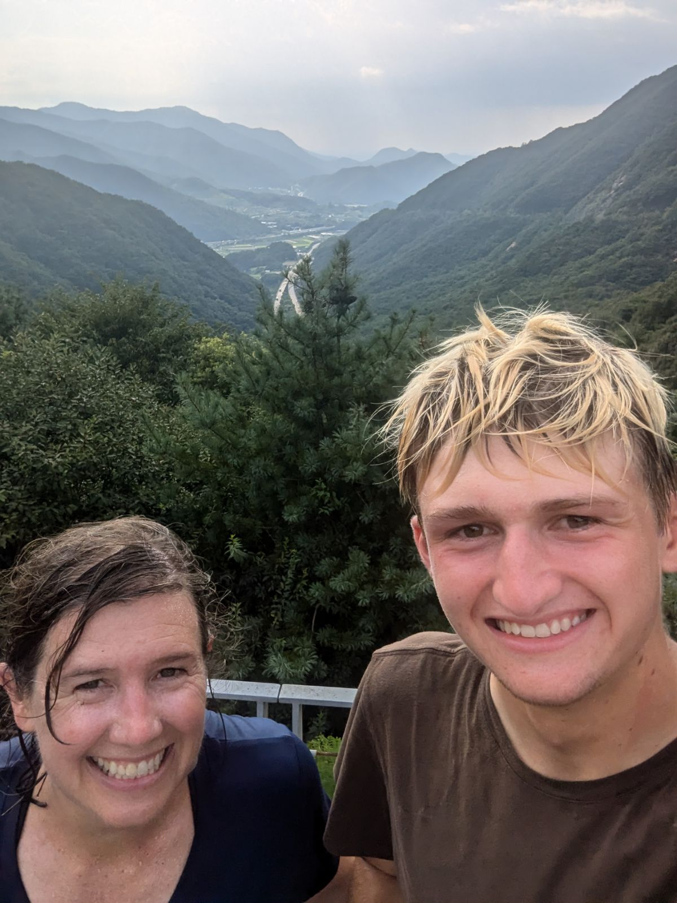

It's still 95 degrees and 80% humidity!

Today's ride took us through rice paddies and fruit tree orchards, then mountains and trees. It was beautiful but we were ready to be done with the hills. We did 40 miles before 11:30, before hitting the hills. We were pretty excited about that!

I picked this trail because it's supposed to follow rivers and be pretty flat except for a good climb on day five. We went over several hills today that I've decided deserve honorary baby mountain status. For each, we climbed about 3 miles, much of it at about 10% grade. The gnats took advantage of our slow uphill pace to hang out with us. But it was beautiful!

Other than tiredness, I feel pretty good, except for my hands. I think when the seat bothered me the first day or two, I leaned on them too much and pinched some nerve. I can't use my hands normally. This is awkward but manageable, except in a world of chopsticks. I now look like a very novice chopstick user, not that I ever looked like an expert!

18yo took charge of most logistics today! He tracked our mileage, followed the trail without getting us off track, found our lunch restaurant, and found us a hotel right off the bike track! Remember, Google Maps doesn't work here!

Oh, and 18yo had at least 3 smoothies today that I remember.

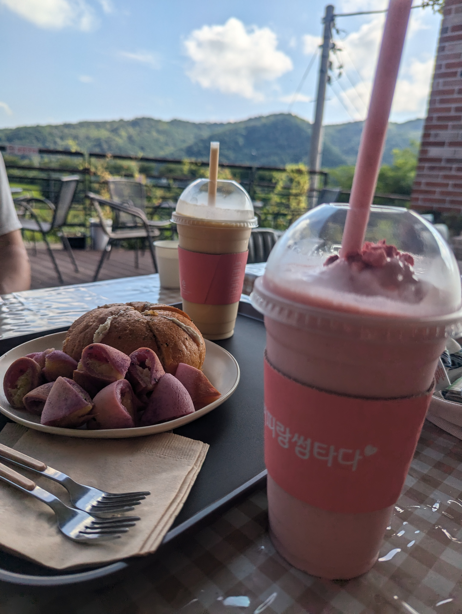

We did about 63 trail miles today.

### Day 4: Seoul to Gumi (Formerly Seoul to Busan)

Sad news, we need to rename this trip Seoul to Gumi. We're calling an end to the biking portion. (Although I think we're both second-guessing, so we may change our minds tomorrow.) We've had 4 beautiful days of Korean countryside biking. Nothing happened; we just realized our afternoons haven't been that enjoyable as they're scorching hot, yet to make it to Busan, we'd have to maintain this pace. 70 trail miles today! And neither of us has visited Seoul before, so we were hoping to have a few days there.

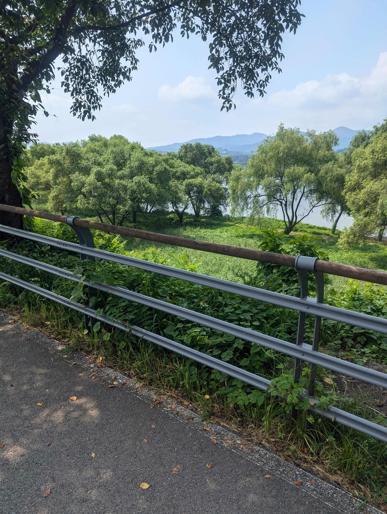

Today was our most trail miles but also our easiest day. I think we've found our rhythm, got an early start, and were baby-mountain free!

This morning was gorgeous. We left with the sunrise and the trail was my favorite part, tied with the morning of day 2. (Notice that hot, humid afternoons are never my favorite!) It was a raised bike path along a small river and rice paddies. Lots of groups of serious bikers. All very friendly. A couple of very short 15% grade uphills. I walked most of that. We also visited the Nakdonggang History Museum. They were very excited to have us and spent time finding the English version of their brochure. We passed more duck and cattle farms this afternoon.

The bike trail was better marked today. Some signs were confusing, but if you went the wrong way, it was usually obvious quickly. We left at sunrise and the temperature was nice until about 10am. We reached our hotel just as it started to pour.

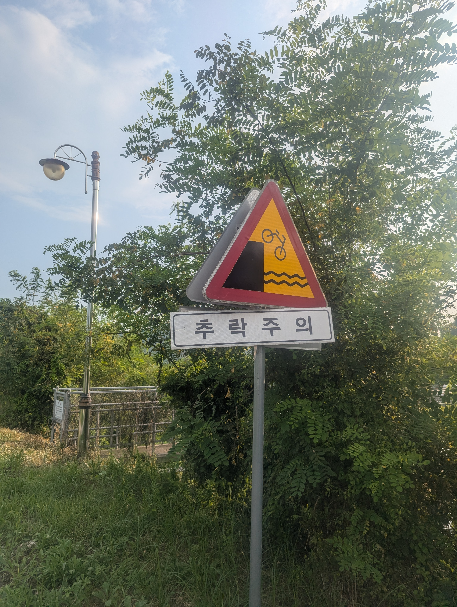

This evening we're in the nicest hotel so far and... drumroll... it doesn't smell like smoke! Our hotel rooms have varied between $25-45/night and they include all amenities from toothbrushes and combs to mini-fridges full of water and phone charging cables. Plus slippers because each has an entry room where you leave your shoes.

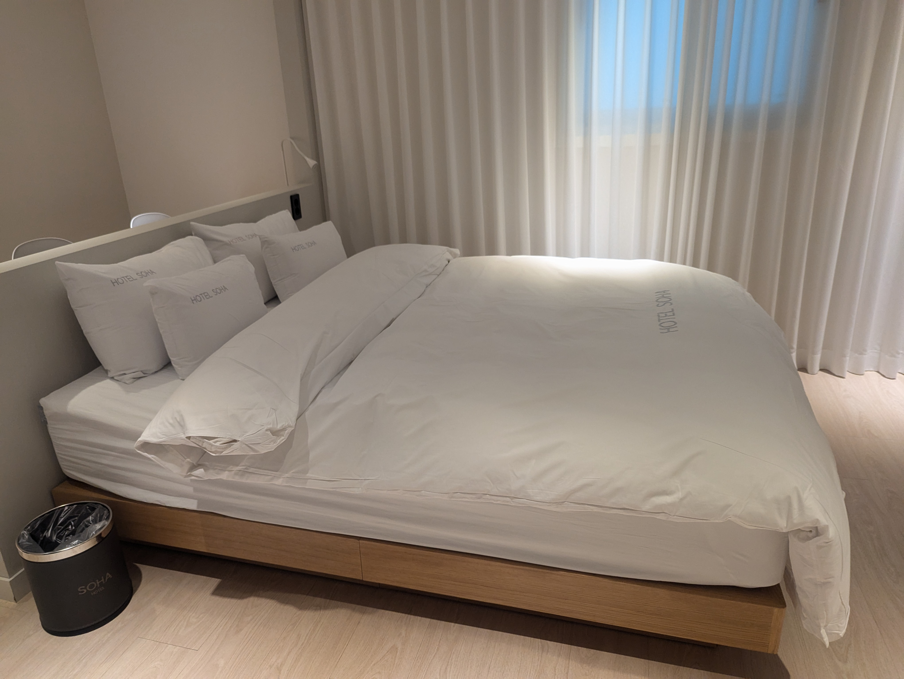

### Day 5: Back to Seoul

We got an Express bus back to Seoul. It was super easy, comfortable, and cheap. When we were putting our front tires back on our bikes, several bus station employees gathered around to examine them and ask questions. All I understood was "Trek good" and they thought the tread on my tires was low.

Hotels in Seoul are not $25 a night! To get two rooms, we booked an Airbnb in a very old part of town on a narrow street. I have the cutest little fridge in my room, and we have a nice patio with cats that come and watch us through the doors.

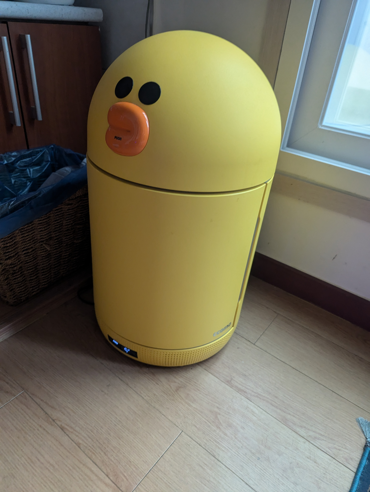

My hands still aren't working right. I'm hoping they're more functional before my work lunches and dinners next week!

We have a couple of adventures planned for tomorrow!

### Day 6: Language and Food

We took a Korean language lesson in the morning. We learned the alphabet, which was fascinating and might enable us to read business signs. I find the sounds really tricky, like when they say, "this makes a sound like the letter B. Listen, puh, puh, puh" and I say "like the letter P?" and they say "no, no, that's this one."

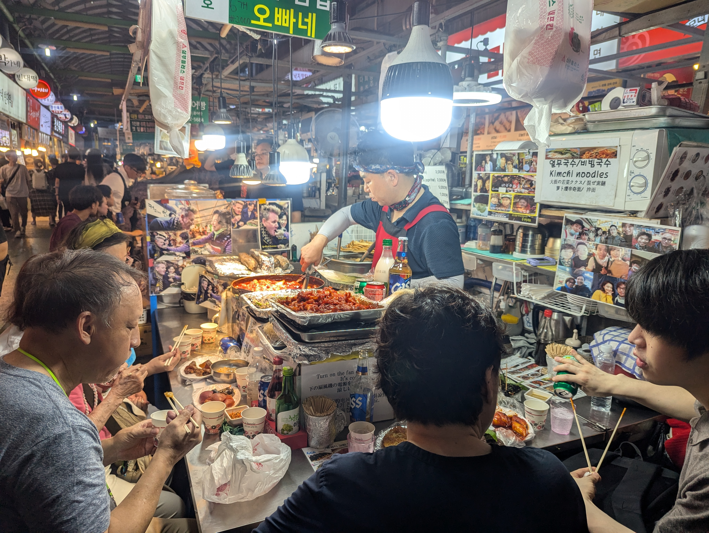

In the evening, we went on a food tour of the night market, which was really interesting to learn what we were eating and how it fits into life here. We also had fun with our tour group. My 18yo pointed out that it's the first time all week we've had a real conversation with words with anyone else. The group included a couple from Israel, a couple from Iraq, a woman from London, a guy from Mexico, a guy from Brooklyn, and a guy from Longmont!

A lot of my pictures are foggy because my plastic screen protector and sunscreen don't play well together. I'll have to upgrade.

#### Airbnb Fruit

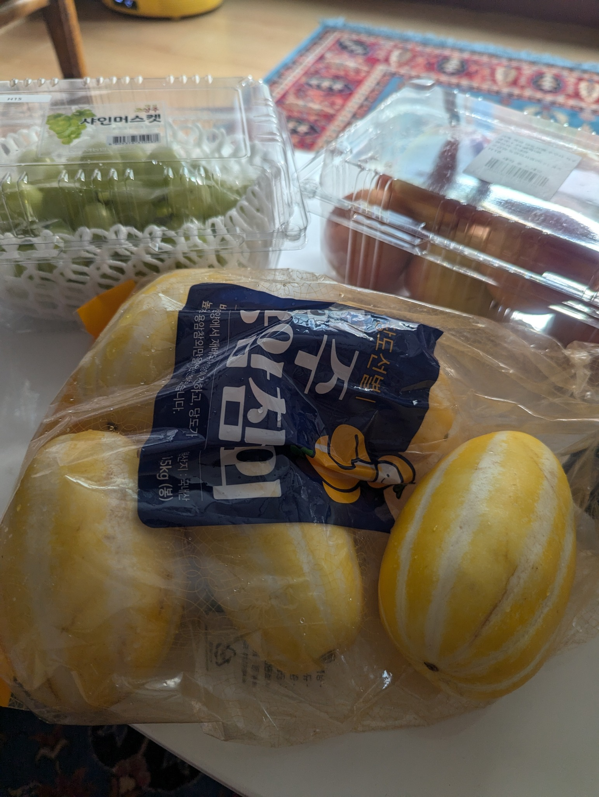

Our Airbnb host had a box of fruit delivered to us! Shine muscat grapes, melons, and plums. Then we had a very confusing conversation about checkout dates, but I think we agreed we're on the same page. Auto translators can do strange things. Combine that with written communication and it's ripe for misunderstandings!

No idea how we are going to eat all this in 2 days!

### Day 7: Palace Tour

We had the cutest tour today.

We showed up at the Gyeonghuigung Palace. A man asked if we wanted an English tour. We asked how long, he said 40 minutes. He said it's free.

We said sure. 18yo whispered to me, "We're getting abducted."

The guy emphasized, "It's free. English only! No cost! No tips!" He made a big X with his arms. We said, "Oookkkaaay."

Then he called over our tour guides from the National Youth Heritage program.

We appreciated them. We learned a lot from these two sixth graders, 13 and 14 in Korean age. Everyone is born 1 year old in Korea, and everyone turns one year older on New Year's.

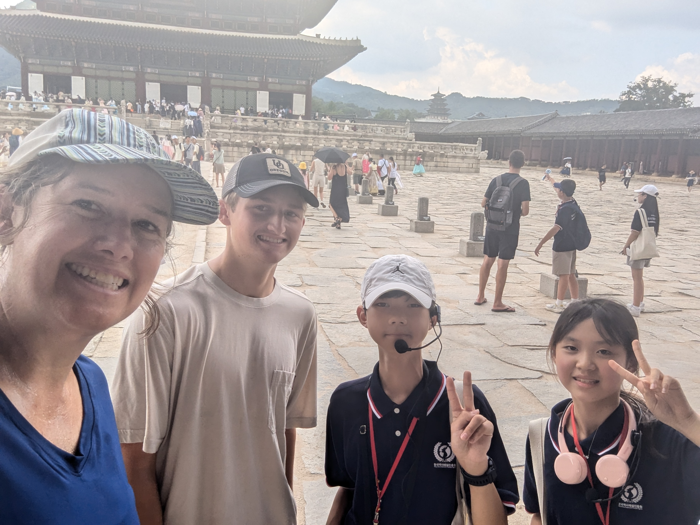

## Trip Planning & Practical Information

### Fitness Requirements

Neither of us did any special training for the trip. My 18yo plays high school sports, and I do CrossFit and run regularly. While many bikers with fancy bikes and gear passed us, plenty of people went slower than we did. We were fine and covered plenty of miles daily. I did walk up a few hills. I also had the chain come off my bike on a long uphill because I insisted on downshifting once more when there were no lower gears! (My son was ahead carrying the toolkit, so I called him to stop but not come back down. I managed to get the chain back on with my hands, and we both continued.)

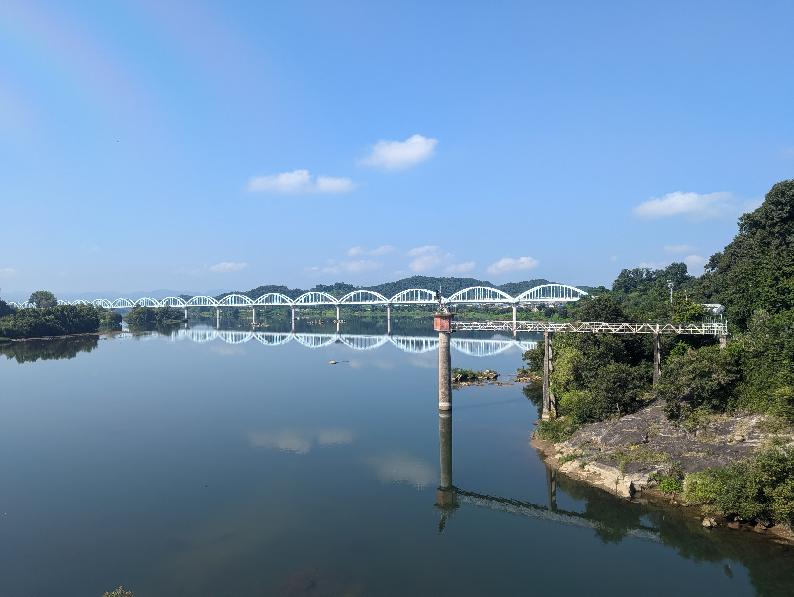

### Apps and Navigation

Google Maps doesn't work well in South Korea, so download one of the two most popular Korean map apps. Google Maps was useful for finding reviews in English, but it was often outdated and places may no longer exist.

### What to Pack

We rented two panniers with our bikes. If I did it again, I'd just pack a small backpack and strap it onto the bike's rack. The panniers felt like they created drag - probably not true but they felt like it! - and we didn't need two each. One would be plenty.

We packed too much. At minimum, pack one set of biking clothes (including a very light long-sleeve top), one pair of evening clothes (shorts and a t-shirt is what we wore everywhere), sleepwear, sunglasses, two water bottles, sunscreen, your phone, and a charger. Plus any non-standard cosmetics or medication. We received soap, shampoo, hairbrushes, and toothbrushes at every hotel. (Not deodorant.) At night, you can wash your bike clothes in your hotel room and hang them to dry. We left our suitcases at the bike rental.

The only non-essential item I would have really liked was a mosquito net for the night I thought we might sleep outside.

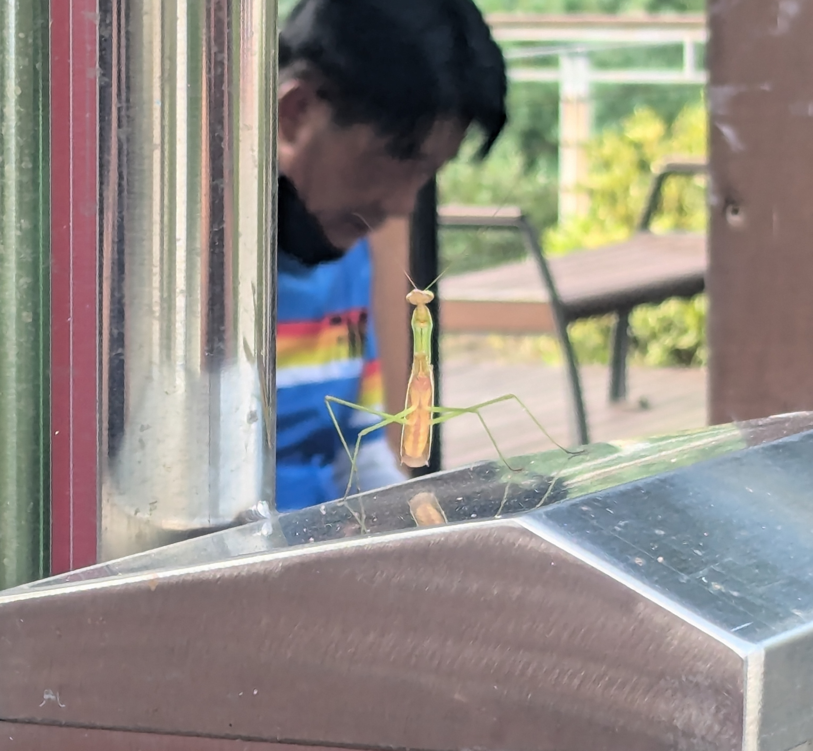

### Bike Rental

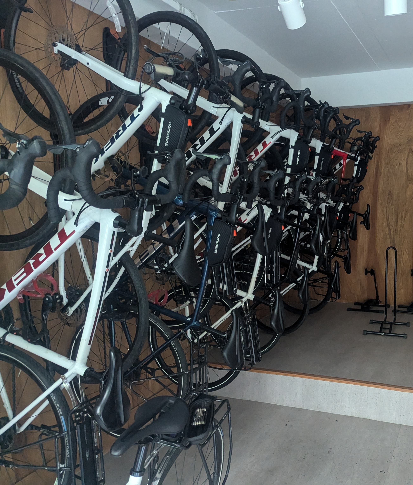

We rented from [Bike Rental Korea](https://bikerentalkorea.kr/). We got two Trek bikes with racks, water bottle holders, phone holders, and two panniers each. We also rented a toolkit. The bikes were in very good shape. I originally contacted them through their website and then switched to WhatsApp. They had good written English. When we picked up our bikes, we entered the store with a code and left our suitcases there after loading our panniers.

The service was excellent. I recommend renting from a larger store if you want to buy last-minute items like bike shorts or water bottles or need to ask questions.

If I did it again, I'd bring my own bike seat. The doctor I saw about my hands when I got home said he always takes his own bike seat!

I also wish we'd had them deliver the bikes to the beginning of the trail instead of picking them up at the store and riding there.

We rented bikes in Seoul and arranged to return them in Busan for an extra fee, planning to take a high-speed train back to Seoul. When we decided to end in Gumi, we put the bikes in a bus's baggage compartment. We removed the front tires, and each bike lay flat in one compartment.

### Accommodation

Small, simple hotels were plentiful on the trail. We paid between $20-45/night for a room. Our rooms always had a comfortable bed, bathroom, cosmetics (enough that you wouldn't need to bring anything, even a toothbrush), slippers, and a fridge. All had air conditioning. Most smelled like smoke. One night my room even had a closet style steamer to clean my clothes with!

When looking for a room, search all terms in the Korean app: hotel, motel, inn, guesthouse, etc. Also, ask locals if you're stuck. One night we biked right by a hotel and were later sent back by a local. It looked just like a house with a sign out front. We usually started looking mid to late afternoon and only had one evening where I worried we'd be sleeping outside with all the bugs!

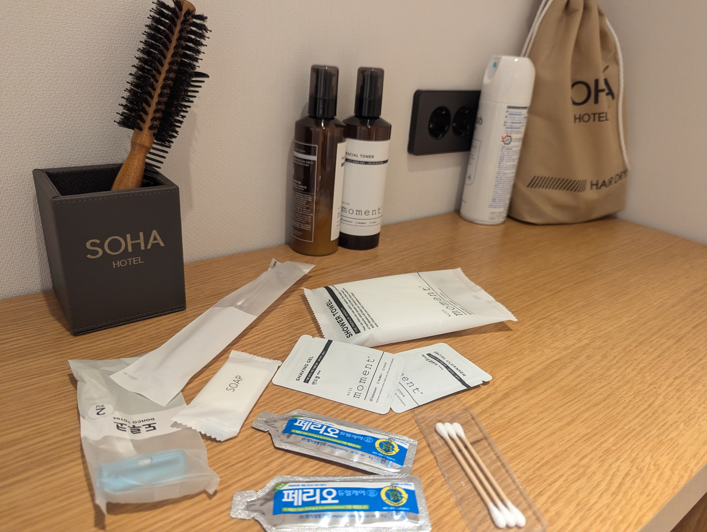

I was looking forward to visiting bathhouses and staying in one for a night, but we didn't find many on the route. Supposedly, many closed during COVID.

### The Trail

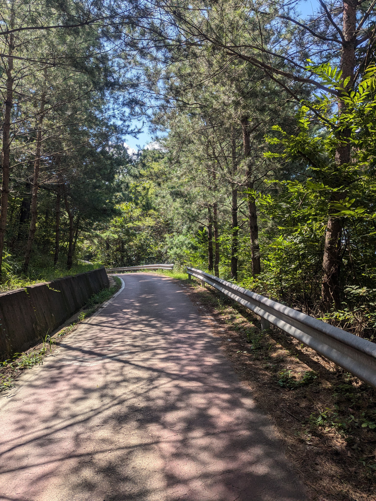

The trail consisted of hundreds of miles of bike-only paths. They were well-maintained and had clearly marked lanes in cities. We were only confused about directions a few times but eventually figured it out.

Google Maps doesn't work in South Korea, and navigating - or rather finding places - while not too difficult, was definitely our biggest challenge.

### Food

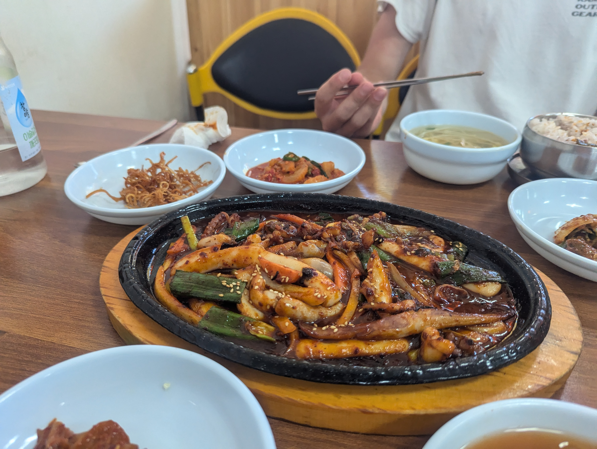

We stopped along the route at whatever restaurant, convenience store, or coffee shop we saw. All the food was excellent. We often couldn't order well given the language barrier, but we always received plenty of good food. There was only one day through the countryside when my 18yo got really hungry. Also, we couldn't find many places open for breakfast, so we often had convenience food (rice with various toppings served as finger food) in the mornings.

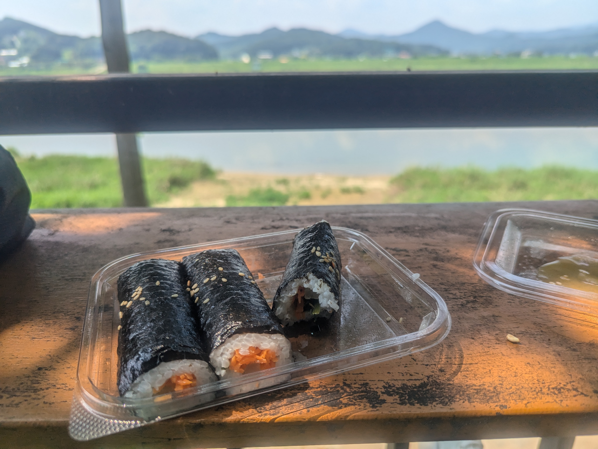

## What We'd Do Differently

1. Timing. Not go in August.
2. Start point. Have the bikes delivered to the start of the trail, especially if going straight from the airport. The airport is close to the trail. From the bike shop, we biked 2.5 hours to the start of the trail and then had to bike the same trail again. (We went to the start to get our trail passports - while it was fun to have a passport and stamp it, I could easily skip that part. I did appreciate the map we got there though.)
3. Pack less. One set of clothes for biking, one for the evenings.
4. [Rayban Meta sunglasses](https://amzn.to/44dedkN). I really wished I had packed my rayban meta sunglasses for taking quick pictures while biking. I ended up not using my phone holder on my bike because I couldn't get the phone out fast enough to take pictures. This meant that I also couldn't quickly see where we were or what time it was.

## Conclusion

Despite the heat cutting our journey short, biking through South Korea gave us an intimate view of the country we never would have experienced otherwise. One day my 18yo said it was the first time he's been on vacation and not seen another tourist. The combination of stunning landscapes, delicious food, and the kindness of strangers made for an amazing adventure. If you're considering a similar trip, I highly recommend it - just maybe not in August!

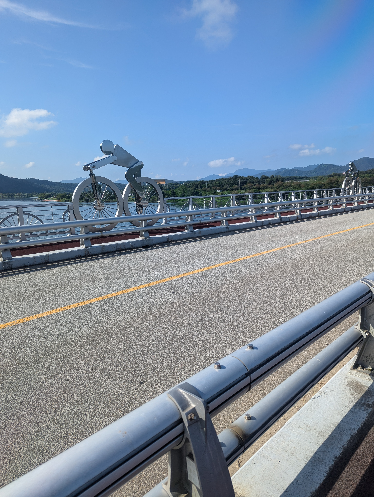
