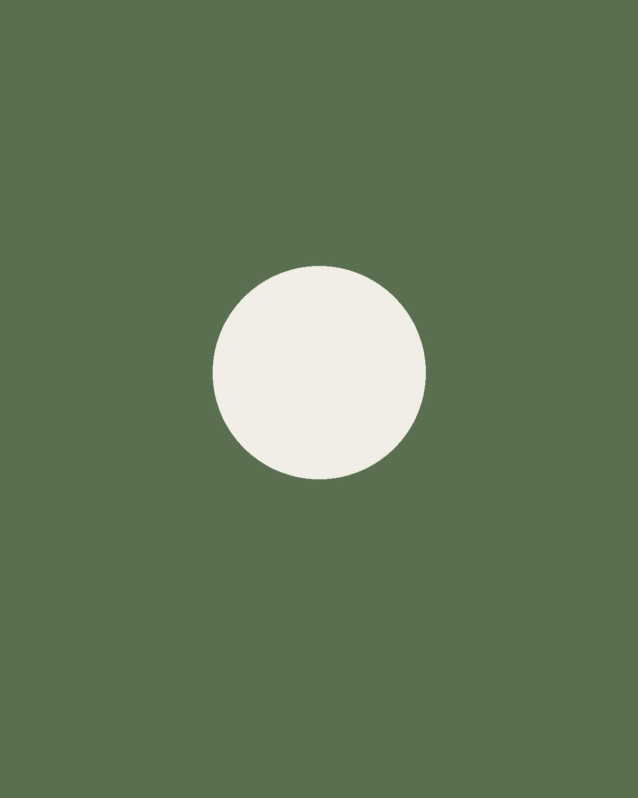

Here is a paragraph with [a tracked link](https://example.com/article) and some *emphasis*. The stripes get repainted every spring.

A second paragraph, mentioning [pedestrian crossings](https://en.wikipedia.org/wiki/Pedestrian_crossing) without tracking.

