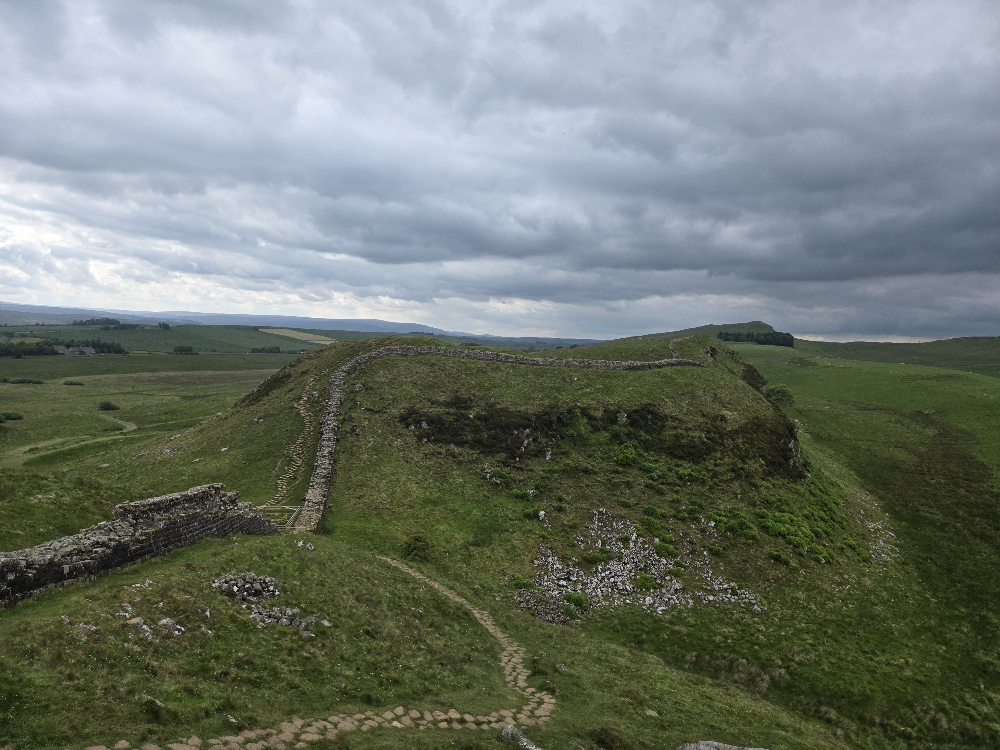
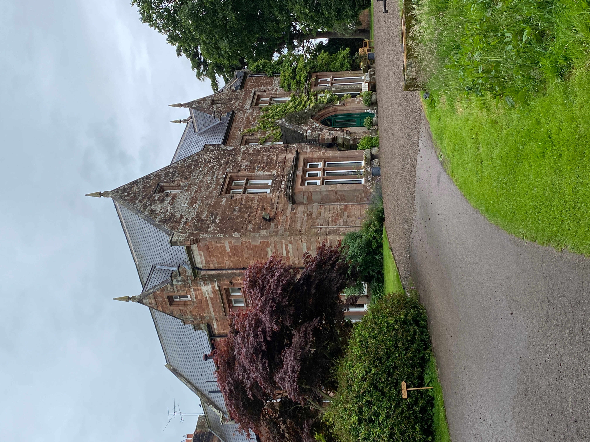
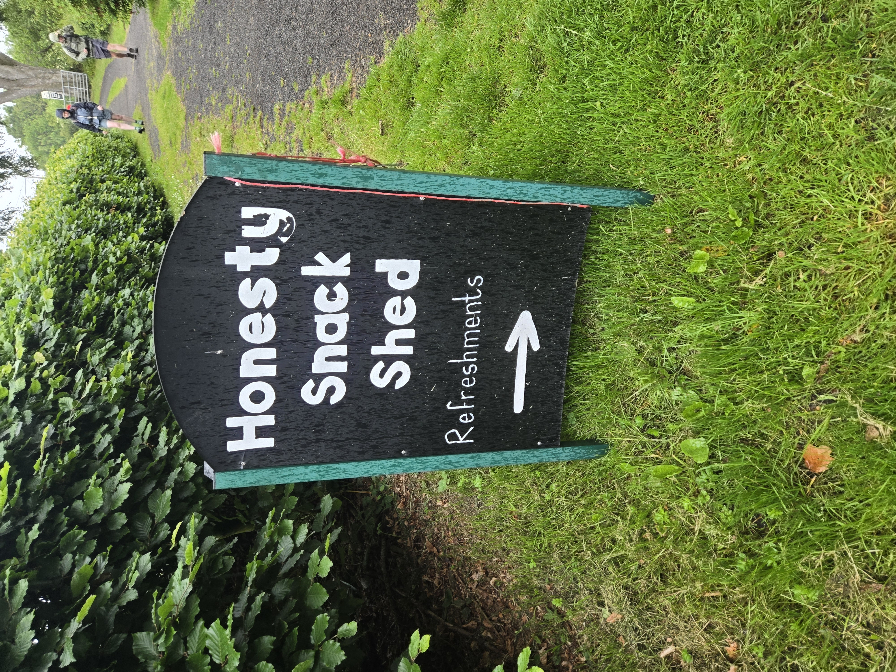
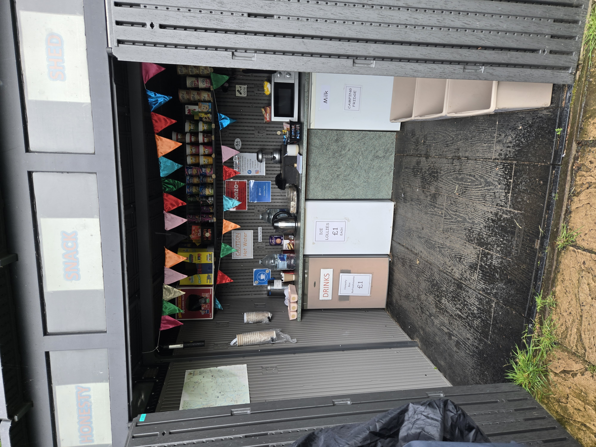
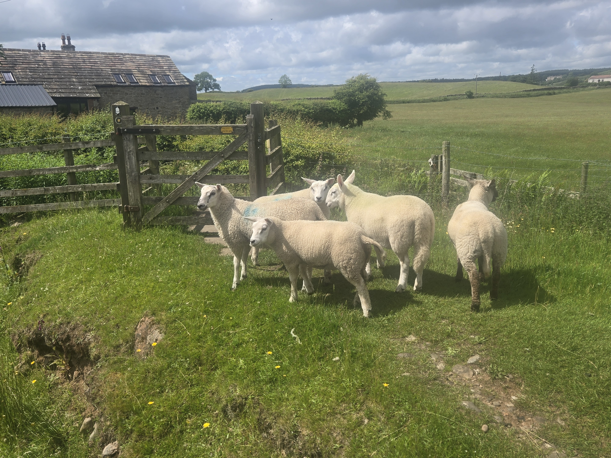
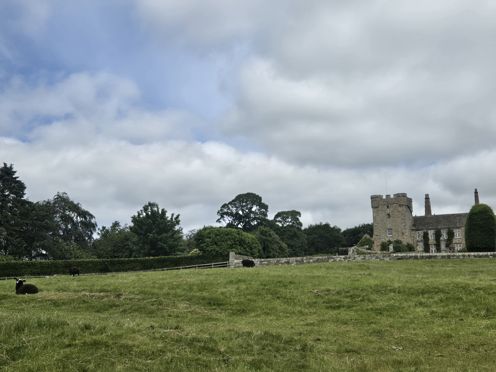
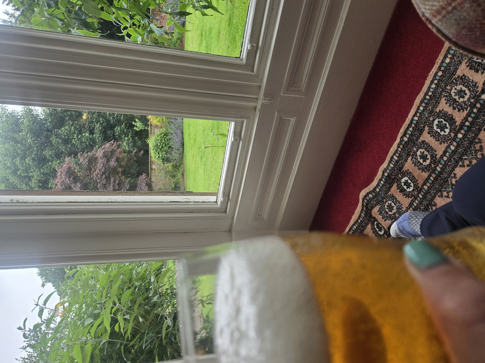
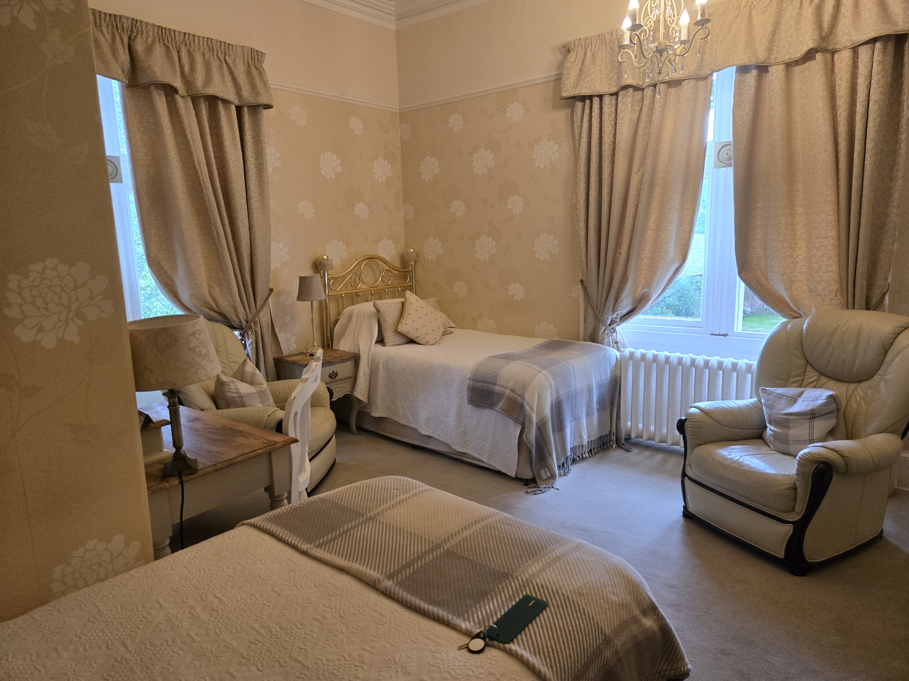
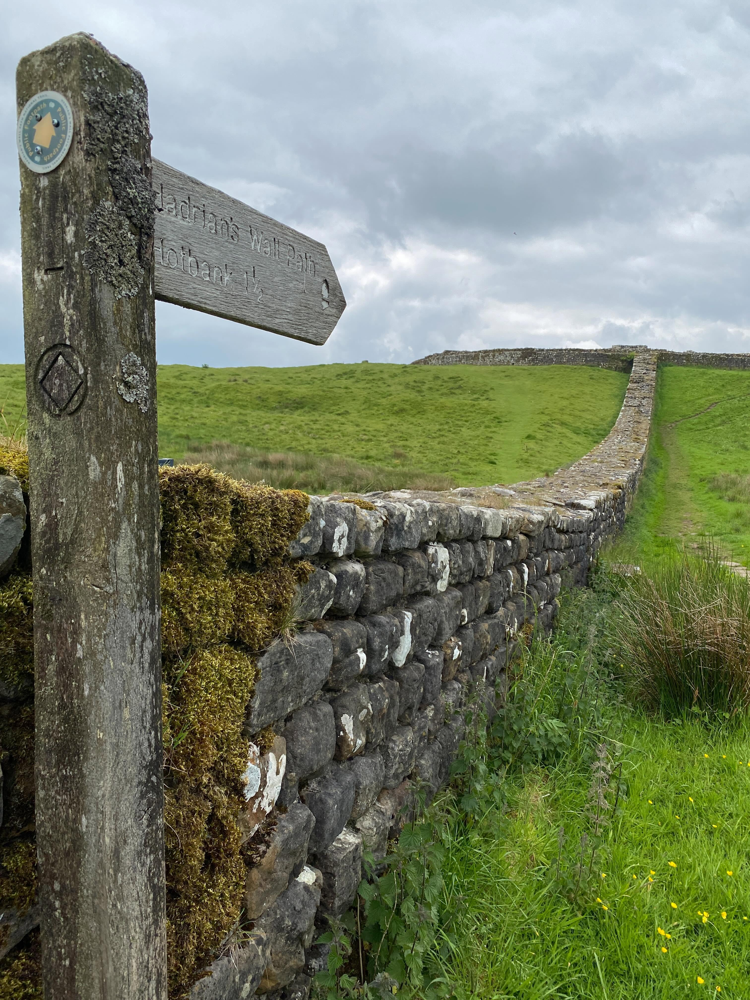

Enjoy hiking? Seeing castles and ruins? I highly recommend a week’s stroll across the UK along Hadrian’s Wall.

We spent 5 days walking along the wall the Romans built in AD 122 to keep the northern tribes away. There’s not much of it left as many of the stones were carted off to build other things once the wall was no longer needed. We had dinner one night at our bed and breakfast with two German cousins in their 70s who were quite disgusted with the “ruins.” They said they had *real* ruins in their country. (But they were still very much enjoying the hike.)

## The rhythm of the days

Every morning we got up, packed our suitcases, and set them out for the luggage transfer service. Then our bed and breakfast host served us homemade, made-to-order breakfasts. Everything from yogurt and fruit to a hearty full English breakfast of eggs, beans, and sausage. They packed us a lunch too. Usually a sandwich, chips, a piece of fruit, and a candy bar. But some went above and beyond - one day we got something like 5 homemade sweets.

We started walking around 9am and were usually done by 2 or 3, with stops to explore and eat lunch along the way. Along the trail there were “honesty bars” that ranged from full-blown huts with fridges and snacks to just a cooler sitting on a wall. You took what you wanted and left cash.

## The scenery (and the sheep)

The weather was often cloudy and sometimes rather wet, but always a luscious green full of rolling hills and stony cliffs. And lots and lots of sheep and cows. Very friendly sheep and cows. At one point we had to google “how to get a cow to move” because we couldn’t get a herd of them to give us space to walk through.

We watched ranchers with working sheep dogs tending their flocks. And one day we passed a couple of guys headed the other direction who had somehow inherited a dog they couldn’t get to go back home. He was just ... hiking with them.

The dog guys weren’t the only ones going the other way. We kept crossing paths with people walking and running in the opposite direction. Some were so focused they barely noticed us. Some looked like they were trying to run but were barely moving. I managed to get a few of them to chat in the 30 seconds we crossed paths and learned they were doing the Montane Summer Spine Race, 268 miles along the Pennine Way, which crosses the wall path. The 2026 women’s winner, Jenny Hartley, finished in almost 105 hours. She was moving at nearly our hiking speed. For 105 hours. In a row.

We saw pieces of the wall, remains of the milecastles (built every mile) and turrets (built every third of a mile), and lots of stone fences, stone houses, and castles that looked exactly like I imagined homes in the UK should look.

## The evenings

One of the best parts of every day was arriving at our bed and breakfast, taking a shower, and having a good pint. Either at the B&B or at the local pub.

Our accommodations varied from a room in someone’s house to a garage apartment to a room above a brewery. Always clean, often small, and never air conditioned. Always extremely friendly and helpful. One went on my list for future vacations.

## If you want to do it

We signed up with one of the 17 (!) companies that arrange all your accommodation and transport your bag every day. We picked a 6 day moderate option: 5 days of hiking, 6 nights of accommodation, about 10 miles a day. For people who don’t normally walk all day - people with desk jobs - it was the perfect amount. We didn’t cover the full 73 miles of the wall, but we felt like we got the most scenic pieces.

We hiked with 20L day packs carrying rain gear, water, and our lunch. Plus blister treatment and hiking poles. The poles earned their keep on the really rainy day with a lot of downhill on very slippery rocks.

