I thought what I’d like most about Venice would be the canals. (I imagined it would be like C.J. Cherryh’s *Angel with the Sword*.) I thought I’d be entranced by St. Mark’s Square. (I think I had Plaza Catalunya in mind for that one.)

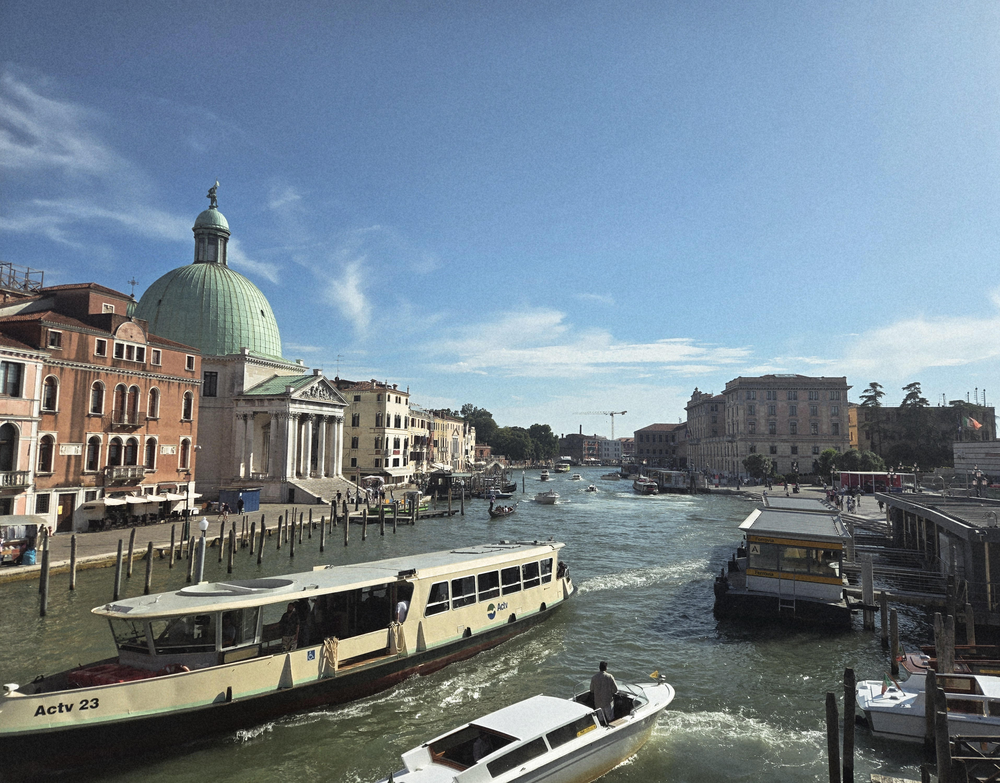

But what I really loved was the narrow, twisty streets — the ones that sometimes doubled back on themselves, that offered multiple ways to get to the same place, that followed no pattern at all.

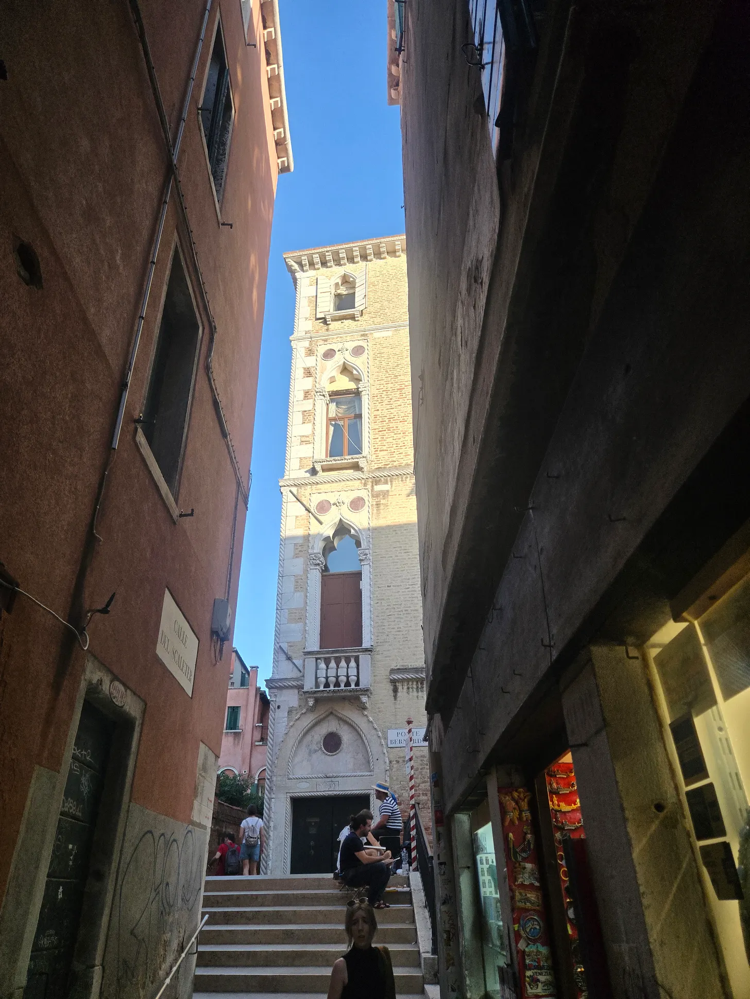

It was like an adult-size, real-life maze. Every day was an adventure, with delightful pieces of art and architecture waiting around every corner. You might turn a corner and see what looked like a real-life castle. Or a sculpture. Or a neat little store.

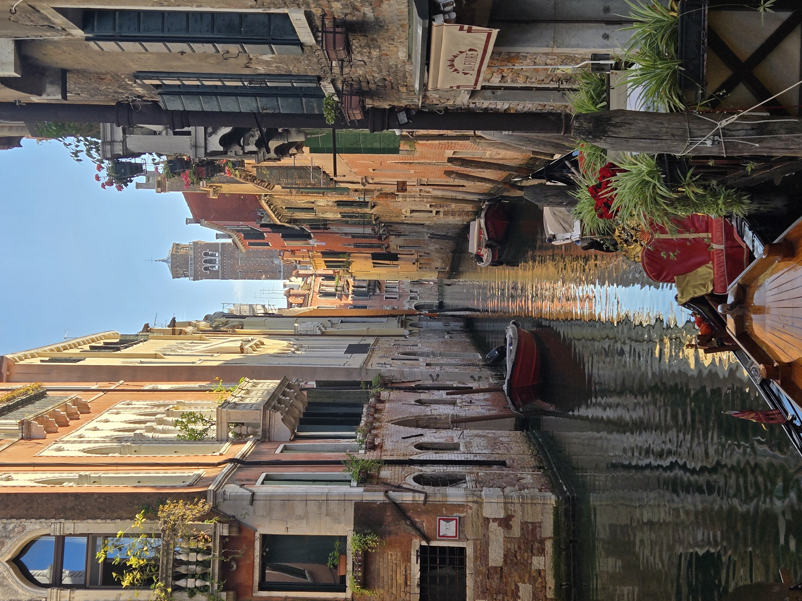

Even the grocery store was an adventure. I thought it was a tiny little shop, and it turned out to be a full-blown grocery store inside. And the fact that the whole city is car free made it that much more delightful.

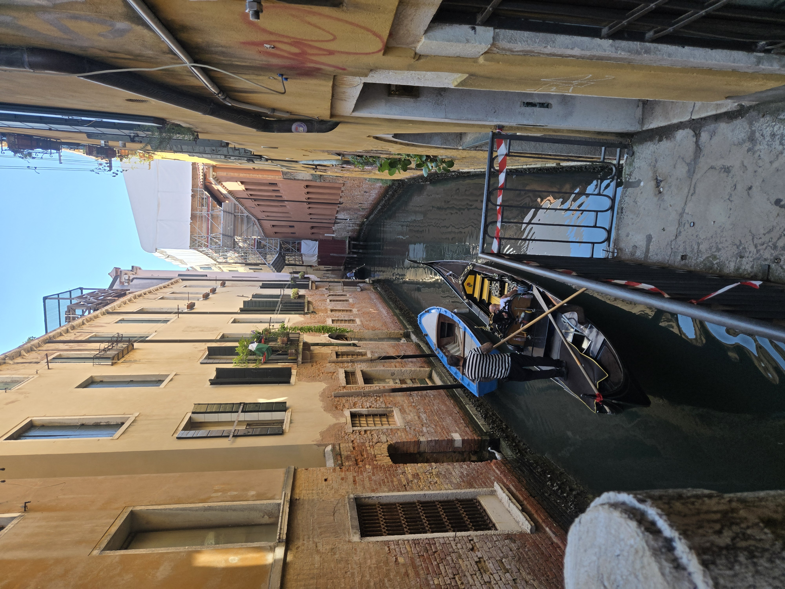

## Navigating the maze

People warned us that our phone GPS wouldn’t work very well in Venice, so I downloaded offline Google Maps. It was really useful for looking up where things were. But I found it more fun to just try to navigate on my own. After a few days, I had landmarks (there’s the bookstore!) that I watched for to remember different intersections.

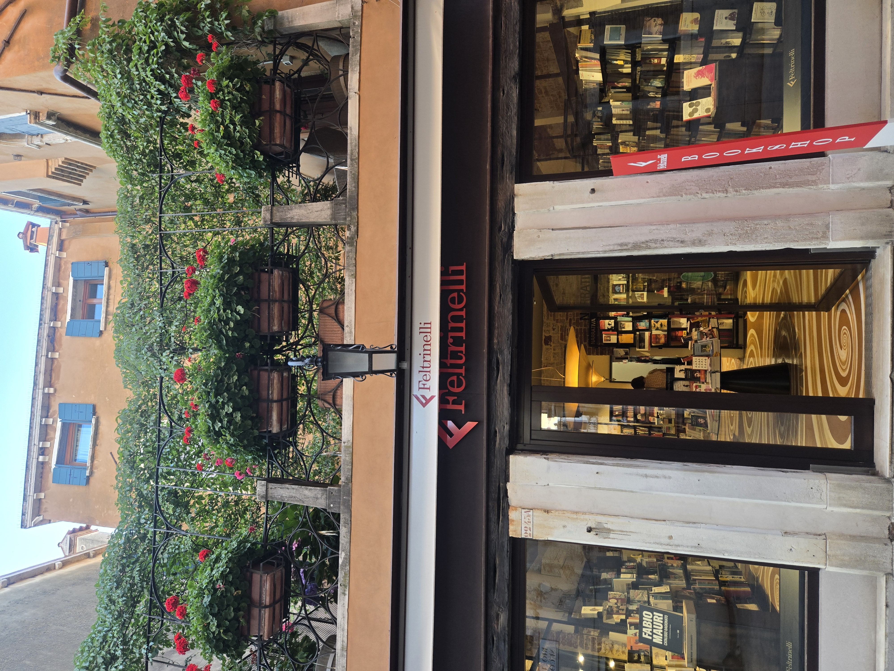

## Life on the water

I kept wondering about all the houses with doorways opening directly onto the canal. Some were just open, gaping doorways. Some had been bricked up. And some looked like they were still functional. What would Venice have looked like when most people did business by boat?

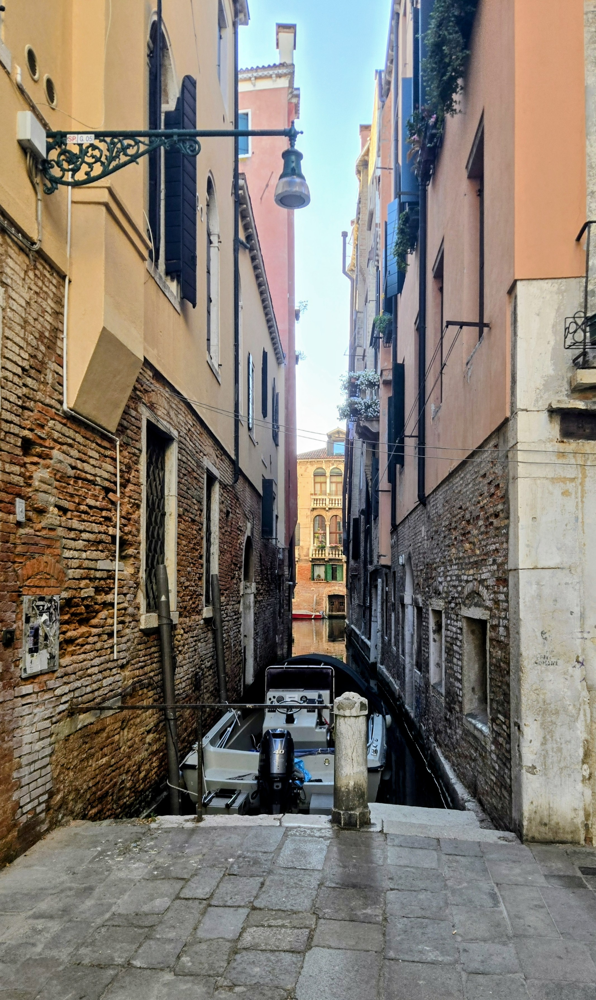

There’s still quite a bit of boat traffic. All the trash gets picked up by boat … quite a feat. It has bins for trash and recycling.

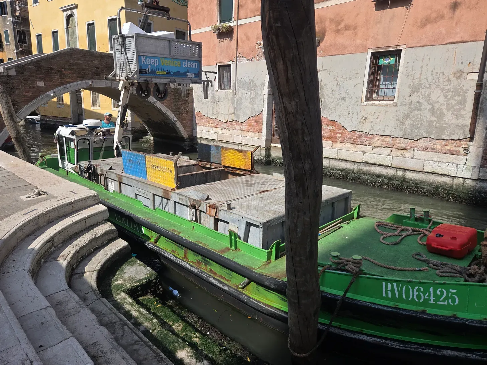

We even saw workers painting a house from a boat, with scaffolding balanced right on top of it!

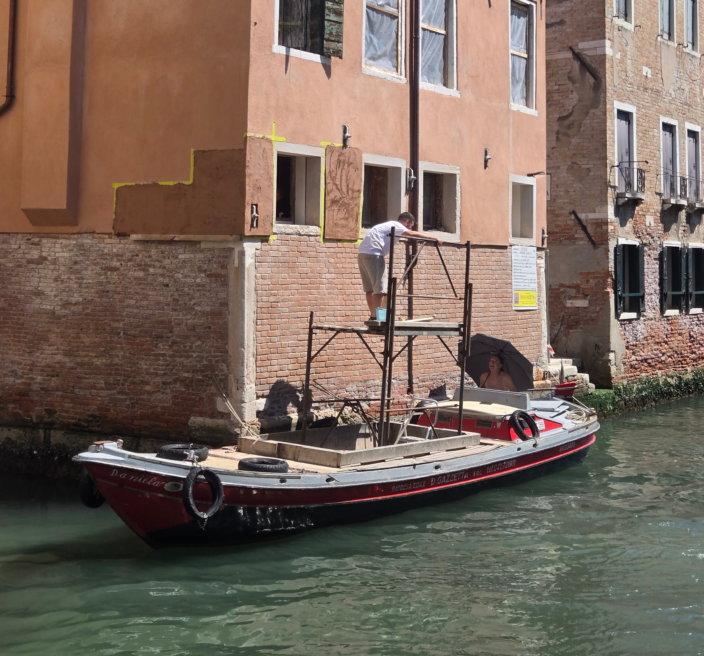

Supplies get delivered by boat. And you can get a water taxi anywhere. But it didn’t look like any of the amazing houses (palaces?) were using their waterfront door as the main door anymore.

## The gondola ride

We did get a gondola ride, and it was amazing. Our gondolier spoke Italian so slowly and clearly that I understood him. I actually had to stop for a minute to figure out whether he was speaking Spanish or English or something else I understood. Turns out he’d only been a gondolier for a few months! I think that’s what made him amazing. He wanted to be sure to point out all the key places, he sang for us, and he was very careful on his corners.

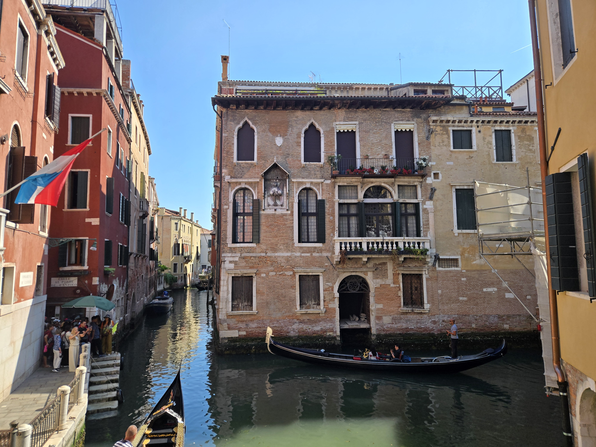

You know that Italian half-yodel, half-song you associate with gondoliers? They’re calling out as they take the corners so they don’t collide with oncoming traffic.

I recommend the gondola ride. Grab one away from the Grand Canal. Keep an eye out and you’ll start to recognize the gondola stops after a while. But if the price of a gondola ride is prohibitive, there are other ways to explore the canals. You can get a water taxi. Or there’s the *traghetto*, a shared gondola ferry that shuttles people straight across the Grand Canal for just a couple of euros. Note that they won’t do this at night - we tried to grab one after dinner one evening. Watch and you might see someone riding a traghetto standing up!! Or you can take what I thought of as the water subway. (It’s officially called the vaporetto.) It’s like a big enclosed, floating train car that goes around the Grand Canal.

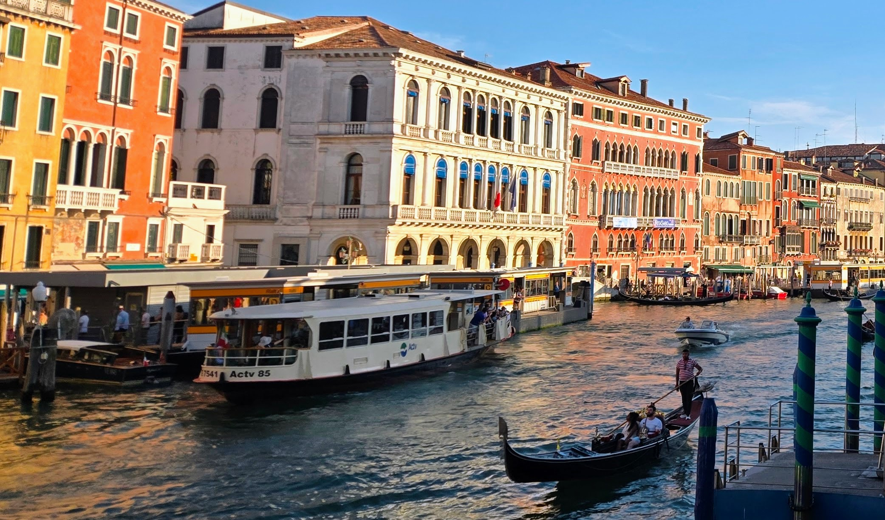

We actually got on for one stop once, just to cross the canal. There were no bridges nearby, and the water subway picked us up on one side and dropped us off at the next stop, just a few hundred feet away on the other side.

## A city built in a swamp. On purpose.

I also found the history of Venice really interesting. Everyone talks about how it’s sinking and full of water, but that’s *why* it was built! It was supposed to be in a waterlogged place that was hard to get to. Around 400 AD, people fleeing the invading tribes from the north deliberately went out into the swampy lagoon and built their homes there. Turns out they were some pretty hardworking, smart people, and they became a society of skilled craftspeople and excellent merchants.

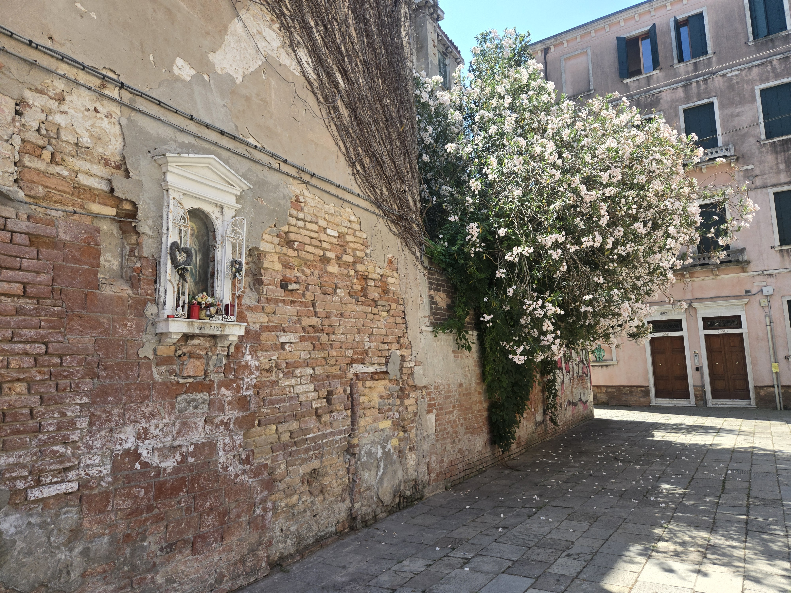

The city was sinking for a long time. Until they realized that pumping water out of the aquifers was the problem. They stopped the industrial pumping in the 1970s, and now Venice only sinks a millimeter or two a year. Unfortunately, high seas and changing weather still cause it to flood often.

## One practical tip

Make sure your hotel is near the train station or a canal. You’re going to arrive at the train station with your bags, and there are no cars. None. Not even a bike. Then you and your suitcase are going to have to navigate narrow cobblestone streets full of tourists all the way to your hotel with probably a bridge or two thrown in for extra exercise. And all the bridges go *up and over*, not just over (because the boats go under). If you’re near the water, you can get a water taxi. Otherwise, you’re walking. So choose your hotel wisely.

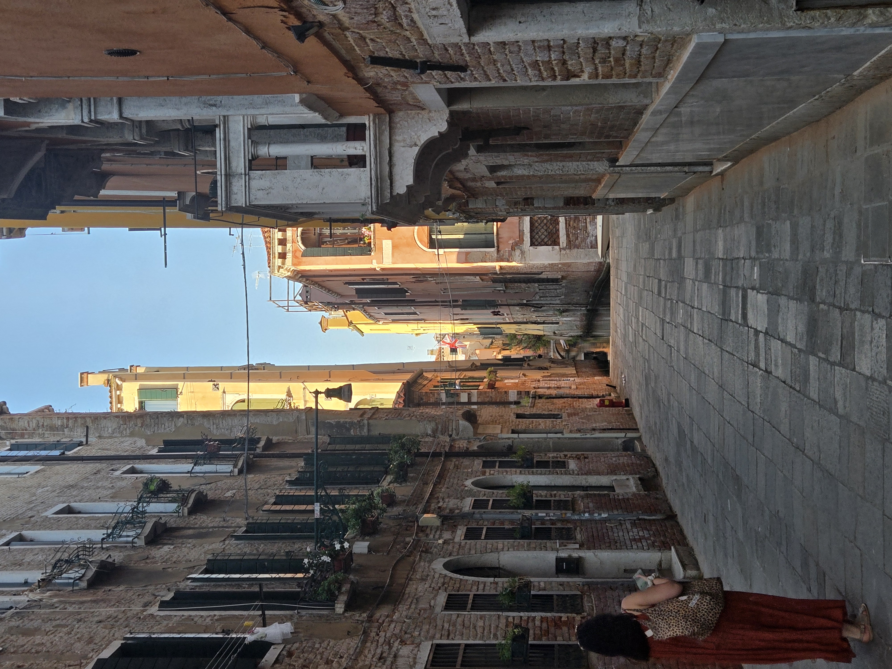
